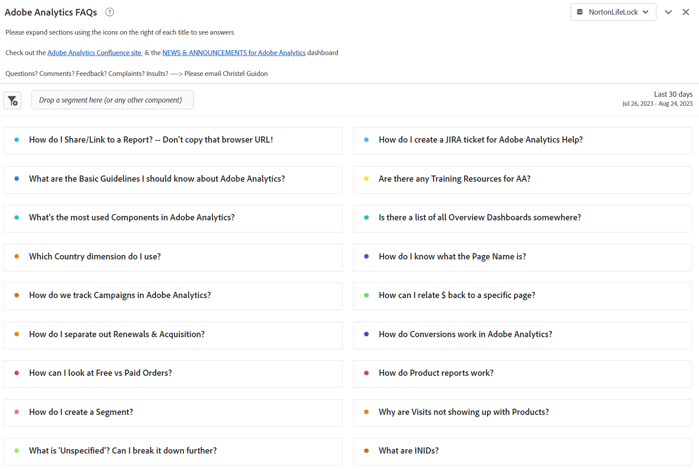
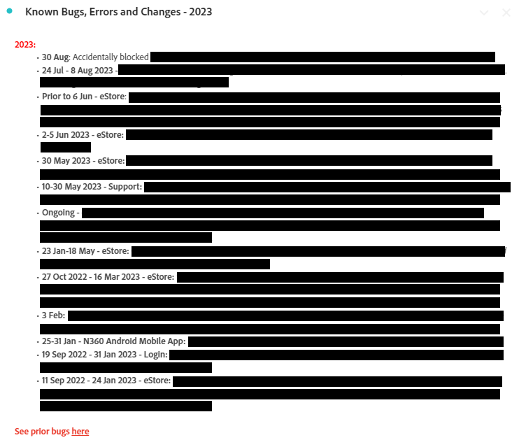

# Analysis Workspace内での運用ダッシュボードの作成

_Workspaceの運用ダッシュボードが、コミュニケーショ [!DNL Adobe Analytics] と効率性にどのように革命をもたらしたかを確認します。 FAQ、ニュースとお知らせ、バグと機能のダッシュボードを作成して、情報を合理化し、ユーザーエクスペリエンスを向上し、エンゲージメントを強化する方法を説明します。_

多くの管理者と同様に、[!DNL Adobe Analytics] ーザー向けに内部情報ハブ（Confluence など）を実行しています。 時間が経つにつれて、私は繰り返し同じ質問に答えることにうんざりし、私がピンチや迷惑を感じていないように私のユーザーに到達するためのよりスムーズな方法を必要としていました。 静的でない情報のリポジトリーが必要でした。

ユーザーは、「VPN がオフになっています」、「今は読めません」などの理由で、Confluence サイトへの参照を無視することがよくあります。 基本的に、「私はそのドキュメントを後で読みます」というのは、ドキュメントが読まれることは決してなく、同じ質問が来週も再び尋ねられるということを意味します。

***実現ヒット：**&#x200B;Workspaceの汎用性は、ゲームを変える可能性があります。 ユーザーはWorkspace内ですばやく直接的に回答することを好むので、そこに留めておきます。余分な手順を回避しましょう。*

さらに、会社全体で共有するための運用ダッシュボードを作成しました。 これまでのところ、ユーザーへの情報の提供、情報の一元化、不満の解消を行っています。 これは、時間の経過と共に効率を向上させる、簡単で進化するプロセスでした。

人々は私がいなくても多くの良い情報を得ることができ、サイトの領域を理解し、[!DNL Adobe Analytics] の素晴らしさを確認し、（私にとって重要な？?）質問を減らし、時間を短縮することができました。

**サイトのすべてのプロパティまたはメイン領域のダッシュボードを作成することを強くお勧めします。** プロパティ/サイト/アプリ/フローの概要を示し、基本情報と迅速なインサイトを持っている必要があります。 これらは会社全体で共有する必要があり、すべてのユーザーがハンドホールドなしでプロパティを理解できるようになります。 私にとって、これらのダッシュボードは通常、得られる質問の 80% に答え、貴重な時間を節約します。

これにより、Confluence サイトを維持できなくなります。これは、引き続き非常に役立ちます。 各操作ダッシュボードの上部でも参照できます。 しかし、私は自分とユーザーの両方のショートカットが大好きです。

これらの目標を達成するために私が会社 GenDigital 用に作成した 3 つの運用ダッシュボードについて説明します。

1. よくある質問（FAQ）
1. ニュースとお知らせ
1. バグ、機能、メジャーリリースログ

## 1 - FAQ ダッシュボード

答えを繰り返す無限のループにうんざりしていますか？ 止まれ！ FAQ ダッシュボードを作成することで、時間を節約できます。 ユーザーは質問する前に情報を参照したり、回答に素早くリンクしたりできます。

タイトルとして書式設定された質問と、コンテンツとして回答/説明を含む [ テキストビジュアライゼーション ](https://experienceleague.adobe.com/docs/analytics/analyze/analysis-workspace/visualizations/text.html?lang=ja) を作成すると、すべてが折りたたまれて質問のみが表示されます。 関連度（ページや製品など）別にグループ化したり、パネルを使用したりします。 シンプルにし、上位に一般的なクエリを優先順位付けします。

長いメールを書いたり、古い説明を再発見したりする代わりに、FAQ ダッシュボードを更新してください。 今すぐ開始し、時間の経過と共に拡張します。 ハイパーリンクを使用して、レポート内の他のダッシュボードや関連 FAQ を参照します。 他のダッシュボードから FAQ にリンクして、必要に応じて複雑なコンテキストを提供します。

Gen Digital に関する FAQ では、基本ではなく、カスタマイズされた [!DNL Adobe Analytics] の使用に重点を置いています。 特定の FAQ リンクをメールで送信するには、右クリックして「ビジュアライゼーションリンクを取得」を選択し、バニティ URL を共有します。 これにより、ユーザーにとって正確なコンテンツがハイライト表示されます。 データのイラストにフリーフォームテーブルを使用し、「説明を編集」で説明を追加します。

FAQ が包括的であると感じたら、それらを会社と共有して、集団アクセスと学習を実現します。 必要に応じて強化を続けます。

FAQ ダッシュボードの表示例を以下に示します。

## 2 - ニュースとお知らせダッシュボード

もう 1 つの便利な操作ダッシュボードは、ニュースとお知らせダッシュボードです。 ユーザーに情報を知らせたかったので始めましたが、代わりに彼らにピンとイライラを感じました。 このアップデートは誰でも必要ですか？ 対象ユーザー パワーユーザーのみ？ 誰も読まない週刊ニュースレターを送るべきですか？ 代わりにWorkspaceで直接更新を行うことで、ユーザーはログインしたらすぐに更新を表示できます。また、誰も読みたくない別の会社のメールを送信する必要はありません。

これらのダッシュボードは会社全体で表示されるので、アップデートはすぐにトップに上がります。 ニュースとお知らせダッシュボードに含める情報の種類：

- 機能リリースおよびアドビ側のアップデート（主にコードリリース）
- [!DNL Adobe] の重要な新機能
- Office Hours スケジュール
- チェックアウトするすべての概要ダッシュボードとクールレポートのリスト

新機能、トラッキング、重要なダッシュボードについて説明します。 テキストレポート内のハイパーリンク（または、右クリックして説明を編集することで他のレポートの上部）を使用すると、[!DNL Adobe Analytics] または [!DNL Adobe] の機能リリースページの他のダッシュボードにリンクできます。

ニュースとお知らせダッシュボードは次のようになります。

## 3 - バグ、機能、メジャーリリースログ

この操作ダッシュボードの目標は、すべてのバグとエラーを一元的に配置することです。 以前は Excel で管理していましたが、共有するのは面倒で大変でした。 Workspaceに直接入れてみませんか？

これを「ニュースとお知らせ」ダッシュボードに統合すると、目立たなくすることができます。 ただし、バグのレポートが会社にとって重大または重要な場合は、別のダッシュボードが賢明な場合があります。

テキストのビジュアライゼーションを使用し、箇条書きにして非常にシンプルにします。 箇条書きには、バグの日付とプロパティが先頭に追加されます（例：「3jan23-17jan23 - Norton.com」、「Prior before before 14sep22 - Chat」）。 その後、詳細を追加して、短く簡潔に保つようにします。 どのチームに問題があるかを示すことや、ユーザーが気にしないであろう技術的な詳細を多く追加することを避けます。

最新のバグは一番上にありますが、古いバグは年次のテキストレポートにあります（例：&#39;2022 – 既知のバグ、エラー、変更&#39;） – すべて折りたたまれています。

空想は何もない。 本当に簡単に行うことができます、そしてあなたは認めなければなりません、あなたがあなたのハードドライブに保ち、Confluence で更新し続けるその Excel ファイルよりも全体ずっと良いです。

また、他の運用ダッシュボードと同様に、概要ダッシュボードとクールレポートもここで参照します。 よくある質問へのリンクや、ニュースおよびお知らせダッシュボードが上部に表示されます。

ログの表示例を次に示します。

Workspaceで運用ダッシュボード [!DNL Adobe Analytics] 作成することは、私にとって非常に重要な変化でした。 多くの管理者と同様に、社内ハブを管理し、回答の重複と効果的なユーザーコミュニケーションに苦労しました。 動的なリポジトリーの必要性は、Workspaceの汎用性がエンゲージメントに革命を起こす可能性があるという認識につながりました。 Workspaceの運用ダッシュボードの力を活用してく [!DNL Adobe Analytics] さい。 ユーザーエクスペリエンスを向上させ、時間を節約し、より整理された環境を楽しみます。 ジャーニーは今から始まります。これらのダッシュボードは、効率と使いやすさの鍵となります。

## 作成者

このドキュメントの作成者：

**Christel Guidon** （Gen 社、デジタル [!DNL Analytics] ッドレスプラットフォームマネージャー）

[!DNL Adobe Analytics] チャンピオン
