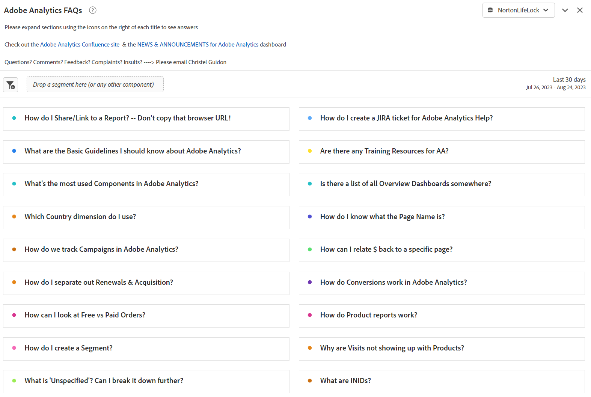
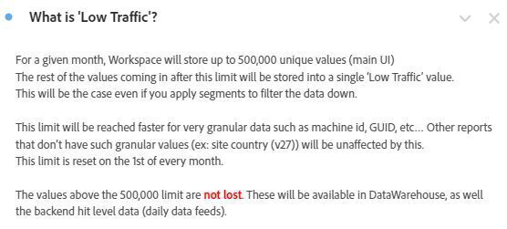
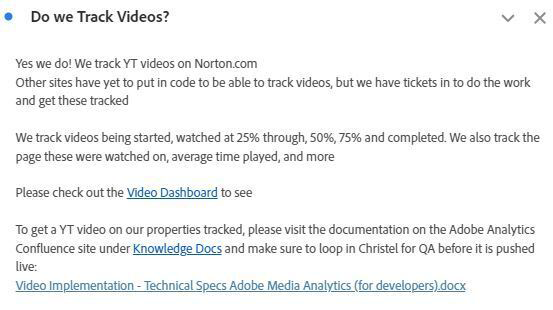
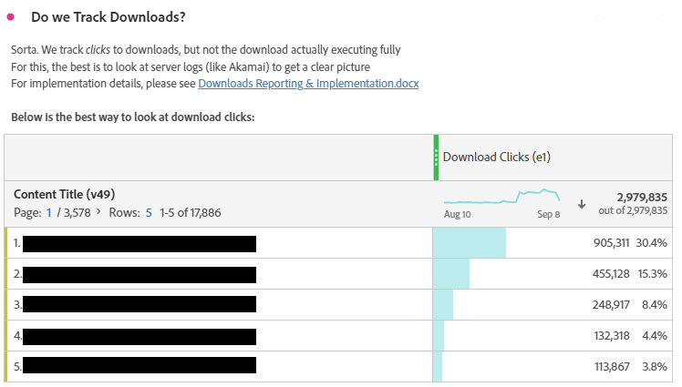
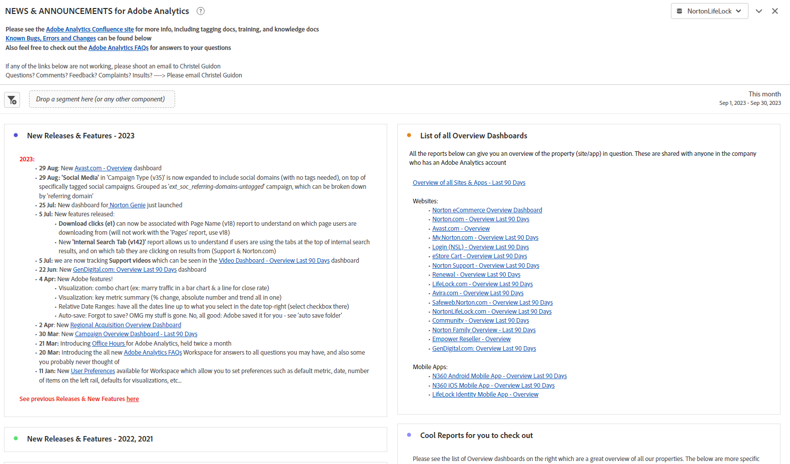
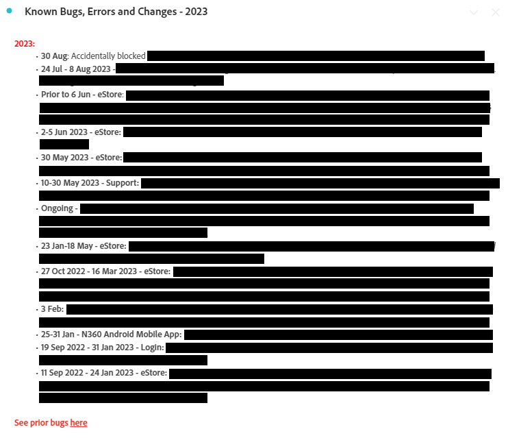

# Analysis Workspace内での運用ダッシュボードの作成

_[!DNL Adobe Analytics] Workspaceのダッシュボード機能が、コミュニケーションと効率性にどのような革命をもたらすのかを解説します。 FAQ、ニュースと通知、およびバグと機能ダッシュボードを作成して、情報の効率化、ユーザーエクスペリエンスの向上、エンゲージメントの強化を実現する方法を説明します。_

多くの管理者と同様に、[!DNL Adobe Analytics]の内部情報ハブ （Confluenceなど）を実行しています。 時間が経つにつれて、同じ質問に繰り返し答えることに飽きてしまい、常にユーザーに悩まされているようには感じることなく、ユーザーにリーチするためのよりスムーズな方法を必要としていました。 より静的な情報のリポジトリが必要でした。

ユーザーが「自分のVPNがオフになっている」、「今は読めない」などの理由で、Confluence サイトへの紹介を無視することがよくあることに気づきました。基本的に「後で読みます」というのは、読まれることはなく、同じ質問が来週も繰り返されます。

***実現ヒット：**&#x200B;Workspaceの汎用性は、画期的な機能になる可能性があります。 ユーザーはWorkspace内で素早く直接的な回答を好むので、追加の手順を避けるようにしましょう。*

まず、全社的に共有する運用ダッシュボードを作成しました。 これまでに、利用者に情報を提供し、情報を一元化し、不満を解消してきました。 これは容易に改善できるプロセスであり、時間をかけて効率を向上できます。

私がいなくても多くの良い情報を得ることができ、サイトの領域を理解し、[!DNL Adobe Analytics]がどれほどクールであるかを確認し、（私にとって重要な😊）質問が少なくなり、時間を短縮することができました。

**サイトのすべてのプロパティまたは主要領域に対してダッシュボードを作成することを強くお勧めします。** プロパティ/サイト/アプリ/フローの概要を説明し、基本的な情報と迅速なインサイトを得る必要があります。 全社で共有する必要があり、すべての利用者が手を取ることなく財産について理解することができます。 私の場合、これらのダッシュボードは通常、質問の80%に答え、貴重な時間を節約します。

これにより、Confluence サイトを維持できなくなります。これは非常に便利な状態です。 各運用ダッシュボードの上部で参照することもできます。 しかし、私はショートカットが大好きです。私にとってもユーザーにとっても

この目標達成に役立った、GenDigitalのために作成した3つのダッシュボードを順を追って説明します。

1. よくある質問（FAQ）
1. ニュース&amp;お知らせ
1. バグ、機能、メジャーリリースログ

## 1 - FAQ ダッシュボード

答えを繰り返す無限のループにうんざりしていますか？ やめろ！ FAQ ダッシュボードを作成することで、時間を節約できます。 ユーザーは質問する前に調べることもできますし、回答の中ですぐにリンクすることもできます。

タイトルとしてフォーマットされた質問と、コンテンツとして回答/説明が含まれる[&#x200B; テキストビジュアライゼーション &#x200B;](https://experienceleague.adobe.com/docs/analytics/analyze/analysis-workspace/visualizations/text.html)を作成するだけで、質問だけを表示するように折りたたまれます。 関連性ごとのグループ化（ページや商品など）やパネルを利用することができます。 よくあるクエリを最上部に配置し、シンプルなクエリを維持します。

長いメールを書いたり、古い説明を再発見したりする代わりに、FAQ ダッシュボードを更新しましょう。 今すぐ始めて、時間をかけて拡大しましょう。 ハイパーリンクを使用して、レポート内の他のダッシュボードや関連するFAQを参照できます。 他のダッシュボードからFAQにリンクすることで、必要に応じて複雑なコンテキストを提供できます。

Gen Digitalについては、FAQで基本ではなく、[!DNL Adobe Analytics]のカスタマイズされた使用方法に注目しています。 右クリックして「ビジュアライゼーションリンクを取得」を選択し、バニティ URLを共有すると、特定のFAQ リンクを電子メールで送信できます。 これはユーザーのための正確なコンテンツを強調しています。 データのイラストにはフリーフォームテーブルを使用し、「説明を編集」で説明を追加します。

FAQを包括的に理解できたら、社内で共有し、アクセスと学習を共有しましょう。 必要に応じて強化する：

FAQ ダッシュボードのスクリーンショットを以下に示します。

## 2 - ニュースとアナウンスのダッシュボード

もうひとつの有用な運用ダッシュボードは、ニュースと発表のダッシュボードです。 ユーザーに情報を伝えたいからこれを始めましたが、代わりにピン留めして迷惑をかけているように感じました。 更新が必要な方はいますか？ どのユーザーか？ パワーユーザーのみ？ 誰も読まない週刊ニュースレターを配信すべきですか？ 代わりにWorkspaceで直接アップデートを行うことで、ユーザーはログインするとすぐに更新を確認でき、私は誰も読みたいと思わない別の会社のメールを送信する必要はありません。

これらのダッシュボードは全社的に見られているため、更新がすぐに上部に表示されます。 ニュースとアナウンスのダッシュボードに含める情報の種類は次のとおりです。

- アドビ側での機能リリースとアップデート（主にコードリリース）
- [!DNL Adobe]の重要な新機能
- オフィス時間数スケジュール
- チェックアウトするすべての概要ダッシュボードとクールレポートのリスト

新機能、トラッキング、重要なダッシュボードについて説明します。 テキストレポートのハイパーリンク（または右クリックと説明の編集を介して他のレポートの上部）を使用すると、[!DNL Adobe Analytics]または[!DNL Adobe]の機能リリースページの他のダッシュボードにリンクできます。

ニュースと発表ダッシュボードは次のようになります。

## 3 - バグ、機能、メジャーリリースログ

この運用ダッシュボードの目的は、あらゆるバグとエラーを一元管理することです。 以前はExcelで管理していましたが、扱いにくく、共有しにくかったです。 Workspaceに直接配置してみましょう。

目立たなくしたい場合は、ニュースと発表のダッシュボードに統合することができます。 ただし、バグ報告が重要または重要な場合は、別のダッシュボードを使用することをお勧めします。

テキストビジュアライゼーションを使用し、箇条書き機能を使って非常にシンプルにしています。 箇条書き記号には、バグの日付とプロパティ（例：&#39;3jan23-17jan23 - Norton.com&#39;、&#39;Prior to 14sep22 - Chat&#39;）が先頭に付けられます。 詳細を追加し、短く簡潔に保つように努めています。 どのチームに欠陥があったかを示すのは避け、ユーザーが気にしていないような技術的な詳細を過剰に追加することは避けます。

最新のバグは上部に表示され、古いバグは年間テキストレポートに表示されます（例：「2022 – 既知のバグ、エラー、変更」）。すべて折りたたまれます。

何も好みません。 本当に簡単に行うことができますし、あなたは、あなたがハードドライブに保持し、Confluence上で更新し続けるそのExcel ファイルよりもはるかに良いことを認める必要があります。

他の運用ダッシュボードと同様に、ここでは概要ダッシュボードとクールレポートも参照します。 FAQへのリンクや、ニュースと告知のダッシュボードは上部に表示されています。

ログの例を次に示します。

[!DNL Adobe Analytics] Workspaceで運用用ダッシュボードを作成することは、私にとって画期的なことでした。 多くの管理職と同様に、私は社内ハブを管理し、回答の重複や効果的なユーザーコミュニケーションに苦慮していました。 そこで、動的なリポジトリを導入する必要がありました。そこで同社は、Workspaceの優れた汎用性がエンゲージメントに変革をもたらすことを認識しました。 [!DNL Adobe Analytics] Workspaceのダッシュボード機能を活用してください。 ユーザーエクスペリエンスを向上させ、時間を節約し、より整理整頓された環境を享受しましょう。 カスタマージャーニーは今から始まります。これらのダッシュボードは、効率性と使いやすさの鍵となります。

## 作成者

この文書の作成者：

**Christel Guidon**、デジタル [!DNL Analytics] プラットフォームマネージャー（Gen）

[!DNL Adobe Analytics] チャンピオン
