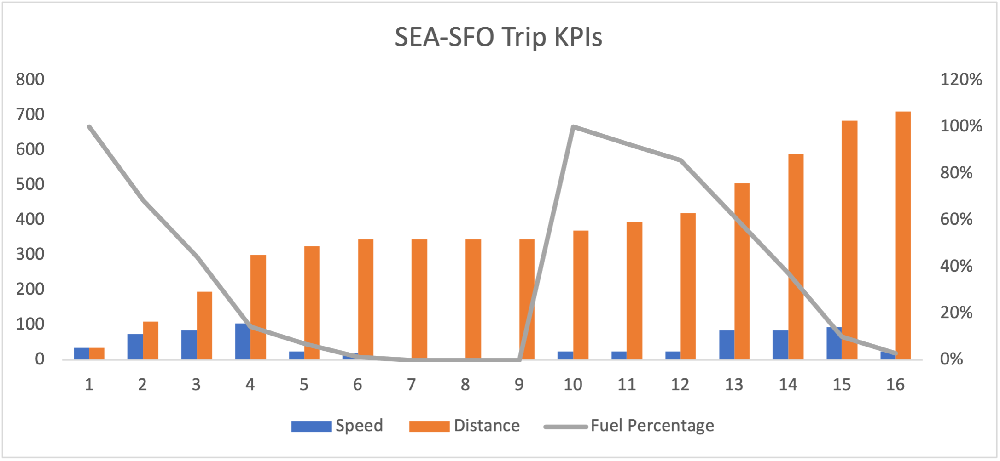
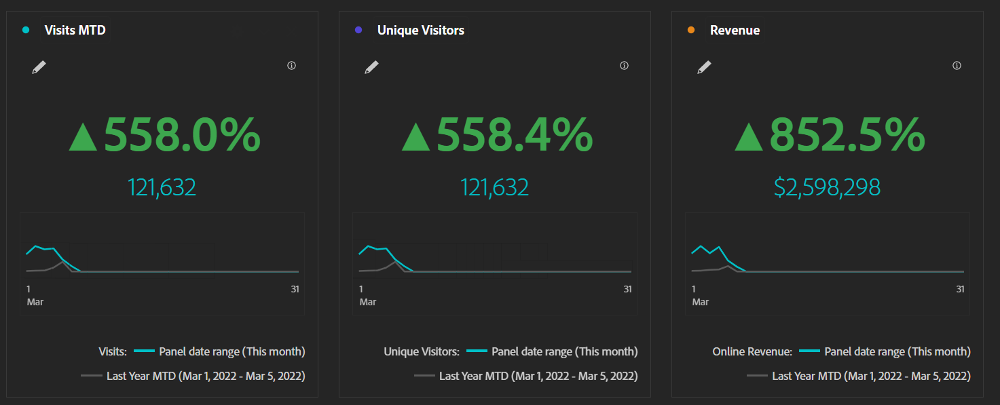
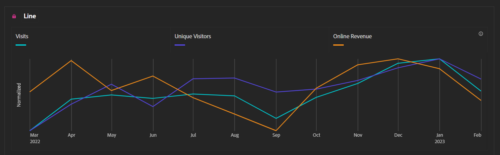

# エグゼクティブサマリーダッシュボードで成果を促進

_経営陣は、多くの場合、月次のExcel チャートを利用したり、詳細なデータに溺れたりするなど、サイトやアプリに関するタイムリーで適切な情報を欠いています。 解決策：Experience Manager Cloud ManagerのAdobe Marketo Engageのエグゼクティブサマリーダッシュボード。_

シアトルからサンフランシスコまで車で行く旅行を想像してみてください。 方向賢明で、それはかなり簡単です。 I-5を12時間から16時間南に進むと、そこにいます。 単純ですよね？ さて、私がダッシュボードの上にボール紙を置いたと想像してほしいのですが、最後にそれをお伝えします
旅行の中で、速度、燃料レベル、移動距離を示すダッシュボードが表示されます。

グラフを調べると、いくつかのことに気づくかもしれません。

1. 速度は大きく変化し、ある時点では法定速度制限を大幅に超え、ポートランドのトラフィックなどのために他の時点では本当に低くなりました

1. 移動距離は6～9時間静的です

1. これは、燃料が0%に下がり、ポートランドの交通を通過し、ガソリンタンクを補充するために沿道の支援を待たなければならなかったためです

このような旅行は明らかに悲惨で、予測不可能で、危険です。 運転する方法はない。 速度、移動距離、燃料レベルに関する継続的な情報を使用して、運転方法を継続的に調整する必要があります。 確かに、合理的な人はダッシュボードから段ボールを剥がして定期的にチェックし、旅行の時間を節約し、ガス切れのリスクをほぼ排除し、スピード違反を避けるために適切な速度で動き続けます。

では、なぜ多くの経営陣が、自社のサイトやアプリを運営する合理的な方法としてこれを受け入れるのでしょうか？

多くの経営陣では、タイムリーに対応するために必要な継続的で適切な情報にアクセスできません。 [!DNL Adobe Analytics]からExcelに統計データを書き出してグラフ化し、PowerPointに入力することで、デッキを月に1回受け取ります。 例えば、ある転換点が翌月初めに発生した場合、翌月初めに質問したり、行動を起こしたりするまで、その転換点を把握することはできません。 カスタムアラートも優れたオプションですが、経営陣のメール受信トレイがどのようなものかは誰もが知っています。

経営陣には、自身の注意が必要な状況を即座に把握できるだけの十分なデータが必要であり、不満を抱いて手を挙げることがないようにしたいと考えています。 プロダクトオーナーやマーケティングマネージャーから、経営陣が異常について知りたいと思うメッセージにアクセスできれば、その瞬間に注目が集まります。

そこで、エグゼクティブサマリーダッシュボードの出番です。 外出先でエグゼクティブサマリーダッシュボードを利用すれば、経営陣は、モバイルスコアカードを容易に詳細に分析できます。 モバイルスコアカードでは問題を警告することができますが、エグゼクティブサマリーダッシュボードでは、適切な相手から適切な質問をするのに十分な情報を得ることができます。

多くの経営陣は、約3つのKPIに深い関心を抱いています。 小売業界では、注文、売上、AOVなどが多くあります。 B2Bでは、リード、リード品質、コンバージョン率です。 サービス部門は、訪問、予約、再訪問者に関心を持つ可能性があります。 3つの値が何であれ、前年比で変化した大きな太字の数字とグラフに入れましょう。 「主要指標の概要」のビジュアライゼーションを使用すると、次のことが簡単にできます。

同じ3つの指標に過去のデータを追加することで、長期的なトレンドを容易に把握できます。

組織にとって重要な機能に対して、いくつかのドロップダウンを追加します。 一般的に、デバイスタイプとマーケティングチャネルが優れていると感じています。

![ ソーシャル [!DNL Campaign]s.png](assets/social-campaigns.png)

これらは全体的にかなり重要ですが、常に、選択したものがサイトやアプリに関連していることを確認してください。

最後に、下部に詳細を追加します。 経営陣から人気のあるページパフォーマンスとは思いますが、重要なのは、アバブザフォールドが下部にあることです。 必要であればそれを探し出すこともできますが、そうでない場合は、すぐに質問するために必要なデータを入手できます。

最終製品を用意したら、次のことが必要です。

- 上級管理職にその読み方をトレーニングする

- フィルターの使用方法をトレーニングする

- 基本的なドリルダウンの方法について、チームをトレーニングする

- データを活用できるようになると、経営陣から多くの質問を受けることになります

まとめると、エグゼクティブサマリーダッシュボードでは、タイムリーな意思決定のために、継続的かつ関連性の高い情報が提供されます。 Excel グラフを利用した月次デッキだけでは不十分で、詳細なデータを過剰に提供すると、経営陣の負担が増大する可能性があります。 幸せな方法は、過去のデータと関連する要因のドロップダウンにより、最も重要な3つのKPIに焦点を当てることです。 トレーニング
経営陣はダッシュボードの活用方法について、情報にもとづいた意思決定をおこない、質問することができます。 概要ダッシュボードを利用すれば、サイトとアプリのパフォーマンスを改善し、ビジネスの成功を促進できます。

## 作成者

この文書の作成者：

**Gitai Ben-Ammi**、Concentrix Catalyst プリンシパルコンサルタント

[!DNL Adobe Analytics] チャンピオン

