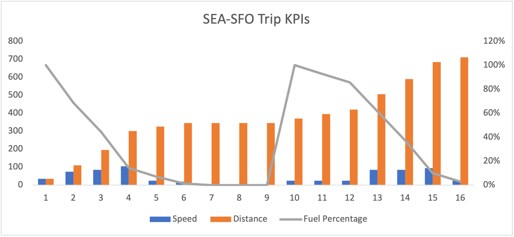

# エグゼクティブサマリーダッシュボードで成功を推進

_経営陣は、毎月のエクセルチャートに頼ったり、きめ細かいデータに溺れたりして、サイトやアプリのタイムリーで関連性の高い情報を欠いていることがよくあります。 解決策：Experience ManagerCloud Managerarcheto Engagexecutive 概要ダッシュボード_

シアトルからサンフランシスコまで車で行くことを想像してほしい。 方向に関しては、それは非常に簡単です。 12 時間から 16 時間 I5 南部に乗り込むと、そこにいます。 シンプルだろ？ さて、私があなたのダッシュボードの上に段ボールを置いたことを想像してほしいのですが、最後にそれを言います
旅の途中には、スピード、燃料レベル、移動した距離を示すダッシュボードが届きます。

グラフを調べると、次のことに気付くかもしれません。

1. あなたのスピードは、ポートランドのトラフィックのようなことのために、いくつかの点で法的な速度制限を超えて、大幅に変化し、他の点で本当に低かった

1. 移動距離は時間 6 ～ 9 の間静的です

1. これは、燃料が 0% に下がり、ポートランドの交通を通過してガスタンクを補充するために道端の援助を待つ必要があったからです

そのような旅は明らかに悲惨で、予測不可能で、危険です。 運転なんて無理だ。 運転方法を継続的に調整するには、速度、移動距離、燃料レベルに関する継続的な情報が必要です。 確かに、合理的な人はダッシュボードから段ボールを引き剥がして定期的にチェックし、旅行時間を短縮し、ガス欠のリスクをほぼ排除し、スピード違反のチケットを避けるために適切な速度で移動し続けます。

それでは、多くのエグゼクティブが、自社のサイトやアプリを実行する合理的な方法としてこれを受け入れるのはなぜでしょうか。

多くの経営幹部は、タイムリーにアクションを実行するために必要な、継続的で関連性の高い情報にアクセスできません。 代わりに、月に 1 回、[!DNL Adobe Analytics] から Excel にエクスポートされた統計を含むデッキを受け取り、グラフ化してから、PowerPoint にアップロードします。 1 か月の早い時期に変曲点が発生した場合、質問やアクションを実行できるようになった後、翌月の初めまで変曲点について把握できません。 カスタムアラートも優れたオプションですが、exec の電子メールインボックスがどのように表示されるかを誰もが知っています。

エグゼクティブには、すぐに注意が必要なタイミングを把握できる十分なデータを用意してもらいたいと考えています。腹立たしく思って手を放すほどではありません。 製品所有者またはマーケティングマネージャーから、経営幹部が異常値について知りたいメッセージが表示された場合は、スイートスポットに到達しています。

ここで、エグゼクティブサマリーダッシュボードがハッピーメディアとして表示されます。 モバイルスコアカードは、外出先で経営幹部に簡単にチェックインするのに最適ですが、エグゼクティブサマリーダッシュボードを使用すると、エグゼクティブがデスクにいるときに簡単に少し深く掘り下げることができます。 モバイルスコアカードでは、ユーザーに問題を警告できますが、エグゼクティブサマリーダッシュボードでは、適切なユーザーから適切な質問をするのに十分な理解が得られます。

ほとんどのエグゼクティブは、深く関心を寄せている KPI を約 3 つ持っています。 小売では、注文、売上高、AOV の場合があります。 B2B の場合、リード、リード品質およびコンバージョン率。 サービスは、訪問、予定、再訪問者に興味を持つ場合があります。 3 つが何であれ、それらを大きくて太字の数字に入れて、前年比の変化とグラフを持ちます。 主要指標の概要のビジュアライゼーションを使用すると、これを非常に簡単に実行できます。

これら同じ 3 つの指標の履歴データを追加することで、長期的な傾向を簡単に確認できます。

組織にとって重要なものについては、いくつかのドロップダウンを追加します。 デバイスタイプとマーケティングチャネルは通常、良い賭けです。

![Social [!DNL Campaign]s.png](assets/social-campaigns.png)

これらは両方とも非常に重要ですが、いつものように、選択したものがサイトやアプリに関連していることを確認してください。

最後に、下部に詳細を追加します。 ページのパフォーマンスはエグゼクティブに人気があることが多いですが、重要なのはパフォーマンスが慎重であることです。 必要に応じてシークすることもできますが、それ以外の場合は、すぐに質問する必要があるデータが用意されています。

この最終的な製品を手に入れるには、以下が必要です。

- 読み方について専門家を訓練する

- フィルターの使用方法について学習します

- 基本的なドリルダウン方法を学習させる

- コーヒーを飲んで準備しましょう。データを使用できるようになると、エグゼクティブが多くの質問を持って来るからです

最後に、エグゼクティブサマリーダッシュボードは、タイムリーな意思決定に役立つ継続的で関連性の高い情報を提供します。 Excel のグラフを使用した月次のデッキは不十分で、精度の高いデータを提供しすぎると、経営幹部が圧倒される可能性があります。 幸せな手段は、履歴データと関連要因のドロップダウンを含む 3 つの最も重要な KPI に焦点を当てることです。 トレーニング別
ダッシュボードの使用方法に関するエグゼクティブは、十分な情報に基づいた意思決定を行い、質問することができます。 エグゼクティブサマリーダッシュボードを使用すると、サイトとアプリのパフォーマンスを向上させ、成功を促進できます。

## 作成者

このドキュメントの作成者：

**Gitai Ben-Ammi**、Concentrix Catalyst 主任コンサルタント

[!DNL Adobe Analytics] チャンピオン

