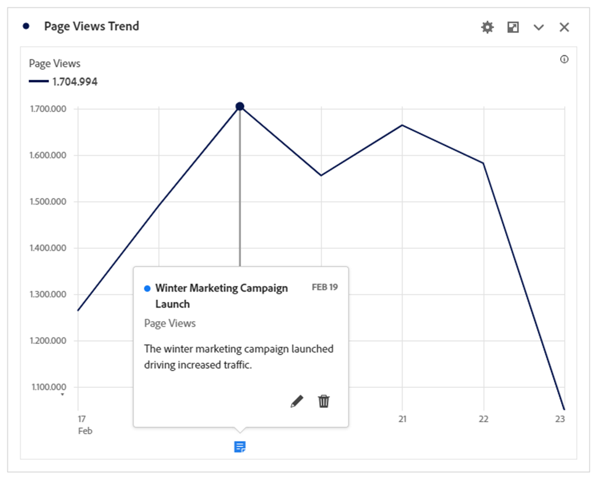
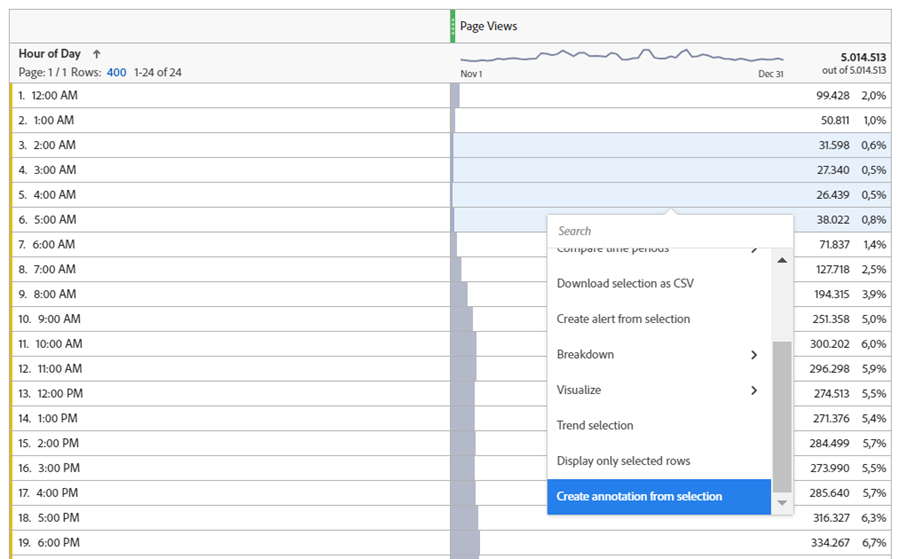
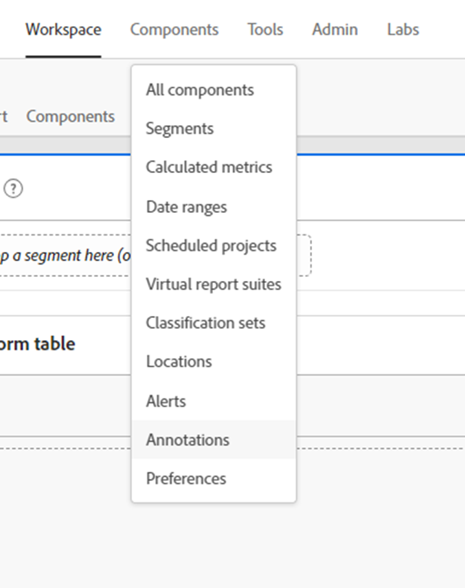
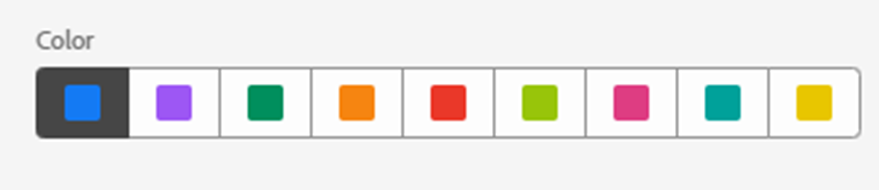
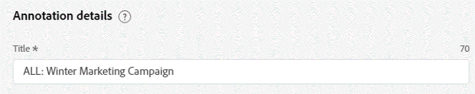
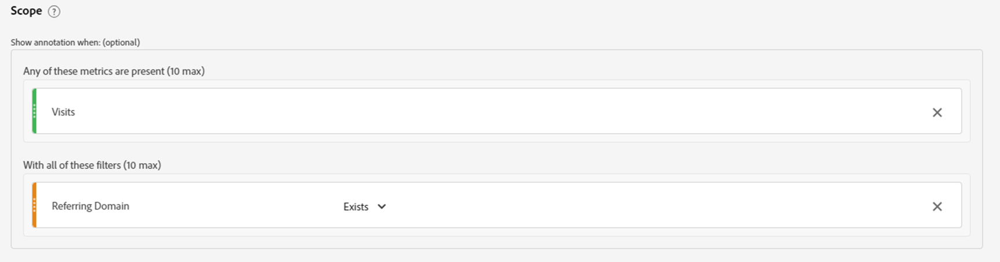
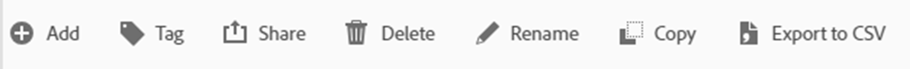
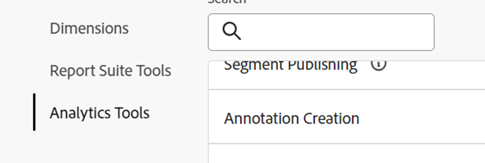

# 分析insightを活用し、注釈の力を活用

注釈データコンポーネントは、Adobe Analysis Workspaceで提供される最もシンプルな機能のひとつですが、長期的には、最も時間を節約する機能のひとつです。 Workspaceの他の機能とは異なり、この機能は、ユーザーや他のWorkspace ユーザーの物語の歴史的な記憶として機能します。

簡単に言えば、注釈とは、Adobe Workspace内の最新のトレンドデータに追加できる簡単な説明テキストです。 Annotationsは、企業のデータ履歴を理解する際にAnalysis Workspaceを使用するすべてのユーザーにコンテキストを提供し、パフォーマンスをより迅速に分析し、すべてのレポートに高度にカスタマイズされた雰囲気を提供します。

## ユースケース

注釈が特に便利な場合は、複数の状況があります。

- **異常値（ピークとトラフ）** – 傾向データの主なピークとトラフの理由を知っている場合は、異常値データポイントをすばやく右クリックし、「選択項目に注釈を付ける」を選択して、その知識を全員と共有します。

- **主要マーケティングキャンペーンとテスト** - マーケティングキャンペーンとテスト（A/B、多変量分析など） トラフィックとパフォーマンスに直接影響を与える可能性があるため、全員がAnnotationsでキャンペーンやテストのタイムフレームを文書化することは簡単にメリットです。

- **外部要因とイベント** – 大規模な1回限りの出来事から、競合他社の行動、新製品のリリース、関連するグローバルまたは国内のイベントまで、データに関連する外部要因を注釈に必ず追加してください。

- **ギャップとエラー** - アラート機能を使用して、データ収集の潜在的な問題を警告する必要がありますが、最も経験豊富なチームでも、残念ながら、データ収集エラーや一時的なギャップが発生することがあります。 注釈は、データが不足しているか不完全であることをユーザーに知らせることで、影響を最小限に抑えるための優れた方法です。

## ハウツー

注釈の作成と編集は直感的で、ほぼ自明です。 日付傾向ビジュアライゼーションまたはフリーフォームテーブル内のデータポイントを右クリックし、「選択範囲に注釈を付ける」を選択して注釈を作成するか、メインナビゲーションの「コンポーネント/注釈」を使用して注釈を作成および編集します。

{width="70%"}{width="30%"}

注釈の仕組みについて詳しくは、[Experience Leagueのビデオチュートリアルを参照してください](https://experienceleague.adobe.com/ja/docs/analytics-learn/tutorials/analysis-workspace/navigating-workspace-projects/annotations-in-analysis-workspace)。

## スタートガイド

最後に、すぐに注釈を使い始めるための便利なヒントをいくつか紹介します。  これらの提案を使用すると、すべてのユーザーに対して効果的で明確かつ有益な注釈を作成できます。

- **カラーコーディング** - 「注釈」機能では、Workspace プロジェクト内に表示される様々な色の範囲から選択して、様々な種類の注釈を区別できます。 複数の異なるサイトやアプリを測定する場合は、それぞれに異なる色を選択できます。 または、注釈のカテゴリごとに異なる色を指定することもできます。

- **タイトルのラベル付け** - ユーザーが注釈に関する視覚的な手がかりを簡単に得られるためのさらなる方法は、注釈のタイトルにラベルを付けることです。 カラーコーディングと同様に、組織のデータ構造に応じて、チャネルや名前（WEB、APP、ALL）などの異なるラベルを選択できます

- **スコープ** – 注釈を作成する場合、適切なコンテキストで注釈を表示するために、ディメンション、指標、およびリミッターの全範囲を自由に使用できます。 一部の注釈は特定のディメンションまたは指標にのみ関連しているため、対応するディメンションまたは指標に注釈を表示するタイミングを制限できます。

- **別名で保存** – 注釈を1つまたは2つ作成したら、テンプレートとして再利用して、時間を節約する「別名で保存」オプションを使用して、新しい注釈を作成できます。

- **注釈マネージャー** - メインナビゲーションの「コンポーネント/注釈」を使用して、注釈マネージャーにアクセスします。注釈を作成し、特に編集するためのより広範な機能が見つかります。

- **権限 –**&#x200B;注釈を作成する機能がない場合は、Admin Consoleで「注釈の作成」を許可できる管理者にお問い合わせください。

詳細なドキュメントについては、[注釈の概要](https://experienceleague.adobe.com/ja/docs/analytics/analyze/analysis-workspace/components/annotations/overview)と関連する記事を参照してください。

## 作成者

この文書の作成者：

トーマス・エドワード・バックリー、Data Warehouse&amp;Business Intelligence・アット・マイルズ&amp;モアのマネージャー（ルフトハンザグループ）
