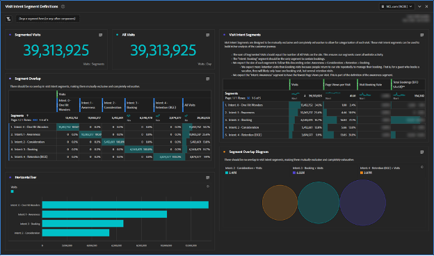
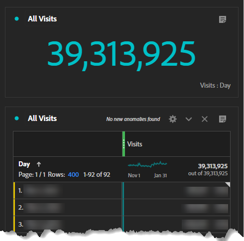

# カスタマージャーニーセグメントの作成

で行動ベースのカスタマージャーニーセグメントを作成する方法を説明します。 [!DNL Adobe Analytics] を使用して顧客体験を向上させる [!DNL Adobe] Experience Cloud（この詳しい手順ガイドに従って）

より優れたカスタマージャーニーセグメントを作成しましょう。 このシリーズでは、 [!DNL Adobe Analytics] を使用して、行動ベースのセグメントを定義し、オーディエンスのサイズを推定して、ユーザーの動きを追跡します。 最終的には、メディアをパーソナライズし、顧客体験を向上させることができます。 [!DNL Adobe] Experience Cloud。 これらのセグメントは既に存在し、顧客に関する詳細情報を確認する際に更新する必要があることに注意してください。 レポートにはいくつかの課題がある場合がありますが、ご心配はおかず、ご案内します。 まず、「1 ヒットの驚異」セグメントから始まる、最初の顧客ジャーニーセグメントのセットを作成します。

今日は、最初の顧客ジャーニーセグメントのプレースホルダーを作成し、 [!DNL Adobe Analytics] ワークスペースを使用して、セグメントを定義し、最初のセグメントである「One Hit Wonders」を定義します。

このシリーズを最後までに、でカスタマージャーニーセグメントを作成できるようになります。 [!DNL Adobe Analytics] 行動のシグナルに基づいて ジャーニーの各ステージで各オーディエンスのサイズを推定し、ユーザーがこれらのステージ間をどの程度移動しているかを把握できます。 また、これらのカスタマージャーニーオーディエンスをに書き出すことができます。 [!DNL Adobe] Experience Cloudでパーソナライゼーションとメディアのターゲティングを有効にします。

各ビジネスは異なります。つまり、カスタマージャーニーのセグメントは、自分のセグメントとは異なります。 したがって、セグメントに対して特定の数式を規定するのではなく、見るべき点とそれを構築する全体的なプロセスを提案します。

また、カスタマージャーニーのセグメントは生きているセグメントになることに注意する必要があります。 これは、1 回限りの練習ではありません。 顧客に関する詳細情報を確認したら、これらのセグメントを更新します。 これは、レポート作成に関するいくつかの課題を示します。 ユーザーは、レポートの一貫性を求めています。セグメント定義が変更されると、レポートの数値も変更されます。

## 訪問の目的セグメントを使い始める

カスタマージャーニーセグメントを構築する最初の手順は、行動シグナルと、可能な場合は顧客の声データを使用して、ゲストが Web サイト上にいる理由を推測することです。 一連の訪問目的セグメントを作成して、Web サイト上のすべての訪問を分類します。 この時点で、訪問インテントセグメントは、相互に排他的で完全に網羅的である必要があります。 各訪問は、1 つの（1 つの）訪問目的セグメントにのみ属する必要があります。

訪問目的セグメントは訪問を表すので、セグメント定義で訪問コンテナを使用します。

訪問の目的に関する最初のセグメントセットに含まれていたもの：

* 驚異に打ち勝つ
* 認識
* 考慮事項
* 予約（購入）
* 定着（予約/購入の管理）

訪問の目的セグメントを使いやすくするために、セグメント名の先頭に「目的：」を付け、並べ替えを有効にする数を付け、それらに「目的」とタグ付けしました。 私のセグメントは下の図のようになりました。

**先に進み、ページビュー数 >= 1 のプレースホルダー定義を使用して、訪問コンテナを使用して訪問目的セグメントを作成します。**

このように、これらのセグメントを構築するプロセスは、反復的で相互に連結されたプロセスです。 これらのセグメントを今後の投稿で構築するプロセスについて説明します。

## 訪問インテントセグメントデータ品質ワークスペース

単純なワークスペースを使用して、訪問インテントセグメントを適切に定義していたことを確認しました。 各訪問は、1 つの（1 つの）訪問目的セグメントにのみ属する必要があります。 設定したワークスペースは、すべての訪問が計上され、セグメント間に重複がないことを確認します。

このワークスペースの名前を「データ品質：訪問目的セグメント」、「データ品質」、「訪問目的」、「カスタマージャーニー」というタグで「データ品質：訪問目的セグメント」にしました。 後で、「訪問インテントダッシュボード」が作成されるので、「DATA QUALITY」というプレフィックスは、このワークスペースがセグメントを設定および管理するためのものであることを示します。 これは、ビジネスインサイトがかなり少ない管理ダッシュボードですが、セグメントを確実に維持するために重要です。 セグメントが正しく定義されていることを確認するために、定期的にこのダッシュボードに戻るか、アラートを設定することをお勧めします。

このワークスペースで最も重要なビジュアライゼーションは、左中央にあるセグメントの重複フリーフォームビジュアライゼーションです。 訪問回数指標を使用して、各訪問の目的セグメント用に列フィルターを作成し、最右列にすべての訪問回数セグメントを作成します。 左側に各訪問の目的セグメントの行を作成します。 これで、クロスタブビジュアライゼーションが表示されます。 セグメントが正しく設定されると、各訪問の目的セグメント自体との積集合に、1 列と 1 行のデータのみが存在します。

次に重要なビジュアライゼーションは、左上の概要指標です。 セグメント化訪問数の概要では、その値はセグメントの重複ビジュアライゼーションのすぐ下にある「すべての訪問回数」列から取得されます。 すべての訪問回数の概要には、独自の非表示テーブルがあります。

右上で、各セグメントに指標を追加し、セグメントがどのように形成されているかに関する「風味」を付け加えました。 特に、これらのセグメントは相互に排他的なので、予約目的セグメントの予約のみが表示されます（そうではありません。訪問目的セグメントを訪問者ベースにすると、コンバージョン率に達します）。

プレースホルダーセグメントを作成しました。 最初は、ワークスペースが不思議に見えます。 すべての訪問意図セグメントは同じ定義を持つので、100%と重複します。 これは正しく、プロセスのこの時点での表示内容に正確に一致します。 セグメント定義を作成すると、これらのセグメントが形成され始めるのがわかります。

## 初回訪問インテントセグメントの作成

訪問意図セグメントの定義は、少し削除のプロセスで、両者の間に多くの相互依存関係があります。 私はこのようなセグメントをジャーニーの順序で構築するのではなく簡単に定義できるものから最も困難なものまで順に構築しました それが私に次の命令を与えた。

1. 目的： 0 - 1 ヒットの驚異
1. 目的： 3 — 予約
1. 目的：4 — リテンション
1. 目的： 2 — 検討
1. 目的： 1 — 認識

かなりランダムだな？ これらの訪問の目的セグメントを定義するのは、繰り返しの、前後の、プロセスで、多くの場合、1 つのセグメントに対する調整で、他のセグメントに対する更新が必要になりました。 これは、これらの各セグメントを定義する方法を説明すると、より明確になります。

今日は、最初で最も簡単なセグメント、「1 ヒットの驚異」を定義します。

## One Hit Wonders セグメントの作成

最初のセグメント「ワンヒットワンダー」は簡単に定義できました。 1 つのページビューのみを持つ任意の訪問です。 そのユーザーがなぜウェブサイトにいたのか私たちは本当に分かりませんバウンスしたのです エントリページに基づいて意図を推測できると思いますが、1 つのページビューでは、意図を十分な情報に基づいて推測するのに十分な情報が得られないだけです。

このセグメントを定義した後、訪問インテントワークスペースが形成され始めます。

を使用したカスタマージャーニーセグメントの作成 [!DNL Adobe Analytics] 難しいけれどやりがいのあるプロセスです。 行動ベースのセグメントを作成し、オーディエンスのサイズを推定し、ユーザーの動きを追跡することで、ビジネスはメディアをパーソナライズし、顧客体験を向上させることができます。 各ビジネスは一意で、セグメントを作成するための具体的な数式はありませんが、ガイドラインと従うプロセスがあります。 セグメントは、企業が顧客に関する詳細情報を得たら更新する必要があります。この情報は、レポートに関する課題を示します。 訪問目的セグメントを作成するプロセスに従うことで、企業は全体的な顧客体験を向上させることができます。

## 作成者

このドキュメントの作成者：

**アロンフォッサム**, Director, Digital [!DNL Analytics]

[!DNL Adobe Analytics] チャンピオン
