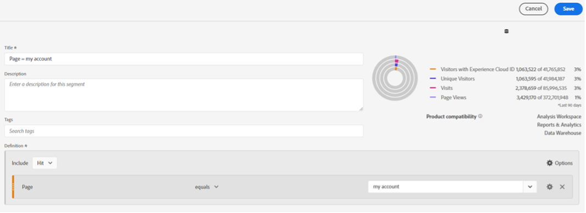

# Analysis Workspaceでのセグメントビルダーとクイックセグメントの違い

セグメントは、データ分析ツールキットで最も強力なツールの 1 つになる可能性があります。 効率化のために、Analysis Workspaceでのセグメントビルダーとクイックセグメントを使用する場合の違いについて説明します。

>[!TIP]
>
> ページの下部にある画像をクリックすると、Analysis Workspaceの各ツールを使用するタイミングに便利なリマインダーをダウンロードできます。

セグメントは、データ分析ツールキットで最も強力なツールの 1 つになる可能性があります。 トラフィック、サイトセクション、カスタマージャーニーの特定のグループを確認する場合、セグメントを使用すると、サイトへのトラフィックの特定のサブセットに分析の焦点を合わせることができます。 小売環境から作成した、最も役立つセグメントのいくつかは、新規顧客と既存顧客、アカウントにログインした顧客とゲストなど、様々なタイプの顧客グループに対するものです。 ただし、これらは、様々なサイトセクション、特定のアクションを実行する顧客、その他の考えられる要素に対しても作成できます。

**セグメントを作成する主な方法には、次の 2 つがあります。**

* コンポーネントメニューでのセグメントビルダーの使用
* パネルの上部にあるクイックセグメントの使用

セグメントビルダーを使用してセグメントを作成すると、保存して、他のプロジェクトで再利用できます。 これは、サイトの特定のセクションにアクセスしてから購入する人物など、特定の顧客グループに焦点を当てることができる優れた方法です。 一方、探索的分析を行っていて、様々なセグメント設定をテストする場合は、クイックセグメントビルダーを使用すると便利です。 それぞれの方法の主なメリットをいくつか見てみましょう。

## クイックセグメント

各パネルの上部にあるクイックセグメントアイコン（+記号の付いたファネル）をクリックして、ビルダーを開くことができます。 これにより、最大 3 つの条件を使用して、任意のレベル（ヒット、訪問、または訪問者）でセグメントを作成できます。 これにより、メインのセグメントビルダーと同様に、データを返しているセグメントと、セグメントに含まれる全体的なトラフィック母集団の割合が右側に示されますが、これはセグメントビルダーに表示される完全なセグメントボリュームビューよりも簡略化されたバージョンです。 複数の条件を追加する場合は、「and」演算子と「or」演算子を使用できます。 ただし、クイックセグメントには「then」オプションがないので、順次セグメントが必要な場合は、完全なセグメントビルダーを使用する必要があります。 また、クイックセグメントには、コンテナが 1 つという制限もあります。 これは、迅速に作成および編集できる基本的なセグメントに使用することを目的としているからです。 クイックセグメントをパネルに適用したり保存したりすると、パネル内で編集できなくなります。

探索的分析を行う際に、様々なタイプのセグメントをテストして、様々な顧客グループの反応や様々なカテゴリのパフォーマンスを確認する場合、クイックセグメントを使用すると、セグメントビルダーを使用するよりもはるかに高速になります。 また、これらのセグメントは、作成元のプロジェクトでのみ使用できるので、必要な結果が得られないことが判明した場合でも、マスターリストから保存したセグメントを削除することについて心配する必要はありません。 セグメントをテストした後で、それが他のプロジェクトで役立つことに気付いた場合は、常に「ビルダーを開く」ボタンをクリックして完全なセグメントビルダーでセグメントを開き、通常のセグメントとして保存できます。 ただし、これを行うと、クイックセグメントビルダーで編集できなくなります。

## セグメントビルダー

セグメントビルダーにアクセスするには、左側のコンポーネントメニューのセグメントリストの上にある+記号をクリックするか、コンポーネントのドロップダウンをクリックして「セグメントを作成…」を選択します。クイックセグメントとは異なり、すべてのオプションを使用できます。 複数の条件を追加する場合は、「then」演算子を使用して順次セグメントを作成できます。 順次セグメントでは、（ヒット、訪問または訪問者の代わりに）「論理グループ」をレベルとして使用することもできます。 また、セグメントビルダーを使用すると、セグメントに説明を追加できます。これにより、セグメントを作成したユーザーやフィルターに作成したデータのタイプに関するコンテキストを追加したり、組織的な目的でセグメントに「タグ」を追加したりできます。どちらもクイックセグメントビルダー内では使用できません。

コンテナを使用する必要がある場合や順次セグメントが必要な場合、セグメントに 3 つ以上の条件を設定する際は、セグメントビルダーの使用が不可欠です。 完全なセグメントビルダーには、より複雑なセグメントを作成するための多くのオプションが用意されており、様々な顧客タイプ、カテゴリ、カスタマージャーニーなどを分類するのに役立ちます。 これらのセグメントを作成して保存すると、セグメントのマスターリストに追加されます。つまり、タグ付け、承認、共有、複数のレポートでの使用、Experience Cloudへの公開を行うことができます。 Experience Cloudで公開すると、パーソナライゼーションターゲティング用の [!DNL Adobe] Target など、他の [!DNL Adobe] 製品でセグメントを使用できます。 セグメントビルダーで作成したセグメントは、クイックセグメントパネルでは編集できません。変更するには、セグメントビルダーを開く必要があります。 幸いにも、右側のプレビュービジュアライゼーションでは、過去 90 日間にセグメントで発生したトラフィックをより詳細に分析できます。つまり、保存する前に、セグメントで発生している目的のトラフィックを確認するのが簡単になります。

## ユースケース

業界が異なれば、カスタムセグメントを作成する用途も異なる場合があります。 大規模小売業者の e コマース部門で作業していると、探索的分析を実行して、顧客が購入に至るまでの経路を特定することがよくあります。 買い物かごへの製品の追加や注文などのアクションで急増や急減が見られる場合、クイックセグメントを使用すると便利です。 分析中に、特定のタイプの顧客に対するセグメントや、顧客がクリックする特定のアクション/リンクに対するセグメントをすばやく作成できます。 セグメントビルダーを開いて各セグメントを保存する必要がないので、条件をすばやく追加して、同じようにすばやく削除できます。 これにより、サイトに変更が表示される理由を説明する際に多くの時間を節約できます。

または、セグメントビルダーが頼りになる場合もあります。 すべての顧客が同じというわけではありません。多くの場合、特定のタイプの顧客を、その顧客のアクションや経路によって特定する必要があります。 セグメントビルダーを使用することで、複数のアナリストが共有して使用できるように、複数の条件を追加して様々なタイプの顧客を特定し、セグメントを保存できます。 レポート間でこれらのタイプのセグメントの一貫性を保つことが重要です。そのため、結果が異なる場合があるので、各自が独自のバージョンを作成するよりも、誰もが使用できるように作成する方がよいでしょう。

全体的に、クイックセグメントとセグメントビルダーは両方とも、分析で使用する優れたツールです。 それぞれに目的、メリット、デメリットがあります。 クイックリファレンスガイドについては、以下の便利なダウンロード可能なヒントとコツのシートを確認してください。

## 作成者

このドキュメントの作成者：

**Mandy George** （Best Buy Canada 社、デジタルアナリスト III）

Adobe Analytics チャンピオン

## ダウンロード

[] （assets/[!DNL Adobe]_[!DNL Analytics]_&#x200B;Segments_Vs_Segment_Builder_Reference_Guide.pdf）
