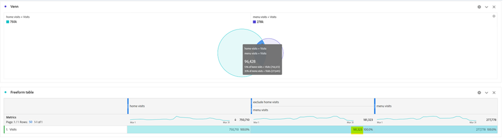

# 次は、セグメントを使用してAnalysis Workspaceで新しいインサイトを見つけてください

新規 [!DNL Adobe Analytics] ユーザーでも経験豊富なプロでも、Analysis Workspace プロジェクトでセグメントを非常に活用できます。 [[!DNL Adobe] Experience League](https://experienceleague.adobe.com/docs/analytics/components/segmentation/seg-overview.html?lang=ja) では、「セグメントを使用すると、特性や web サイトでのインタラクションに基づいて訪問者のサブセットを識別できます」と説明されています。 この機能の基本的な結果は、サイトへのユーザー、訪問、ヒットのグループを分離することを意味しますが、自分のような頭の良いアナリストは、このツールでクリエイティブになり、サイトアクティビティに関するインサイトを得る新しい方法を見つけることができます。 選択肢は多数あります。ぜひ自分で作ってみてください。また、Experience League上の [[!DNL Adobe Analytics]  コミュニティ ](https://experienceleaguecommunities.adobe.com/t5/adobe-analytics/ct-p/adobe-analytics-community?profile.language=ja) や [#MeasureSlack](https://www.measure.chat/) コミュニティなどのコミュニティで、自分の組織やオンラインの他のユーザーと共有してみてください。

セグメントの作成方法に関する簡単な復習が必要な場合は、Analysis Workspaceでの [ セグメントビルダー ](https://experienceleague.adobe.com/docs/analytics/components/segmentation/segmentation-workflow/seg-build.html?lang=ja) の使用に関するExperience Leagueドキュメントを参照してください。

## セグメントの比較と対比

Analysis Workspaceでは、「[ セグメント比較 ](https://experienceleague.adobe.com/docs/analytics/analyze/analysis-workspace/panels/segment-comparison/segment-comparison.html?lang=ja)」を使用して 2 つのセグメントを比較できます。 セグメント比較は、左側のナビゲーションバーの「パネル」セクションで確認できます。

ただし、エンドユーザーに主要なインサイトを提供するために、比較の完全なパネルを必要としない場合もあります。 ありがたいことに、一部の機能は標準パネルでも比較できます。

[ ベン図ビジュアライゼーション ](https://experienceleague.adobe.com/docs/analytics/analyze/analysis-workspace/visualizations/venn.html?lang=ja) は、簡単な比較を作成するのに役立ち、カーソルを合わせて、重複するセッション、注文、ユーザーなどを確認できます。 2 ～ 3 個のカスタムセグメント。 また、重複するセクションを右クリックして、セグメントをすばやく作成することもできます。

重要な情報は、重複するデータではなく、重複しないデータである場合があります。 これを簡単に確認するには、1 つのセグメントのコピーを作成し、「除外」セグメントにします。

「除外」セグメントを比較の他のセグメントと積み重ねることで、同じセッションでホームページも表示せずに、メニューページにヒットした訪問回数をすばやく計算できるようになりました。

## スタック攻撃

同様に、任意のセグメントを積み重ねるだけで、ベン図の交差データを作成できます。 スタックするセグメントや個々のディメンションの数に制限はありません。 例えば、先月の曜日を携帯電話、特に Samsung Galaxy A52s でサイトを訪問した際に、メニューと栄養のページは表示されながらホームページは表示されなかったものをすばやく確認したい場合は、次のように、その場ですばやく作成できます。

さらに良いことに、ユーザーや訪問ベースの完全なサブセットを見つけたら、これらの値をすべて選択して右クリックし、即座にセグメントを作成できます。

1 つのセグメントで大きな力を発揮します。

## 多数のセグメントに対応する数値のセグメント

多くのユーザーは、セグメントを作成する際に、呼び名、序数、間隔の値を調べます。例えば、訪問されたページ、ユーザーの年齢範囲、ユーザーが過去に訪問した回数などを調べます。 ただし、組織の標準ディメンション、標準指標、カスタム変数および指標のいずれであっても、これらの値をバケット化することで、セグメントを作成する際に比率データを使用できます。

例えば、ページでの滞在時間や訪問あたりの滞在時間には、次の事前定義済みバケットがあります。

ただし、これらは組織のニーズに常に適合するとは限りません。おそらく、サイトのほとんどの訪問時間が 10 分未満で実行されます。 詳細な測定を使用して、異なるサイズのバケットを作成できます。 次に、1 分、1 秒から 1 分、30 秒の間に持続する訪問を見るために作成されたものを示します。

作成したら、カスタマイズした様々なバケット化されたタイムグループ別に、訪問、注文、その他のイベントを確認できるようになりました。

主要業績評価指標（KPI）の変化を、ユーザーの滞在時間、訪問でのページ数、過去の訪問回数、その他の数値の要因として調べることも可能です。基本的に、別の指標の要因として指標を調べることができます。

セグメントを使用して新しいインサイトを見つける可能性は無限にあります。 これは出発点にすぎません。 自分で試してみて、発見したものをコミュニティに知らせてください。Experience League上の [[!DNL Adobe Analytics]  コミュニティ ](https://experienceleaguecommunities.adobe.com/t5/adobe-analytics/ct-p/adobe-analytics-community?profile.language=ja) または [#MeasureSlack](https://www.measure.chat/) コミュニティ。

セグメント化が完了しました。

## 作成者

このドキュメントの作成者：

**Dan Cummings**、シニアプロダクトエンジニアリング担当 [!DNL Analytics] マネージャ、McDonald&#39;s Corporation

[!DNL Adobe Analytics] チャンピオン
