# カーテンの背後にある魔法：複雑なセグメント：除外、コンテナ、アトリビューション

_複雑なデータ セグメンテーションの複雑さを明らかにし、除外、コンテナ、アトリビューションモデルを探ります。 魔法使いの手の振る舞いのように、これらのテクニックを習得することで、アナリストはデータの魔法を実行し、正確さと洗練されたインサイトを変換できます。_

カーテンは開いていて、ステージが設定されています…これはラスベガスの魔法の行為ではないかもしれませんが、セグメントを構築する際にはかなり素晴らしいトリックを実行できます。

このモジュールでは、次の項目について説明します。

- ロジックを除外
- コンテナの使用
- アトリビューションモデル

## 含める/除外

デフォルトでは、すべてのコンテナは&#x200B;**include** タイプとして開始されます。つまり、条件に一致するデータが返されます。 ただし、セグメント、つまりセグメント内のコンテナを&#x200B;**exclude** タイプに変更して、特定の条件を拒否することもできます。

マジシャンはデッキでカードを見つけることができますが、そのマジシャンがデッキの残りの部分を存在させないのは素晴らしいことです。 同様に、セグメントを除外する場合、不要なデータはデータセットから単純に消えてしまいます。

皆さんも「よし、でも既に『等しくない』と『含まない』の選択肢があるので、それをカバーすべきではないですか？」と考えて座っているかもしれません。 残念ながら、それに対する答えはノーです…そして、それは単一の要素でロジックグループを除外できることだけではありません。 単一のコンポーネントを扱う場合でも、多くの場合、目標を達成するために&#x200B;*excludes*&#x200B;を使用する必要があります。

- **次を含まない/次と等しくない** – 特定の文字列が含まれていない項目に一致する
- **除外：値が含まれる/次と等しい** – 文字列に一致する項目が&#x200B;*除外*&#x200B;されます

一見、これらは両方とも同じように聞こえます…そして、**ヒット** レベルのセグメント / コンテナでは、同じアクションを実行するので、正しいでしょう。 ただし、**訪問**&#x200B;または&#x200B;**訪問者**&#x200B;の範囲を使用すると、結果が大きく異なります。

**図1：次を含まない/次と等しくない – ヒット スコープ**

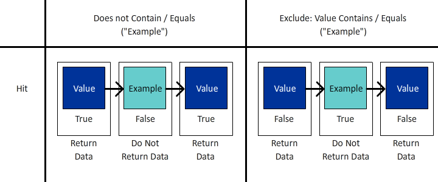

*各ヒットがtrueまたはfalseの値を返し、それらの値がdoes notとexcludeの間で逆転することに注意してください。*

- 「値」には「サンプル」が含まれていません（はい）。したがって、trueを返し、そのヒットを含めます。同様に、「サンプル」には「サンプル」が含まれていません（いいえ、含まれていません）。したがって、falseが返され、そのヒットは含まれません。 基本的には、真の結果を返すデータを返します。
- 「Value」には「Example」（no）が含まれているため、falseを返し、そのヒットを除外しません。同様に、「Example」には「Example」（yes）が含まれているため、trueを返し、そのヒットを除外します。 基本的に、**not**&#x200B;のデータは真の結果を持つか、条件に対して偽のデータを返すかのどちらかです。
- **ヒット** レベルでは、両方のロジック セットが同じデータセットを返します。

**図2：次を含まない/次と等しくない – スコープを参照**

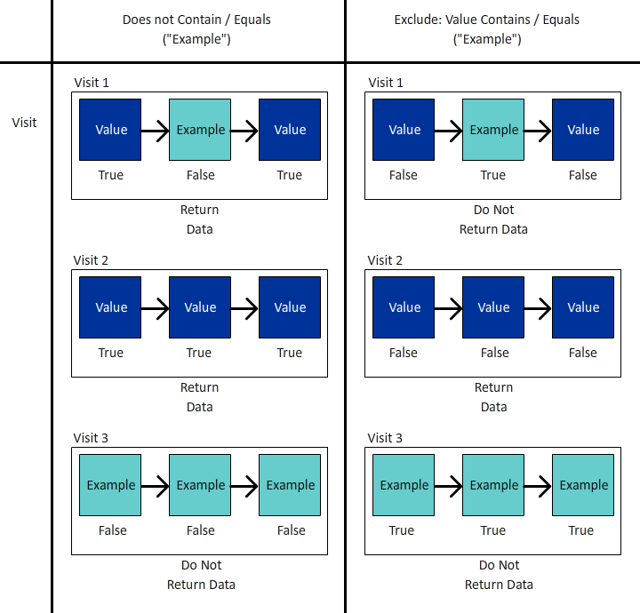

*上記と同様に、**visit**&#x200B;内の各ヒットは、同じtrue / falseで評価されます。 ただし、返されるデータセットは、訪問全体のデータセットです。*

- 各ヒットで「値」に「サンプル」が含まれていない（yes）、したがってtrueが返されます。同様に、「サンプル」に「サンプル」が含まれていない（no、それを含まない）、したがってfalseが返されます。
   - 訪問中の&#x200B;**any** ヒットが&#x200B;**true**&#x200B;を返した場合、**訪問全体**&#x200B;が返されます*。
   - 訪問が「例」を含むヒットで完全に構成されている場合、ヒットはtrueを返さないため、その訪問はデータセットで&#x200B;**返されません**。
- 繰り返しますが、各ヒットで「Example」に「Example」が含まれているため（yes）、trueが返されます
   - **任意のヒット**&#x200B;が&#x200B;**true**&#x200B;を返した場合、訪問全体は&#x200B;**除外**&#x200B;になります
   - 訪問中のすべてのヒット **が** false **を返す場合、その訪問はデータセットで返されます**
- これで、このロジックがどこで発散し始めるかがわかります。 上記の例では、3つの異なる訪問があります。
   - 「次を含まない/次と等しい」を使用する場合、**3**&#x200B;回の訪問のうち2回が返されます。
   - 「含む/次と等しい」を使用する場合、**それらの訪問のうち1つの**&#x200B;のみが返されます

**図3：次を含まない/次と等しくない – スコープを参照**

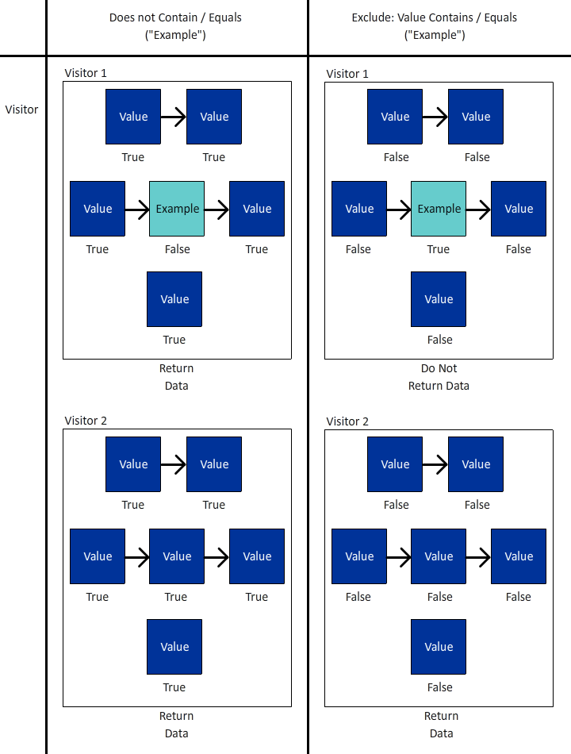

*上記と同様に、**訪問者**&#x200B;が行った各ヒットは、同じtrue/false ロジックで評価されます。 しかし、現在、この訪問者が行ったすべてのヒットを、すべての訪問（選択した日付範囲内）で確認しています。*

- 各ヒットで「値」に「サンプル」が含まれていない（yes）、したがってtrueが返されます。同様に、「サンプル」に「サンプル」が含まれていない（no、それを含まない）、したがってfalseが返されます。
   - 訪問者がヒットした&#x200B;**any**&#x200B;が&#x200B;**true**&#x200B;を返した場合、**訪問全体**&#x200B;が返されます。
   - 訪問者が「例」を含むヒットを作成しなかった場合、ヒットはtrueを返さないため、その訪問者はデータセットで&#x200B;**返されません**。
- 繰り返しますが、各ヒットで「Example」に「Example」が含まれているため（yes）、trueが返されます。
   - **任意のヒット**&#x200B;が&#x200B;**true**&#x200B;を返した場合、訪問者全体（およびその後のすべての訪問）は&#x200B;**除外されます。**
   - 訪問中のすべてのヒット **が** false **を返した場合、その訪問者はデータセットで返され、「X」を行わなかった訪問者が正常に返されます。**
- これは、さらに多くの考慮事項がある訪問ロジックの拡張です。 上記の例では、それぞれ3回の訪問を伴う2つの異なる訪問者があります。
   - 「次を含まない/次と等しい」を使用すると、両方の&#x200B;**訪問者が返されます。その際、訪問回数の** 3 **がすべて返されます（レポートでは2人の訪問者と6人の合計訪問回数を考慮します）**
   - 「含む/次と等しい」を使用する場合&#x200B;**それらの訪問者のうち1人**&#x200B;のみが返され、その訪問者に関連する3つの訪問のみが含まれます（レポートでは1人の訪問者と3つの合計訪問を考慮します）

>[!TIP]
>
>このロジックは、特にコンテナのネストを開始する場合は複雑になる可能性があります。制御されたサンプルデータをテストして、セグメントが実際に必要と思われるデータを返していることを確認することをお勧めします。

### セグメントの例1：購入した訪問を除外

この例では、サイトにアクセスし、訪問中に&#x200B;*not*&#x200B;購入したユーザーをターゲットにします（基本的に、トランザクションを実行した訪問を除外します。したがって、トランザクションを完了しなかった訪問は残ります）

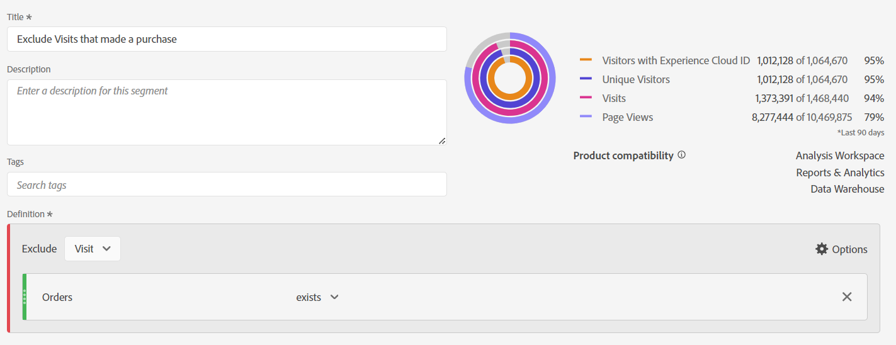

比較のために、「存在しない」を使用して構築されたセグメントを見てみましょう。

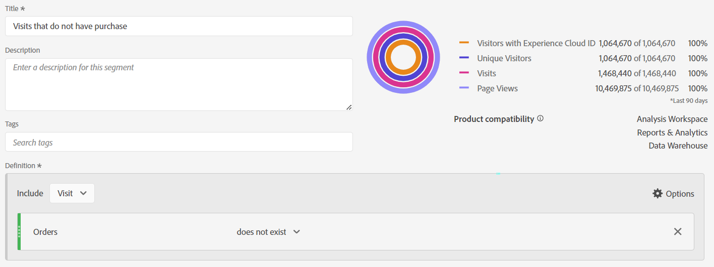

プレビューで表示される結果は非常に異なります。実際、このセグメントでは、すべての訪問に「注文」指標を含まないヒットが少なくとも1回あるため、訪問回数の100%が返されます。

さらに、2つのセグメントを並べて比較してみましょう。

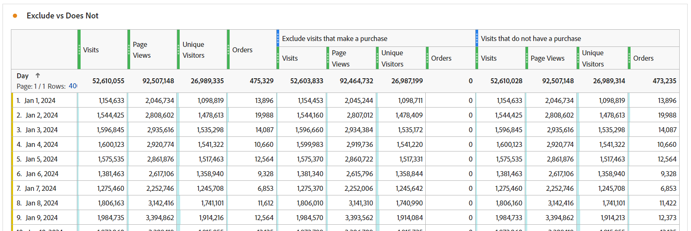

最初に、セグメントの&#x200B;*訪問* レベルの範囲にもかかわらず、セグメントを他の指標（ページビューやユニーク訪問者など）と組み合わせることができます。 最初の列のセットはセグメント化されていないため、1つのセグメント（存在しない）がデータのほぼ100%を返していることを一目で確認できます。除外セグメントのみが、必要な処理を行っています。

最も顕著な列は注文です。ほとんどの注文がまだ返されているので、「存在しない」コンテナが間違っていることはすぐに明らかです。

### セグメントの例2：レポート期間内に購入した訪問者を除外

この例では、前のサンプルのアイデア（特に訪問レベルで見た）を使用して、レポートの時間枠内に購入しなかった訪問者を見つけるために拡張します。

このセグメントは、上記の例とほぼ同じように見えますが、セグメントの範囲は大きな違いを生みます。

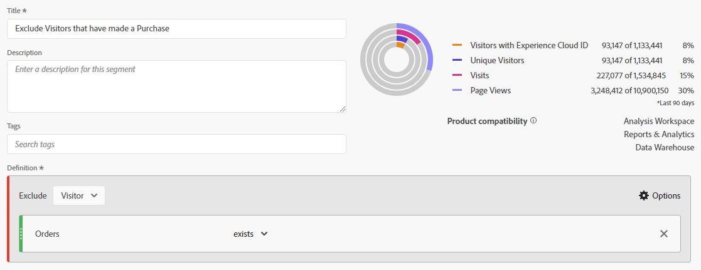

現在、訪問者範囲セグメントを上記の訪問範囲セグメントと比較すると、より多くのデータが表示され、購入した&#x200B;*訪問者*&#x200B;には購入が行われなかった訪問も含まれているので、多くの訪問が除外されます。そのため、これらの訪問も訪問者のライフサイクルの一部であるため、除外されます。

>[!IMPORTANT]
>
>訪問者範囲のデータを探している場合、レポートの期間が長いほど、除外が大きくなります。これは、多くの訪問者がサイトへのロイヤルティの高い再訪問者になるためです（もちろん、一部のビジネスモデルは他のビジネスモデルよりも影響が大きくなります）

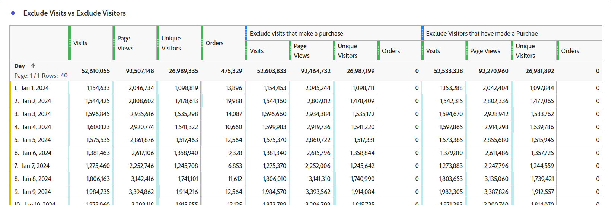

>[!IMPORTANT]
>
>訪問と訪問者の違いは&#x200B;*微妙な* （特にこのサンプルデータ）ですが、考慮すべき一意のロジックです。 データは、サイトやユーザーの行動によって大きく異なる場合があります。

レポートで伝えようとしているデータ、または&#x200B;*story*&#x200B;を正確に把握することが重要です。 テーブルとビジュアライゼーションでオーディエンスに表示されている内容&#x200B;***を明確に伝えるようにし、適切なセグメントモデルを使用することは、適切な分析を行うために不可欠です。***&#x200B;情報にもとづいた意思決定は、全員が自身の状況を理解してから初めて適切におこなうことができます。

## コンテナの使用

コンテナは、セグメントのメインロジック内に「サブロジック」を作成する機能を提供します。一般的な誤解は、セグメントとコンテナ間ですべてのスコープが同じである必要があるということです。しかし、そうではありません。 これにより、より大きなスキームで特定のシナリオを作成したり、複雑なロジックを構築したりするための自由度が増します。

コンテナについて考える最良の方法は、各コンテナがボックスであり、別のボックス内に（論理の）ボックスをスタックできることを想像することです。しかし、各ボックスが外側のボックスよりも小さくなければならない物理的なボックスとは異なり、それが正しいデータを取り戻すために私たちを動かすのであれば、より大きなボックスを内側に置くことができます。 それは魔術師の帽子のように考えてください。不可能が中に収まり、私たちはデータの魔術師です…

### コンテナの範囲

まず、*container* スコープの簡単な分類を行います。 *セグメント s* スコープと同様に、基本的な&#x200B;**ヒット**、**訪問**、**訪問者**&#x200B;のスコープ オプションがありますが、訪問者の代わりに&#x200B;**ロジック グループ**&#x200B;と呼ばれるオプションも表示されることがあります（これは順次セグメント内でのみ発生します。次の記事で説明します）。

セグメント内（または他のコンテナ内）へのコンテナの追加は、**options*** メニューにアクセスすることで実現できます（複数のアイテムをネストする場合は、正しいブロックに追加するように注意してください。ただし、誤った場所に追加する場合は、インターフェイス内でコンテナをドラッグ&amp;ドロップできます）

**図1: コンテナの追加**

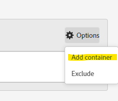

コンテナの範囲は親とは独立しています。前述したように、これらの&#x200B;*は一致する必要がなく*&#x200B;ありません。返す内容に応じて、少なくとも頭の中で視覚化するのが楽になるまで、必要なものを完全に視覚化するために計画を引き出す必要があるかもしれません。

**図2: セグメントスコープとコンテナスコープの比較**

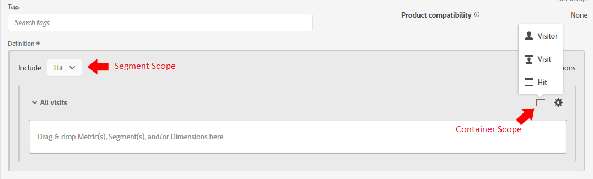

>[!NOTE]
>
>Adobeには、有効なセグメントと無効なセグメントを理解するためのロジックがあります。そのため、*決して*&#x200B;機能しない可能性のあるオプションは提供されません。そのため、ヒット範囲セグメント内で訪問者範囲のコンテナを使用するオプションが表示される場合、これは有効なオプションであることを意味します。

基本的なセグメントと同様に、ネストされたコンテナで複雑なセグメントを作成する場合は、返すデータの種類を&#x200B;***どのような***&#x200B;かについて明確に理解する必要があります。 ***そのデータをどのように使用する予定ですか？*** ***セグメントとペアリングする予定の指標***&#x200B;はどれですか？

これらの質問は、セグメント全体の範囲を決定するのに役立ちます。これは、任意のセグメントの出発点です。

セグメントをユニーク訪問者指標と組み合わせるからといって、セグメント自体が訪問者レベルであるべきではありません。 訪問者レベルのセグメントは、訪問者のすべてのデータを返します…これは、訪問者のすべての訪問、すべてのページビューなどを意味します…訪問者がセグメント条件に一致すると、この訪問者の&#x200B;*過去*&#x200B;のデータをセグメントから返すことができます（ワークスペースの日付範囲内であれば）。

>[!IMPORTANT]
>
>セグメントを一意の訪問者指標と組み合わせる場合でも、この&#x200B;*は、セグメントを自動的に訪問者範囲に設定する必要があることを*&#x200B;意味しません…この誤解&#x200B;*は、膨張した誤った結果を生成する可能性があります*。

そこで、適切なスコープの選択方法について多くのことを説明しましたが、本当に役立つ例や詳細は提供されていません。いくつかの実際のユースケースを見ていきましょう。 魔術師は決して自分たちの秘密を明らかにしないと言うが、それは全く真実ではない。 魔法の世界の中では、テクニックと「カーテンの後ろ」の作品はしばしば仲間と共有され、彼らが幻想を構築し、改善することを可能にします。そしてそれは、あなたを待っている可能性への扉を開くために、私が目指していることです。

### セグメントの例3：最近注文した訪問者からの特定のページのビュー（レポート期間内）

このシナリオでは、最近購入した特定のページのセットのみを返します（セグメント自体がHIT スコープの場合でも、訪問またはユニーク訪問者とペアリングできます）。

このタイプのシナリオは、購入者がサイト上の特定のページ、特定のイベントに明示的に接続されていないページを閲覧している場合に役立ちます。

例えば、「おすすめ商品」と「おすすめ商品」のページを見てみましょう。 現在は、ロジックをシンプルにし、シーケンシャルセグメンテーションには入れないようにするつもりです（少なくともまだ入っていませんが、将来の記事ではそのような複雑なロジックに対処します）。

もう1つの質問は、**なぜ**&#x200B;がヒット数で引き下げられているのかです。 技術的には、訪問者または訪問者を指定できますが、訪問ごとに&#x200B;**ページビュー（特定のページセットの場合）または訪問者ごとに** ページビュー（特定のセットの場合）で、これらの特定のページを見ることもできます&#x200B;**。このスコープは、この特定の計算を実行する柔軟性を提供します。**&#x200B;これらのヒットは、訪問者やユニーク訪問者と簡単に組み合わせて、これらのページを表示する訪問者数や訪問者数を決定できるので、あらゆるシナリオに使用できる最も柔軟なセグメントを選択します。

まず、比較のために、特定のページの単純なHIT ベースのセグメントを次に示します。

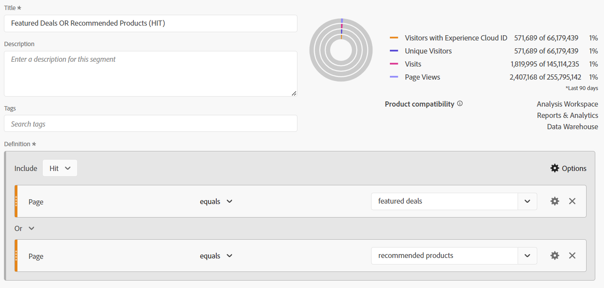

複雑な問題を構築してみましょう。

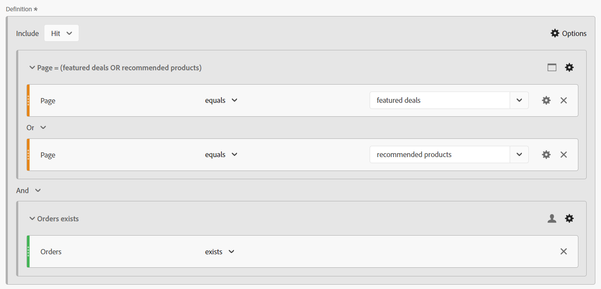

複数のコンテナを使用しているだけでなく、それらのコンテナの範囲を混在させていることに注意してください。 セグメント全体はヒットレベルですが、注文した訪問者も探しています。

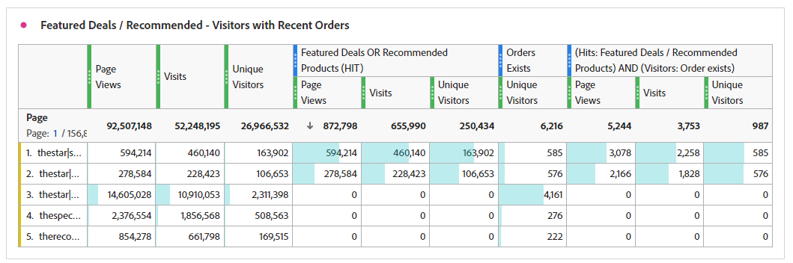

多くの作業が行われているので、少し時間をかけて解凍します。

まず、毎日の内訳を示す代わりに、ページの内訳を示します。これは、2つのセグメントをより良く示すのに役立つと思います。

<table style="border: 0;">
    <tr>
        <td width="352" style="border: 0;">最初の3つの列（ページビュー、訪問、ユニーク訪問者）はセグメント化されておらず、サイト内のすべてのページが表示されます。 注文はアクションで追跡されるため、ページディメンションの範囲には含まれないので、ここでは注文を含めませんでした。</td>
        <td style="border: 0;">&lt;img src="assets/segment-example-3/segment3c-comparison-table-detail1.png" width="352"
        </td>
    </tr>
</table>

<table style="border: 0;">
    <tr>
        <td width="352" style="border: 0;">次に、指定された2つのページの<strong> ヒット </strong>のみを見て、単純なセグメントの結果を表示します。 分類の他のページはすべて、期待どおりに0になります。</td>
        <td style="border: 0;">&lt;img src="assets/segment-example-3/segment3c-comparison-table-detail2.png" width="352"
        </td>
    </tr>
</table>

<table style="border: 0;">
    <tr>
        <td width="352" style="border: 0;">次に、少しボーナスのヒントを紹介します。高度なセグメントの結果を表示する前に、「注文が存在する」という別のシンプルなセグメント（ヒット レベルの範囲）を使用し、ユニーク訪問者と組み合わせました。 これにより、レポート期間に注文した合計UVと、各ページにヒットしたUVが返されます。これは、次の列のセットをより適切に説明するのに役立ちます。</td>
        <td style="border: 0;">&lt;img src="assets/segment-example-3/segment3c-comparison-table-detail3.png" width="352"
        </td>
    </tr>
</table>

<table style="border: 0;">
    <tr>
        <td width="352" style="border: 0;">最後の列セットには、私の複雑なセグメントが積み重ねられています。 注文を伴う全体的なUVは、各ページのシンプルな「注文が存在する」セグメントと一致しますが、合計は大きく異なります。このデータセットのデータは、注文を行った訪問者に対してのみデータセットを明示的に制限し、ページをヒットするので、私は明示的に興味を持っています。</td> <td style="border: 0;">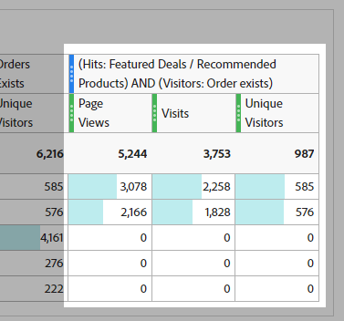
        </td>
    </tr>
</table>

### セグメントの例4：おすすめ商品やお得な情報をヒットした訪問と、同じ訪問で注文する

上記のサンプルでは、より小さなスコープのコンテナ（つまり訪問者）の中に大きなスコープのコンテナ（つまり訪問者）を追加する方法を示しました。つまり、ヒットすると、訪問者の中にヒットコンテナを追加したり、スコープのセグメントにアクセスしたりできることは驚くことではありません。

以前に見ていたのと同じページをいくつか使用して、今では、同じ訪問で同じページにアクセスした訪問者を、おすすめセールやおすすめ商品ページに戻して注文できるようにしています。

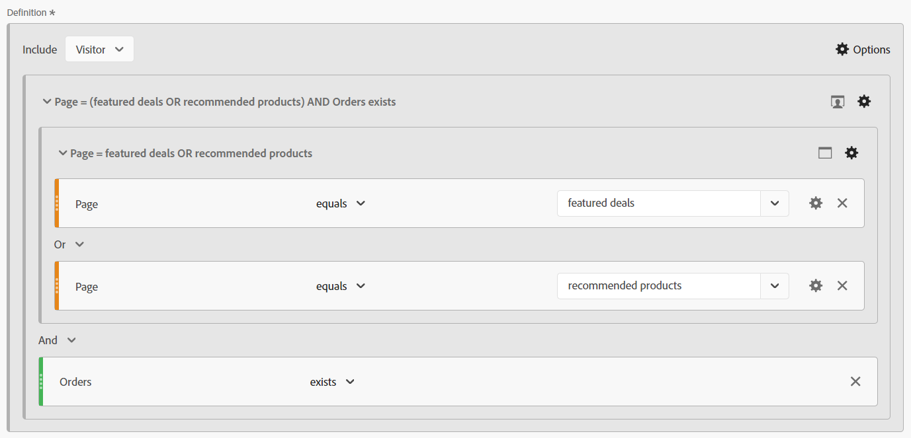

このセグメントは、3つのスコープをすべて組み合わせています。 セグメントの最上位レベルは訪問者であるため、すべての訪問からのヒットが一致する訪問者に返されます。 その中に、訪問範囲コンテナを追加しました。これにより、訪問者は、注文を行い、特定のページを訪問した特定の基準に一致する少なくとも1回の訪問を行う必要があります。 ページ自体にヒットスコープコンテナを追加しました。これにより、OR ロジックを使用して、おすすめの取引ページまたは推奨製品ページのいずれかを検索できます。

この訪問者範囲セグメントの利点は、この条件に一致する訪問者から&#x200B;**ALL**&#x200B;回の訪問が返されることです。このセグメントは、この組み合わせに至るまでの以前の訪問の行動と、そのようなシナリオの後のこれらの訪問者の行動を確認したい場合に適しています。

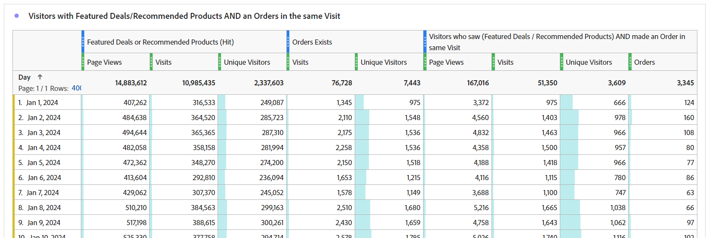

ここでは、おすすめコンテンツのヒット数と、注文が存在する場合と、注文と指定されたページの両方が同じ訪問で存在する複雑なセグメントを比較しています。 複雑なセグメントは、最初の2つのセグメントが交差する場所ですが、訪問者の範囲なので、他の訪問者の訪問も同様に返されます。

## アトリビューションモデル

セグメント定義内のアトリビューションモデルは、主にヒットしない有効期限を持つディメンションに関連しているため、（常にヒットレベルである） propは実際には良い候補ではありません。 ただし、eVarやマーケティングチャネルなどの設定は、実際には目的に合わせて設計されています。

セグメントを見る前に、アトリビューションモデリングの仕組みを簡単な例で確認しましょう。

例えば、2つのeVarがあり、そのうちの1つが有効期限（eVar1）にアクセスし、そのうちの1つが30日間の有効期限（eVar2）に設定されているとします。 簡単にするために、内部キャンペーン（icid）を追跡します。

**訪問1**

- ページ A
   - **eVar1**&#x200B;が設定されていません
   - **eVar2**&#x200B;が設定されていません
- URLに？icid=promo-bannerが含まれているプロモ – ションバナーをクリックします
- ページ B
   - **eVar1**&#x200B;と&#x200B;**eVar2**&#x200B;は「promo-banner」に設定されています
   - eVar1 **の** インスタンスがトリガーされます
   - eVar2 **の** インスタンスがトリガーされます
- ページ C
   - **eVar1**&#x200B;と&#x200B;**eVar2**&#x200B;の両方で、「promo-banner」の値が維持されます
   - 両方のeVarで永続値が使用されているため、eVarのインスタンス指標は実行されません

**訪問2**

- ページ D
   - **eVar1**&#x200B;はどの値にも設定されておらず、eVar1 **の** インスタンスがトリガーされません
   - **eVar2**&#x200B;は、有効期限が30日であるため、「promo-banner」の値を保持します
   - 値が永続的で、実際に設定されていないため、**eVar2**&#x200B;のインスタンスはトリガーされません
- URLで？icid=promo-side-railを使用してSide Rail Promotionをクリックします
- ページ E
   - **eVar1**&#x200B;と&#x200B;**eVar2**&#x200B;は「プロモ側パネル」に設定されています
   - eVar1 **の** インスタンスがトリガーされます
   - eVar2 **の** インスタンスがトリガーされます
- ページ F
   - **eVar1**&#x200B;と&#x200B;**eVar2**&#x200B;の両方で、「promo-side-rail」の値が維持されます
   - 両方のeVarで永続値が使用されているため、eVarのインスタンス指標は実行されません

現在、この2回の訪問から期待される結果は次のとおりです。

<table><tr><th colspan="1" valign="top"></th><th colspan="1" valign="top"></th><th colspan="1" valign="top"><b>ページビュー数</b></th><th colspan="1" valign="top"><b>訪問</b></th><th colspan="1" valign="top"><b>EVar1のインスタンス</b></th><th colspan="1" valign="top"><b>EVar2のインスタンス</b></th></tr>
<tr><td colspan="1" valign="top"></td><td colspan="1" valign="top"></td><td colspan="1" valign="top">6</td><td colspan="1" valign="top">2</td><td colspan="1" valign="top">2</td><td colspan="1" valign="top">2</td></tr>
<tr><td colspan="1" rowspan="7" valign="top">ページ</td><td colspan="1" valign="top"></td><td colspan="1" valign="top">6</td><td colspan="1" valign="top">2</td><td colspan="1" valign="top">2</td><td colspan="1" valign="top">2</td></tr>
<tr><td colspan="1" valign="top">ページ A</td><td colspan="1" valign="top">1</td><td colspan="1" valign="top">1</td><td colspan="1" valign="top">0</td><td colspan="1" valign="top">0</td></tr>
<tr><td colspan="1" valign="top">ページ B</td><td colspan="1" valign="top">1</td><td colspan="1" valign="top">1</td><td colspan="1" valign="top">1</td><td colspan="1" valign="top">1</td></tr>
<tr><td colspan="1" valign="top">ページ C</td><td colspan="1" valign="top">1</td><td colspan="1" valign="top">1</td><td colspan="1" valign="top">0</td><td colspan="1" valign="top">0</td></tr>
<tr><td colspan="1" valign="top">ページ D</td><td colspan="1" valign="top">1</td><td colspan="1" valign="top">1</td><td colspan="1" valign="top">0</td><td colspan="1" valign="top">0</td></tr>
<tr><td colspan="1" valign="top">ページ E</td><td colspan="1" valign="top">1</td><td colspan="1" valign="top">1</td><td colspan="1" valign="top">1</td><td colspan="1" valign="top">1</td></tr>
<tr><td colspan="1" valign="top">ページ F</td><td colspan="1" valign="top">1</td><td colspan="1" valign="top">1</td><td colspan="1" valign="top">0</td><td colspan="1" valign="top">0</td></tr>
</table>

<table><tr><th colspan="1" valign="top"></th><th colspan="1" valign="top"></th><th colspan="1" valign="top"><b>ページビュー数</b></th><th colspan="1" valign="top"><b>訪問</b></th><th colspan="1" valign="top"><b>EVar1のインスタンス</b></th></tr>
<tr><td colspan="1" valign="top"></td><td colspan="1" valign="top"></td><td colspan="1" valign="top">4</td><td colspan="1" valign="top">2</td><td colspan="1" valign="top">2</td></tr>
<tr><td colspan="1" rowspan="3" valign="top">eVar1</td><td colspan="1" valign="top"></td><td colspan="1" valign="top">4</td><td colspan="1" valign="top">2</td><td colspan="1" valign="top">2</td></tr>
<tr><td colspan="1" valign="top">プロモーションバナー</td><td colspan="1" valign="top">2</td><td colspan="1" valign="top">1</td><td colspan="1" valign="top">1</td></tr>
<tr><td colspan="1" valign="top">promo-side-rail</td><td colspan="1" valign="top">2</td><td colspan="1" valign="top">1</td><td colspan="1" valign="top">1</td></tr>
</table>

<table><tr><th colspan="1" valign="top"></th><th colspan="1" valign="top"></th><th colspan="1" valign="top"><b>ページビュー数</b></th><th colspan="1" valign="top"><b>訪問</b></th><th colspan="1" valign="top"><b>EVar2のインスタンス</b></th></tr>
<tr><td colspan="1" valign="top"></td><td colspan="1" valign="top"></td><td colspan="1" valign="top">5</td><td colspan="1" valign="top">2</td><td colspan="1" valign="top">2</td></tr>
<tr><td colspan="1" rowspan="3" valign="top">eVar2</td><td colspan="1" valign="top"></td><td colspan="1" valign="top">5</td><td colspan="1" valign="top">2</td><td colspan="1" valign="top">2</td></tr>
<tr><td colspan="1" valign="top">プロモーションバナー</td><td colspan="1" valign="top">3</td><td colspan="1" valign="top">2</td><td colspan="1" valign="top">1</td></tr>
<tr><td colspan="1" valign="top">promo-side-rail</td><td colspan="1" valign="top">2</td><td colspan="1" valign="top">1</td><td colspan="1" valign="top">1</td></tr>
</table>

次に、セグメントのどこでアトリビューションを設定できるかを見てみましょう。

**図4: アトリビューションモデル**

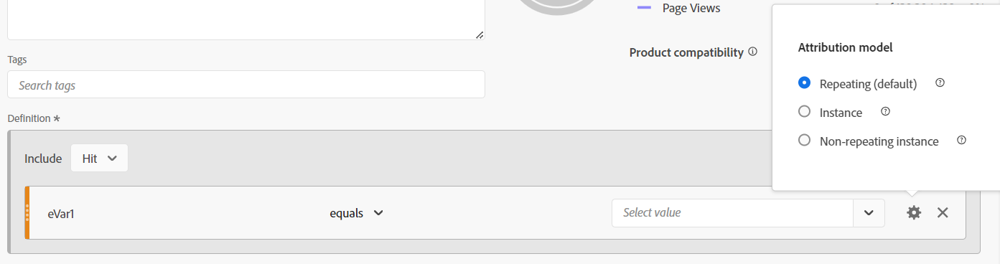

*ディメンションの歯車アイコンは、アトリビューションを設定できる場所です。 各オプションには、「?」の上にカーソルを置いたときに使用できる情報があります アイコン。 基本的に：*

- デフォルトのビヘイビアーでは、値が設定されているeVarのすべてのインスタンスが返されます（具体的には、またはset アトリビューションを使用して）
- インスタンスは、値が明示的に設定されているディメンション（つまり、「eVarのインスタンス」がトリガーされたヒット）のみを返します。
- 繰り返さないインスタンスは、ディメンションの値が初めて設定された場合にのみ返されます（例：上記の例ではカバーされていませんが、プロモ – ションバナーを何度もクリックしたユーザーを想像すると、バナーがクリックされるたびに「eVarのインスタンス」も増加します。この設定では、「プロモ – バナー」の最初の一意のインスタンスのみが取得され、このバナーの後続のカウントは無視されます）

### セグメントの例5：マーケティングチャネルの「有料検索」と有料検索の直接インスタンスの比較

ご存知のように、マーケティングチャネルには長いアトリビューションモデル（デフォルトでは30日間ですが、これは独自のニーズに合わせてカスタマイズできます）があり、設定すると、その後のサイトへの「直接」訪問によってマーケティングチャネルが上書きされなくなり、特定のドライバーがコンバージョンアトリビューションを取得できるようになります。 ただし、特定のマーケティングチャネルによって、サイト内の&#x200B;***エントリ***&#x200B;を具体的に確認する必要がある場合があります。また、エントリによって、マーケティング処理ルールに基づいてマーケティングチャネルが具体的に設定されている場合を確認する必要があります。

まず比較を確認し、セグメントについて詳しく説明します。

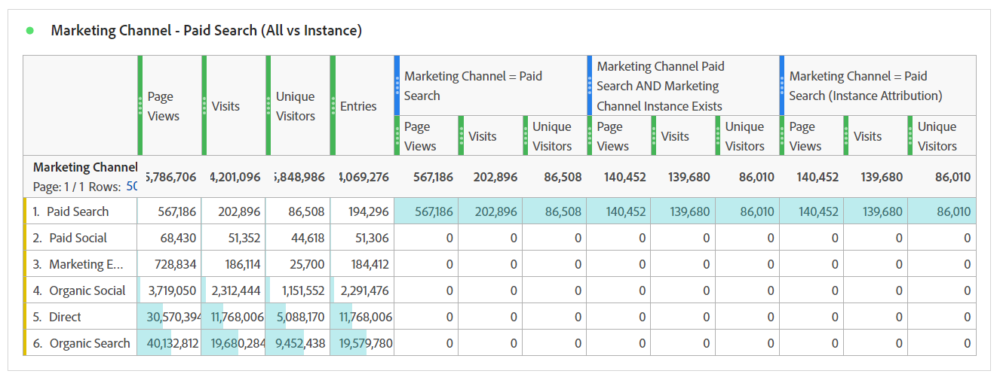

<table style="border: 0;">
    <tr>
        <td width="352" style="border: 0;">最初の4つの列はセグメント化されておらず、理解しやすい必要があります。 *「エントリ」*は、基本的に、訪問者がセッションを開始する場所に基づいて計算された値です。 ユーザーが複数のマーケティングチャネル（ソーシャルメディアの閲覧、検索、マーケティングメールのクリックなど）を通じてサイトにアクセスする際に、同じ訪問/セッション内で情報を取得する可能性があるため、ここで追加しました。</td> <td style="border: 0;">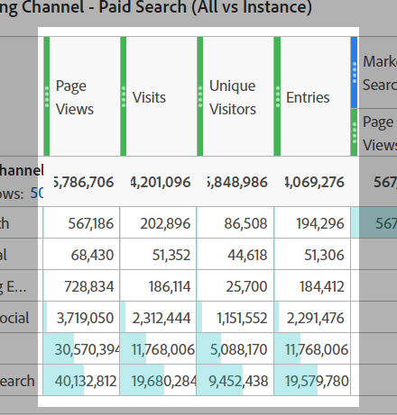
        </td>
    </tr>
</table>

<table style="border: 0;">
    <tr>
        <td width="352" style="border: 0;">次の一連の列では、「標準ヒットセグメント」を使用し、基本的にマーケティングチャネルが「有料検索」のヒットを調べます。 ただし、これはマーケティングチャネルのアトリビューションに基づいてすべてのヒットを返します。ただし、実際の「有料検索」クリックスルーを分離することはできません。 そのため、必要なデータは返されません。</td> <td style="border: 0;">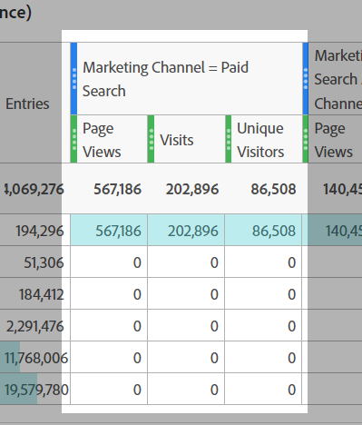
        </td>
    </tr>
</table>

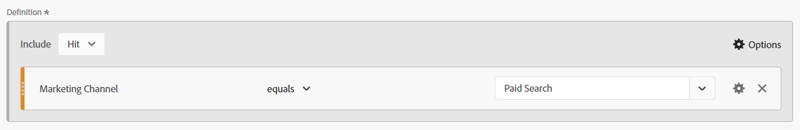

<table style="border: 0;">
    <tr>
        <td width="352" style="border: 0;">さて、次の2つのデータセットは同じように見えます。実際、これらは2つの異なる方法で同じデータを返します。 しかし今、私はマーケティングチャネルが<strong>set</strong>だった<i> インスタンス </i>を「有料検索」に具体的に見ています。</td> <td style="border: 0;">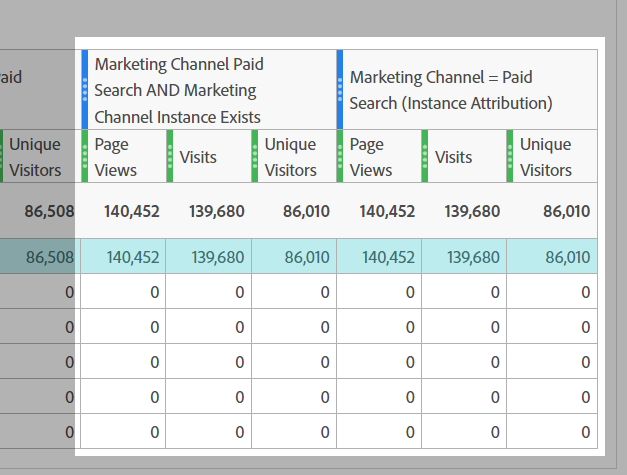
        </td>
    </tr>
</table>

これは、次の2つの方法で実行できます。

まず、「標準」ディメンション属性を使用し、これを特定の「マーケティングチャネルインスタンス」指標と組み合わせます（*exists* ロジックとして）。

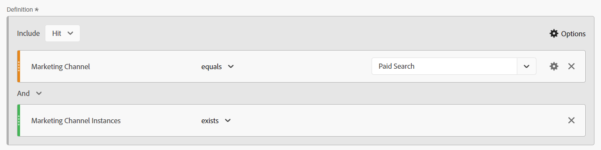

または、よりシンプルなセグメントの場合は、アトリビューションを「インスタンス」に変更できます。 ディメンション名が「マーケティングチャネル」から「マーケティングチャネル（インスタンス）」に変更されることに注意してください。

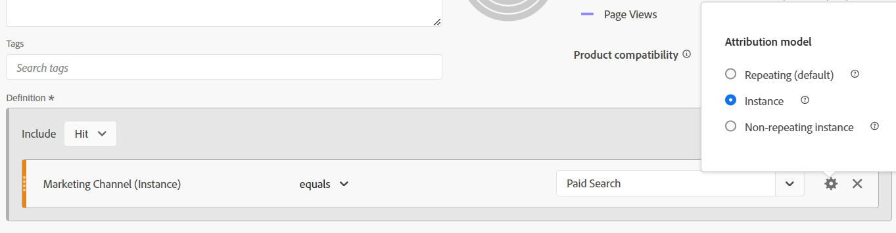

## あらゆる要素を統合

どんな優れた魔術師のように、個々のトリックから始めて、オーディエンスを構築しながら最終的な「名声」に導くことができます。 ここで私たちは本当に輝きます，すべての小さなトリックを取ることによって，そして壮大なフィナーレにそれらをロールアップ。 一見するとバラバラに見えるトリックの部分を取り上げ、実際に、それらすべてが一緒に働いて、まとまりのある全体を形成することを示します。

### セグメントの例6：有料ソーシャルインスタンスへの訪問中に注文を行い、ニュースレターにサインアップした訪問者を除外した訪問者

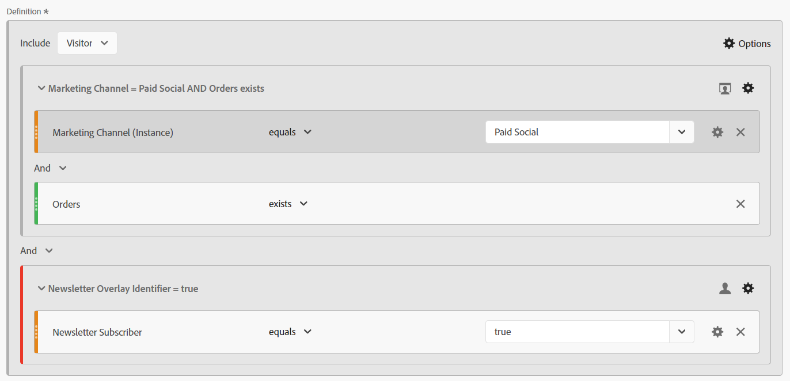

これにより、ソーシャルメディアキャンペーンの訪問中に積極的に購入したが、ニュースレターに登録していない訪問者を特定できます。 これにより、マーケティングチームは、潜在的なユーザーグループを発見し、ニュースレターやマーケティングメールのコンバージョンを試すことができます。

## フィナーレ

ロジックを組み合わせて非常に詳細なシナリオを作成する方法が多数あり、可能性の表面を傷つけることしかできません。

偉大な魔術師と同様に、真の力は、新進世代に基礎を築き、学びを新しく素晴らしいものに再構築するように刺激することです。 皆さんが何を思い浮かべるか楽しみです！

## 作成者

この文書の作成者：

Jennifer Dungan氏（Torstar、最適化マネージャー分析）

Adobe Analytics Champion

