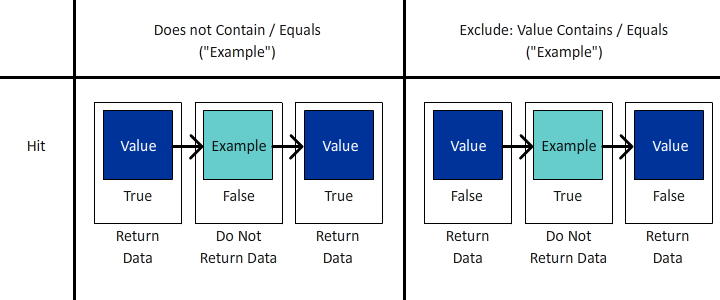
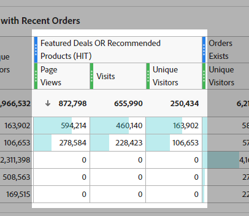
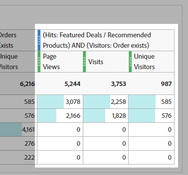
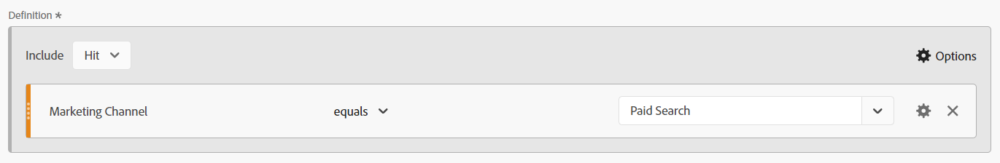

# カーテンの背後にあるマジック：複雑なセグメント：除外、コンテナ、アトリビューション

_複雑なデータのセグメント化の複雑さを明らかにし、除外、コンテナ、アトリビューションモデルを調べます。 魔術師の手のように、これらの技術を習得すると、アナリストはデータマジックを実行し、精度と手際で洞察を変えることができます。_

カーテンが開いていて、ステージが設定されている…これはラスベガスのマジックアクトではないかもしれませんが、セグメントを作成する際に、かなり素晴らしいトリックを実行することができます。

このモジュールでは、以下をカバーします。

- 論理を除外
- コンテナの使用
- アトリビューションモデル

## 含めるか除外するか

デフォルトでは、すべてのコンテナは次のように開始されます。 **含める** タイプの場合、基本的には条件に一致するデータが返されます。 ただし、セグメント（セグメント内のコンテナ）を **除外** タイプを使用して、特定の条件を却下できます。

魔術師がデッキでカードを見つけるのは素晴らしいことですが魔術師が残りのデッキを無くすのは素晴らしいことです 同様に、セグメントを除外する場合、不要なデータはデータセットから単に消去されます。

「はい、でも私には既に「等しくない」と「含まない」のオプションがあるので、それは私をカバーすべきではないのですか？」と考えて座っているかもしれません。 残念ながら、その答えは違う…そして単に 1 つの要素で論理のグループを除外できるだけではありません。 1 つのコンポーネントを扱う場合でも、多くの場合、 *除外* 目標を達成するために。

- **次を含まない/次と等しくない**  — 特定の文字列を含まない項目で一致する、単にそのような音です
- **除外：値に次を含む/等しい**  — これは以下を意味します *除外* 文字列に一致する項目

一見すると、これらの両方は同じように聞こえます…と **ヒット** レベルのセグメント/コンテナの場合は、同じアクションを実行するので、正しい結果になります。 ただし、 **訪問** または **訪問者** 範囲は大きく異なる結果を得るでしょう。

**図 1：次を含まない/次と等しくない — ヒットの範囲**

*各ヒットは true または false の値を返し、does not と exclude の間でそれらの値が逆になることに注意してください。*

- 「値」に「例」（はい）を含まないので、true を返してそのヒットを含めます。同様に、「例」に「例」を含めず（いいえ、含む）、false を返し、そのヒットを含めません。 基本的に、は真の結果を返すデータを返します。
- 「値」には「例」(no) が含まれ、そのため false が返され、そのヒットは除外されません。同様に、「例」には「例」(yes) が含まれ、その結果 true が返され、そのヒットが除外されます。 基本的に、は **not** 真の結果を得るか、偽のデータを条件に返します。
- これは、 **ヒット** レベルの場合、両方の論理セットは同じデータセットを返します。

**図 2：次を含まない/次と等しくない — 訪問の範囲**

*上記のように、各ヒットは&#x200B;**訪問**は同じ true / false で評価されます。 ただし、返されるデータセットは訪問全体のデータセットです。*

- 各ヒットで「値」に「例」（はい）が含まれないので、true が返されます。同様に、「例」に「例」が含まれない（いいえ、含まれている）ので、false が返されます。
   - 次の場合 **任意** 再来訪のヒット数 **true**&#x200B;を、 **全訪問** が返されます。*
   - 訪問が「例」を含むヒットで完全に構成されている場合、ヒットは true を返さないので、訪問は **返されない** 」と入力します。
- 繰り返しますが、各ヒットで「例」に「例」が含まれている（はい）ので、true が返されます。
   - 次の場合 **任意のヒット** 戻り値 **true**&#x200B;を指定した場合、訪問全体が **除外済み**
   - 次の場合 **すべてのヒット** 再来訪中 **false**&#x200B;の場合、その訪問はデータセットで返されます
- ここで、この論理がどこで分岐し始めているかを見ることができます。 上の例では、次の 3 つの個別訪問があります。
   - 「次を含まない/次と等しい」を使用する場合 **三人のうち二人** 訪問回数が返されます。
   - 「次を含む/次と等しいを除外」を使用する場合 **1 つだけ** の訪問が返されます

**図 3：次を含まない/次と等しくない — 訪問の範囲**

*上記と同様、**訪問者**は同じ true / false ロジックで評価されます。 しかし、現在は、（選択した日付範囲内の）すべての訪問にわたって、この訪問者がおこなったすべてのヒットを調べています。*

- 各ヒットで「値」に「例」（はい）が含まれないので、true が返されます。同様に、「例」に「例」が含まれない（いいえ、含まれている）ので、false が返されます。
   - 次の場合 **任意** 訪問者が戻ってくるヒット **true**&#x200B;を、 **全訪問** が返されます。
   - 訪問者が「例」を含むヒットを何も行わなかった場合、ヒットは true を返さないので、訪問者は **返されない** 」と入力します。
- 繰り返しますが、各ヒットで「例」に「例」が含まれている（はい）ので、true が返されます。
   - 次の場合 **任意のヒット** 戻り値 **true**&#x200B;訪問者全体（およびその後すべての訪問）が **除外済み。**
   - 次の場合 **すべてのヒット** 再来訪中 **false**&#x200B;に値を指定しない場合、その訪問者がデータセットに返され、「X」をしない再訪問者にも正常に返されます。
- これは訪問ロジックの拡張であり、さらに考慮事項があります。 上の例では、2 人の個別訪問者があり、それぞれ 3 回の訪問があります。
   - 「次を含まない/次と等しい」を使用する場合 **両方** すべての訪問者と同様に、訪問者が返されます。 **3** 訪問回数（2 人の訪問者と、レポートでの合計 6 回の訪問回数を考慮）
   - 「次を含む/次と等しいを除外」を使用する場合 **1 つだけ** その訪問者のうち、訪問者が返され、その訪問者に関連付けられた 3 回の訪問のみが含まれます（レポートの訪問者数は 1 人、合計 3 人となります）。

>[!TIP]
>
>このロジックは複雑になる場合があります。特に、コンテナのネストを開始する際には、制御されたサンプルデータに対してテストし、セグメントが実際に必要と思われるデータを返すようにすることをお勧めします。

### セグメント例 1：購入を行った訪問の除外

この例では、サイトを訪問し、訪問したユーザーをターゲットにします。 *not* 訪問中に購入する（基本的に、トランザクションを実行した訪問を除外したいので、トランザクションを完了しなかった訪問は残されます）

比較のために、「存在しない」を使用して作成されたセグメントを見てみましょう。

プレビューでは非常に異なる結果が示されます。実際には、このセグメントは訪問の 100%を返します。これは、各訪問に、「注文」指標を含まないヒットが 1 つ以上あるためです。

この点をさらに詳しく説明するために、2 つのセグメントを並べて比較します。

まずは、 *訪問* セグメントのレベル範囲の場合は、セグメントを他の指標（ページビュー数や個別訪問者数など）と組み合わせることができます。 最初の列セットは非セグメント化され、1 つのセグメント（存在しない）がほぼ 100%のデータを返していることを一目で示すために、必要な処理を行うのは除外セグメントのみです。

最も目立つ列は注文です。注文のほとんどがまだ返されているので、「存在しない」コンテナが間違っていることがすぐにわかります。

### セグメント例 2：レポート期間内に購入を行った訪問者を除外する

この例では、（特に訪問レベルで調べた）前のサンプルのアイデアを使用して、それを展開し、レポートの期間内に購入しなかった訪問者を見つけたいと考えています。

このセグメントは、上の例とよく似ていますが、ほとんど同じですが、セグメントの範囲が大きく異なります。

次に、訪問者範囲セグメントを上の訪問範囲セグメントと比較すると、より多くのデータが表示され、さらに多くの訪問が除外されます。 *購入を行った訪問者* また、は、購入がおこなわれなかった訪問を持っているので、訪問者のライフサイクルの一部として、これらの訪問も除外されます。

>[!IMPORTANT]
>
>訪問者範囲のデータを調べる場合、レポート期間が長いほど除外が大きくなります。多くの訪問者がサイトへの常連訪問者となるからです（もちろん、一部のビジネスモデルは他の訪問者よりも大きな影響を与えます）。

>[!IMPORTANT]
>
>訪問と訪問者の違いは次のとおりです。 *微妙な* （特にこのサンプルデータでは）、考慮する必要がある一意のロジックです。 サイトやユーザーの行動に応じて、データが大きく異なる場合があります。

どのデータや何かを正確に知ることが重要です *story*&#x200B;に値を指定しない場合、レポートに通知しようとしています。 テーブルとビジュアライゼーションでオーディエンスが明確に示されていることを確認する ***what*** が表示されているので、適切なセグメントモデルを使用することが、適切な分析をおこなううえで重要です。 情報に基づいた意思決定は、誰もが自分が何を見ているかを理解している場合にのみ、適切に行うことができます。

## コンテナの使用

コンテナは、セグメントのメインロジック内に「サブロジック」を作成する機能を提供します。一般的な誤解として、セグメントとコンテナの間のスコープはすべて同じにする必要がありますが、同じではありません。これにより、より大きな事物のスキームで特定のシナリオを作成し、複雑なロジックを構築するためのより自由な手段が得られます。

コンテナを考える最善の方法は、各コンテナが箱であることを想像し、別の箱の中、別の箱の中に箱を積み重ねることです…しかし、各箱が外の箱よりも小さければならない物理箱とは異なり、正しいデータを取り戻すために私たちは大きな物を入れます。 魔法使いの帽子のように考えてみてください不可能なものが内部に入り込み私たちはデータの魔術師…

### コンテナの範囲

まず、 *コンテナ* 範囲。 次に類似 *セグメント s*&#x200B;対処するには、基本的な **ヒット**, **訪問** および **訪問者** スコープオプションが表示されますが、 **論理グループ** 訪問者の代わりに使用します（これは順次セグメント内でのみ発生し、次の記事で説明します）。

セグメント内（または他のコンテナ内）にコンテナを追加するには、 **options***メニュー（複数の項目をネストする場合は、正しいブロックに追加するように注意してください。ただし、誤った場所に追加した場合は、インターフェイス内でコンテナをドラッグ&amp;ドロップできます）

**図 1：コンテナの追加**

コンテナの範囲は、上述のように、親とは無関係です。 *しない* 戻りたいものに応じて、少なくとも頭の中で快適に視覚化するまで、必要なものを完全に視覚化する計画を描く必要があります。

**図 2：セグメントの範囲とコンテナの範囲**

>[!NOTE]
>
>Adobeには、有効なセグメントと無効なセグメントを理解するロジックがあり、 *なし* 仕事…したがって、ヒット範囲セグメント内で訪問者範囲コンテナを使用するオプションが表示された場合は、これが有効なオプションです。

基本的なセグメントと同様に、ネストされたコンテナを含む複雑なセグメントの作成を開始する際には、 ***what*** 返されるデータの種類です。 ***方法*** あなたはそのデータを使う予定ですか？ ***対象*** 指標とセグメントの組み合わせを計画していますか？

これらの質問は、セグメント全体の範囲が何かを判断するのに役立ちます。これは、どのセグメントの出発点です。

セグメントを個別訪問者数指標と組み合わせる予定があるので、セグメント自体が訪問者レベルである必要があるとは限りません。 訪問者レベルのセグメントは、訪問者のすべてのデータを返します。つまり、訪問者のすべての訪問、すべてのページビュー数などです。訪問者がセグメントの条件に一致したら、セグメントは、 *過去* （ワークスペースの日付範囲内にある限り）この訪問者に対して使用します。

>[!IMPORTANT]
>
>セグメントと個別訪問者数指標をペアリングする予定がある場合でも、これは *次を意味しない* 訪問者範囲を自動的に指定する…この誤解 *might* 水増しされた誤った結果を作成する。

適切な範囲を選択する方法の概念については多くお話ししましたが、実際に役立つ例や具体的な内容は提供していません。では、実際の使用例の例をいくつか見てみましょう。 魔術師は自分の秘密を明かさないと言いますがそれは全く真実ではありません 魔法の世界では、技術や「カーテンの後ろ」の作業が仲間と共有され、彼らが作り上げ、錯覚を改善するのを可能にし、私が目指すのは、あなたを待つ可能性への扉を開くことです。

### セグメントの例 3：最近の注文をした訪問者からの特定のページでの閲覧回数（レポート期間内）

このシナリオでは、最近の購入者がヒットした一連のページのみを返します（セグメント自体が HIT スコープにある場合でも、訪問回数や個別訪問者数とのペアリングは可能です）。

このタイプのシナリオは、サイト上の特定のページを閲覧する購入者がいるかどうか、特定のイベントに明示的に接続されていない可能性のあるページを確認するのに適しています。

この例では、「おすすめ商品」と「推奨商品」のページを確認します。 現在、ロジックはシンプルにし、順次セグメント化には入りません（少なくともまだですが、今後の記事では、このようなより複雑なロジックについて説明します）。

別の質問は **理由** ヒットで引き戻すのか？ 技術的には、ここで訪問回数や訪問者数を取り込むことはできますが、 **（特定のページセットに対する）訪問あたりのページビュー数** または **訪問者ごとの（特定のセットに対する）ページビュー数**&#x200B;を使用する場合、この範囲では柔軟にこの特定の計算を実行できます。 これらのヒットは訪問や個別訪問者と簡単に対になって、これらのページを表示する訪問や訪問者の数を判断できるので、あらゆるシナリオで使用できる最も柔軟なセグメントを選択します。

まず、比較のために、特定のページの単純なヒットベースのセグメントを示します。

次に、複雑さについて説明します。

私は複数のコンテナを使用しているだけでなく、それらのコンテナの範囲を混ぜていることに注意してください。 セグメント全体は HIT レベルですが、注文をした訪問者も探しています。

いろいろとあるので、少し時間を割いてこれを解凍しましょう。

まず、2 つのセグメントをより適切に説明できるように、毎日の分類を表示する代わりに、ページの分類を表示しています。

 最初の 3 つの列（ページビュー数、訪問回数、個別訪問者数）は、セグメント化解除され、サイト内のすべてのページが表示されます。 注文はアクションで追跡されるので、ページディメンションの範囲に含まれないので、ここでは注文を含めませんでした。

 次に、単純なセグメントの結果を、 **ヒット数** を 2 つの指定したページにドラッグします。 分類の他のページは、すべて期待どおりに 0 になっています。

 ここでは、高度なセグメントの結果を示す前に、「注文が存在する」（HIT レベルのスコープ）の別のシンプルなセグメントを使用し、それを個別訪問者と組み合わせました。 これは、レポート期間に注文を行った UV の合計と、各ページにヒットした UV を返します。これは、次の列のセットをより良く説明するのに役立ちます。

 複雑なセグメントで最終セットの列が積み重ねられます。 注文を持つ UV 全体は各ページの単純な「注文が存在する」セグメントに一致しますが、合計が大幅に異なることに気が付くでしょう。このデータセットは注文をした訪問者にのみデータセットを明示的に制限するので、明示的に興味を持ちます。

### セグメントの例 4：特集商談または推奨商品をヒットし、同じ訪問内で注文した訪問

上記のサンプルでは、より大きなスコープコンテナ（訪問者）をより小さなスコープのコンテナ（ヒット）内に追加する方法を示しました。これは、ヒットコンテナを訪問者や訪問スコープのセグメント内に追加できるのは当然です。

以前閲覧したのと同じページを使用して、特集商談または推奨商品ページにヒットした訪問者を戻し、同じ訪問内に注文をした訪問者を取り戻すことに注意します。

このセグメントは 3 つのスコープをすべてミックスします。 セグメントの最上位レベルは訪問者なので、一致する訪問者に対してすべての訪問のすべてのヒットが確実に返されます。 その中に、訪問範囲コンテナを追加しました。これにより、注文をおこなう際の特定の条件に一致する訪問が訪問者に対して少なくとも 1 回、特定のページを訪問したことが保証されます。 OR ロジックを使用して特集の掘り出し物ページまたは推奨商品ページを検索できるように、ページ自体にヒットスコープコンテナを追加しました。

この訪問者範囲セグメントの利点は、このセグメントが **すべて** この条件に一致する訪問者からの訪問者数。したがって、この組み合わせに至る以前の訪問の行動と、このシナリオの後におけるこれらの訪問者のアクションを確認したい場合、このセグメントは役に立ちます。

ここでは、注文と指定したページの両方が同じ訪問内に存在する複雑なセグメントと、注文/推奨コンテンツのヒット数を比較します。 複雑なセグメントは、最初の 2 つのセグメントが交差する場所ですが、訪問者の範囲なので、これらの訪問者の他のすべての訪問も同様に返されます。

## アトリビューションモデル

セグメント定義内のアトリビューションモデリングは、主にヒットの有効期限を持たないディメンションに関連しているので、prop（常にヒットレベル）は実際には適切な候補ではありません。 eVar、マーケティングチャネルなど ただし、これらの設定は実際にはのために設計されています。

セグメントを見る前に、簡単な例でアトリビューションモデリングの仕組みを簡単に確認する必要があります。

2 つの eVar があり、そのうちの 1 つが有効期限 (eVar1) を訪問するように設定され、もう 1 つが 30 日の有効期限 (eVar2) に設定されているとします。 簡単にするために、内部キャンペーン (icid) を追跡します。

**訪問 1**

- ページ A
   - **EVAR1** 未設定
   - **EVAR2** 未設定
- URL に？icid=promo-banner が含まれる Promo Banner をクリックします。
- ページ B
   - **EVAR1** および **EVAR2** を「promo-banner」に設定します。
   - **eVar1 のインスタンス** がトリガーされた
   - **eVar2 のインスタンス** がトリガーされた
- ページ C
   - 両方 **EVAR1** および **EVAR2** 「promo-banner」の値を維持する
   - 両方の eVar が永続化された値を使用しているので、eVar のインスタンス指標はどちらも実行されません

**訪問 2**

- ページ D
   - **EVAR1** がどの値にも設定されておらず、いいえ **eVar1 のインスタンス** がトリガーされた
   - **EVAR2** 30 日間の有効期限のために「promo-banner」の値を維持
   - **eVar2 のインスタンス** 値は永続的で、実際には設定されていないので、はトリガーされません
- URL の？icid=promo-side-rail を使用したサイドレールのプロモーションをクリックします。
- ページ E
   - **EVAR1** および **EVAR2** を「promo-side-rail」に設定します。
   - **eVar1 のインスタンス** がトリガーされた
   - **eVar2 のインスタンス** がトリガーされた
- ページ F
   - 両方 **EVAR1** および **EVAR2** 「promo-side-rail」の値の維持
   - 両方の eVar が永続化された値を使用しているので、eVar のインスタンス指標はどちらも実行されません

現在、この 2 回の訪問からの予想結果は次のとおりです。

<table><tr><th colspan="1" valign="top"></th><th colspan="1" valign="top"></th><th colspan="1" valign="top"><b>ページビュー数</b></th><th colspan="1" valign="top"><b>訪問回数</b></th><th colspan="1" valign="top"><b>eVar1 のインスタンス</b></th><th colspan="1" valign="top"><b>eVar2 のインスタンス</b></th></tr>
<tr><td colspan="1" valign="top"></td><td colspan="1" valign="top"></td><td colspan="1" valign="top">6</td><td colspan="1" valign="top">2</td><td colspan="1" valign="top">2</td><td colspan="1" valign="top">2</td></tr>
<tr><td colspan="1" rowspan="7" valign="top">ページ</td><td colspan="1" valign="top"></td><td colspan="1" valign="top">6</td><td colspan="1" valign="top">2</td><td colspan="1" valign="top">2</td><td colspan="1" valign="top">2</td></tr>
<tr><td colspan="1" valign="top">ページ A</td><td colspan="1" valign="top">1</td><td colspan="1" valign="top">1</td><td colspan="1" valign="top">0</td><td colspan="1" valign="top">0</td></tr>
<tr><td colspan="1" valign="top">ページ B</td><td colspan="1" valign="top">1</td><td colspan="1" valign="top">1</td><td colspan="1" valign="top">1</td><td colspan="1" valign="top">1</td></tr>
<tr><td colspan="1" valign="top">ページ C</td><td colspan="1" valign="top">1</td><td colspan="1" valign="top">1</td><td colspan="1" valign="top">0</td><td colspan="1" valign="top">0</td></tr>
<tr><td colspan="1" valign="top">ページ D</td><td colspan="1" valign="top">1</td><td colspan="1" valign="top">1</td><td colspan="1" valign="top">0</td><td colspan="1" valign="top">0</td></tr>
<tr><td colspan="1" valign="top">ページ E</td><td colspan="1" valign="top">1</td><td colspan="1" valign="top">1</td><td colspan="1" valign="top">1</td><td colspan="1" valign="top">1</td></tr>
<tr><td colspan="1" valign="top">ページ F</td><td colspan="1" valign="top">1</td><td colspan="1" valign="top">1</td><td colspan="1" valign="top">0</td><td colspan="1" valign="top">0</td></tr>
</table>

<table><tr><th colspan="1" valign="top"></th><th colspan="1" valign="top"></th><th colspan="1" valign="top"><b>ページビュー数</b></th><th colspan="1" valign="top"><b>訪問回数</b></th><th colspan="1" valign="top"><b>eVar1 のインスタンス</b></th></tr>
<tr><td colspan="1" valign="top"></td><td colspan="1" valign="top"></td><td colspan="1" valign="top">4</td><td colspan="1" valign="top">2</td><td colspan="1" valign="top">2</td></tr>
<tr><td colspan="1" rowspan="3" valign="top">eVar1</td><td colspan="1" valign="top"></td><td colspan="1" valign="top">4</td><td colspan="1" valign="top">2</td><td colspan="1" valign="top">2</td></tr>
<tr><td colspan="1" valign="top">プロモバナー</td><td colspan="1" valign="top">2</td><td colspan="1" valign="top">1</td><td colspan="1" valign="top">1</td></tr>
<tr><td colspan="1" valign="top">プロモサイドレール</td><td colspan="1" valign="top">2</td><td colspan="1" valign="top">1</td><td colspan="1" valign="top">1</td></tr>
</table>

<table><tr><th colspan="1" valign="top"></th><th colspan="1" valign="top"></th><th colspan="1" valign="top"><b>ページビュー数</b></th><th colspan="1" valign="top"><b>訪問回数</b></th><th colspan="1" valign="top"><b>eVar2 のインスタンス</b></th></tr>
<tr><td colspan="1" valign="top"></td><td colspan="1" valign="top"></td><td colspan="1" valign="top">5</td><td colspan="1" valign="top">2</td><td colspan="1" valign="top">2</td></tr>
<tr><td colspan="1" rowspan="3" valign="top">eVar2</td><td colspan="1" valign="top"></td><td colspan="1" valign="top">5</td><td colspan="1" valign="top">2</td><td colspan="1" valign="top">2</td></tr>
<tr><td colspan="1" valign="top">プロモバナー</td><td colspan="1" valign="top">3</td><td colspan="1" valign="top">2</td><td colspan="1" valign="top">1</td></tr>
<tr><td colspan="1" valign="top">プロモサイドレール</td><td colspan="1" valign="top">2</td><td colspan="1" valign="top">1</td><td colspan="1" valign="top">1</td></tr>
</table>

次に、セグメントでアトリビューションを設定できる場所を見てみましょう。

**図 4：アトリビューションモデル**

*ディメンションの歯車アイコンで、アトリビューションを設定できます。 各オプションで、「?」 アイコン。 基本的には：*

- デフォルトの動作では、値が設定されたeVarのすべてのインスタンスが（特に、または設定されたアトリビューションを通じて）返されます
- インスタンスは、値が明示的に設定されたディメンション ( つまり、「eVarのインスタンス」がトリガーされたヒットに対して ) のみを返します
- 繰り返さないインスタンスは、ディメンションの値が最初に設定された時にのみ返されます ( 前述の例ではありませんが、ユーザーがプロモバナーを複数回クリックしたと仮定します。また、バナーがクリックされるたびに「eVarのインスタンス」が増分されます )

### セグメント例 5：マーケティングチャネルの「有料検索」と有料検索の直接インスタンスの比較

ご存知のように、マーケティングチャネルには長いアトリビューションモデル（デフォルトで 30 日間ですが、独自のニーズに合わせてカスタマイズできます）があり、設定すると、マーケティングチャネルが後続の「直接」サイト訪問で上書きされません。 ただし、特に ***エントリ*** 特定のマーケティングチャネルを使用してサイトにアクセスし、エントリを指定すると、マーケティング処理ルールに基づいてマーケティングチャネルが特に設定されるタイミングを確認する必要が生じます。

状況を変更し、比較を見てから、セグメントを掘り下げてみましょう。

 最初の 4 列は非セグメント化で、わかりやすくなっています。 注意： *&quot;入口&quot;* は、基本的に、訪問者がセッションを開始した場所に基づいて計算された値です。 ユーザーが複数のマーケティングチャネルを通じて（ソーシャルメディアを見て、検索をし、マーケティングメールをクリックするなどして）サイトに入る可能性があるので、これが探している情報を返さないことを示すために、ここに追加しました。 すべてが同じ訪問/セッション内にある )。

 次の列セットは、基本的にマーケティングチャネルが「有料検索」であるヒットを調べる「標準ヒットセグメント」を使用します。 ただし、これにより、マーケティングチャネルアトリビューションに基づいてすべてのヒットが返され、実際の「有料検索」クリックスルーを分離することはありません。 したがって、必要なデータは返されません。

 次の 2 組のデータは同じように見えます実際には 2 つの異なる方法で同じデータを返します しかし今、私は特に *インスタンス* ここで、マーケティングチャネルは **設定** を「有料検索」に変更します。

これは、次の 2 つの方法で実行できます。

まず、これは「標準」ディメンションアトリビューションを使用し、( *存在する* 論理式 ):

また、よりシンプルなセグメントの場合は、アトリビューションを「インスタンス」に変更できます。 ディメンション名が「マーケティングチャネル」から「マーケティングチャネル（インスタンス）」に変更されます。

## まとめ

他の良い魔術師と同じように、個々のトリックから始めて、行くときに観客を構築し、最終的な「名声」に導くことができます。 ここが本当に輝いています小さなトリックを取り上げて大きなフィナーレに盛り上げました 見た目に切り離されたトリックの部分を取り上げ、実際には、彼ら全員が協力して、全体をまとめようとします。

### セグメント例 6：有料ソーシャルインスタンスを使用した訪問中に注文をし、ニュースレターに新規登録された訪問者を除く訪問者

これにより、ソーシャルメディアキャンペーンの訪問中に積極的に購入したが、ニュースレターに新規登録していない訪問者を特定できます。 これにより、マーケティングチームは、潜在的なユーザーグループがニュースレターやマーケティングメールの変換を試みることを確認できます。

## フィナーレ

ロジックを組み合わせて非常に詳細なシナリオに取り組む方法が多数あり、可能性の表面にしか書けません。

他の偉大な魔術師と同様に、真の力は、基本を基に構築し、学びを新しい素晴らしい何かに再想像するために、将来の世代を刺激することです！ 皆さんが思い付くものを見るのを楽しみにしています！

## 作成者

このドキュメントの作成者：

Jennifer Dungan（Torstar 社 Optimization Manager Analytics）

Adobe Analytics Champion
