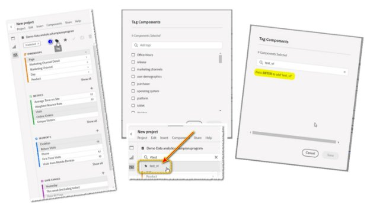

# #Tags — 個人のアシスタント

_個人のアシスタント#TAGSして、必要なものを効率的に見つける方法を学びます。 Adobe Analytics・チャンピオンのジェフ・ブルーマー氏は、お客様の利益に対するツールの可能性を最大限に引き出すための専門家の洞察を共有します。_

誰もが良いタグのゲームをしたり隠れたり探したりして子供の頃に戻って遊んだ覚えがあるでしょ？

最も良いのは、私たちがそれを基地に戻す（タグ）か、誰かが「オリー・オリー・オックスンフリー！」と叫ぶのを聞くまで、最も長く（隠れて探す）隠れた（隠れた）時でした。 （「すべては無料で、すべてのあなたが無料で、&quot;ドイツ語から派生：&quot;alle alle auch sind frei!&quot;）。  つまり、他の全員が基地に着いたり、見つかったり、誰かが「それ」とタグ付けされたりして、私たちはまだ別のラウンドをプレイする自由を持っていたのです。

重要な部分は、ゲームがタグか隠れ、シークか、私たちは何度も誰もが見つかった楽しいアクティビティをプレイしていたかです。

日々の仕事に目を向けると、探し物は、もっと冒険心が薄く、退屈なものになるように見えます。 しかし、少しの作業をフロントエンドに入れる気があるのではなく、必ずしもそうです。  私の家族でよく知られているフレーズは「最も痛みは自ら負う」ですがもっと有名なフレーズですが最近は少し古くさく見えるかもしれませんがここでも非常に関連性が高いのは「時間の中での編み目は 9 を節約する」です - Benjamin Franklin

さて、お気に入りになったので、まず質問から始めましょう。

 

これを行った人は何人いますか？  次の項目を検索し始めました： **ディメンション**, **日付範囲**, **セグメント**&#x200B;または **計算指標**&#x200B;そして、この巨大なリストに遭遇します ( **図 1**) を含める必要はありません。  ***分析&#x200B;****Workspace*** それは役に立つと考えているが、実際には、それはまったく役に立たないことに成功しただけだ。  私は正しいの？

*図 1 - 「year」を検索する*

より良い結果が得られました。いくつかを作成しました。 *新規* **日付範囲** および **セグメント**&#x200B;そして、それらは「とても新しい」ので、少なくともこれらの項目は、次に入ってきたときに、すばやく簡単に見つけられると思うでしょう ***Adobeワークスペース***. 正しいの？

バブルが破れるのは嫌ですが、出て行ってみてください ***Adobe Analytics*** 新しい「小さな友人」を全部作った後、戻ってきたら、大半の人は逃げ出してしまいます。  もし運が良ければ *maybe* 一人は後に残って待ち続けていたが、残りは既に長く行って、隠れて探し続けていた。

それは 1 日目からのゲームですがルールを変えられたら？

実際に、自分の個人用アシスタントを作って、役割を正しく切り替えられたらどうでしょうか？

まじかに、ここでお話ししているのは、TAGS です。  そうだ!!  私たちの友人のハッシュタグです以前は「数字」や「ポンド記号」と呼ばれていました電話で見たとおりです  我々のミュージシャン達は、それを「鋭い」と呼びさえする。

あなた方のために *本当に* リマインダーが必要な場合は、次のようになります。 **#**

とにかく、我々が話している理由は **#tags** 「退屈で退屈で、いっぱいな、いっぱいなもの」の「任意のバケット」に集中してしまうので（説明のように）、私たちは皆、より重要なものを作り出すのに急いでいるので、（私は知らない）

- Workspace レポート
- セグメント
- 計算指標 
- 日付範囲

向き合え、みんな！  名前をつけてみると、やつらがスキップされた理由の言い訳がすべて耳に入ります。

「ああ、おい、でも簡単だ。  後で戻って来て、昼休みの間に更新することも、会議で座っている間でも、更新することもできます。 *すべてを手に入れる*&#x200B;と、決してしなかった人はみんな言いました。

**Adobe** 私たち人々は、すぐにすぐにすぐに#TAGSの選択セットを作成するサービスを行っていました。なぜなら、彼らは私たちをどこかに出発させる必要があったからです。  私は少しだけで追加の注意事項を提供しますが、私が最初にデモしているものは、あなたのお金に最大の大きな効果を与えるでしょう！

独自のを作成する前に、まず知っておく必要があるのは、既存の **タグ**:

新規プロジェクトであれ既存のプロジェクトであれ、コンポーネントの検索バーに移動し、#hashtagと入力して（ビデオを見るだけで）Enter キーを押し、単にスクロールを開始して認識可能な語句を見つけるだけです。

最初の注意事項：注意すべきことは、適切な命名規則に忠実である場合、 *own* タグは、ほぼすべての *資本化された* タグが表示されます。 *should*&#x200B;そして、「必ず」という言葉には注意を払う。 **Adobe**、標準のタグ付き項目。  つまり、作成するタグがすべて小文字であることを確認します。

さて、私が先ほど「個人アシスタント」について言ったことに戻りましょう。  お気に入りの既存のコンポーネントを選択し、それらを表示する唯一のコンポーネントにすることができますと言ったらどうでしょうか？

1. 複数のコンポーネントを選択し始めると（Ctrl キーを押しながら左クリック）、一部のアイコンが上に表示されます。  そのうちの 1 つがタグアイコンになります。
1. それをクリックすると、[ タグ ] ダイアログが開き、これらのコンポーネントに関連付けられている既存のタグが表示されます。
1. この画面から、次の項目を割り当てることができます。 **追加/新規** この時点でタグを使用できます。  ( 例： **test\_v1**)
1. 任意のコンポーネントに新しいタグを追加するには、単に **ENTER** をクリックしてから、「保存」ボタンをクリックします。
1. 新しいタグを割り当てたら、ハッシュタグ (#) と新しいタグを入力して検索することができます。

駄洒落を謝すが「#tagだな！」  今後のシークを大幅に減らしました！  今、あなたの適正な勤勉さと努力が最終的にどこに役立つかを見ることができます。

例えば、 **旅行業界** そして我々は彼らのために報告書を作り上げている **コア営業時間**.  「TRAVEL」という単語だけで検索を始めると、必要以上の結果が得られる可能性があります。  実際、もし我々がただ A を引き上げただけなら **Workspace** 必要な結果の半分も含まれているので、コンポーネントは容易に使用できない状態です。

ただし、毎日の作業を通じて、定期的にタグ付けを行っています。 **セグメント**, **指標**、およびその他の関連する **コンポーネント** 新しい作成時に、新しい作成を作成する場合は、新しい作成を作成する必要があります。 **workspace**&#x200B;では、我々が好意を持ってルールブックを書き直す方法を真剣に実証してきました！

この場合、次のアイテムすべてに対して#tagンなを作成しました： #core.

仕事習慣のこの部分を作り続け、何度も何度もこれを行うスキルを向上させ続ける中で、#tagsを使用することは、自分の個人的なアシスタントを持つようになることに気づくでしょう。

もっと現実世界の例を見たいのか？ 次の点を考慮してください。

1. 例えば、 **セグメント** および **日付範囲** 対象： **四半期** in **2023 年**?

   

   *追加のヒント*：右側の小さな四角形では、並べ替え順を *アルファベット*!

1. もちろん、誰もが **キャンペーントラッキングコード** ある程度まで  もしあなたがただの見解を明確に保ちたいなら *あなたの* おもちゃ，追加を検討 **#tag**&#x200B;は、実際に必要なコア項目のみを表示し、その他のすべてのノイズを除外します。

確かに隠れて探すのは子供の頃は楽しかったけど今は大人だ  重要な事を探す時間がないので、自分の好みに応え、ツールと戦う時間を無駄にしないでください。  ルールを書き直し、ツールを機能させます。

## タグ、あなたはそれです！

## 作成者

このドキュメントの作成者：

**Jeff Bloomer** Kroger Personal Finance 社の Digital Analytics 担当マネージャ

Adobe Analytics チャンピオン

