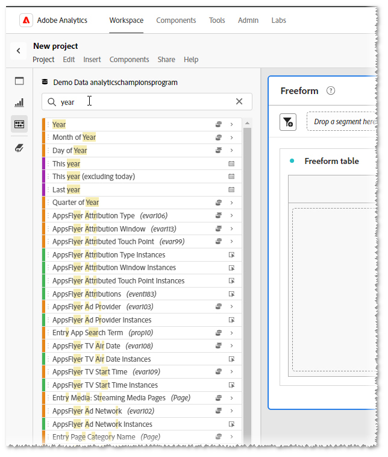
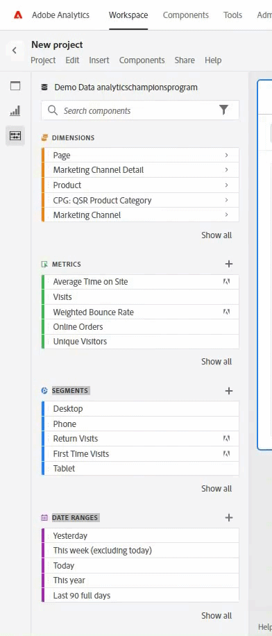
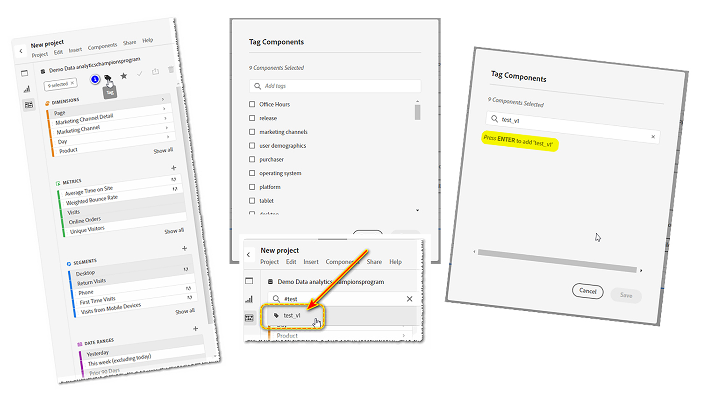
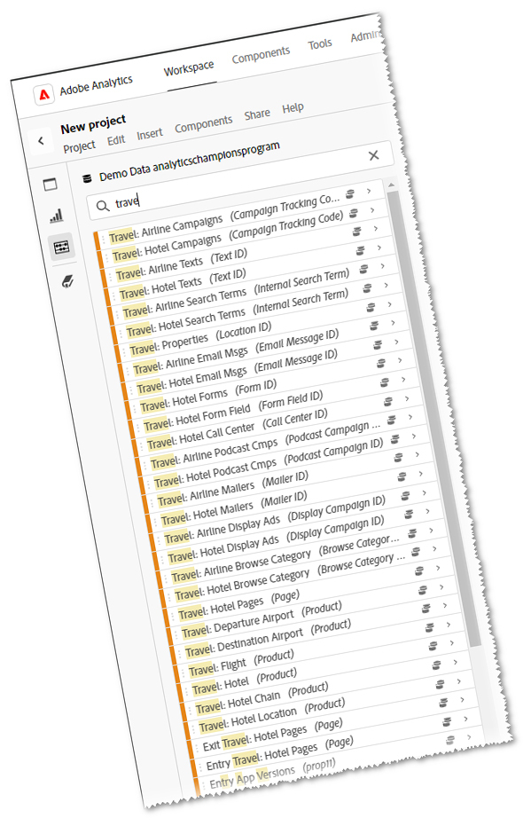
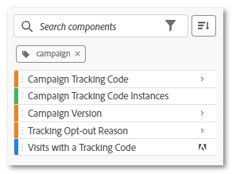

# タグ – パーソナルアシスタント

_必要な情報を効率的に見つける#TAGSめのパーソナルアシスタントとして、デジタル分析を効率化する方法をご覧ください。 Adobe Analytics ChampionのJeff Bloomerが、このツールの潜在能力を最大限に引き出すための専門家のインサイトを紹介します。_

子供の頃は、誰もがタグ付けや隠れたり探したりしていたことを思い出します？

何より素晴らしいのは、基地に戻るか（タグ付け）、一番長い時間だけ隠れて（隠して探す）、誰かが「オリーオリーオリーオクシンは自由だ！」と叫ぶのを聞いた時でした。 （&quot;All ye all ye out in free&quot; from the German: &quot;alle alle auch sind frei!&quot;）  これは最終的には他の誰もが基地に到着したか、発見されたか、誰かが「it」というタグが付けられていたので、私たちはまだ別のラウンドを自由にプレイすることができました。

重要な部分は、ゲームがタグ付けまたは隠してシークであるかどうかです、私たちは誰もが何度も発見された楽しいアクティビティをプレイしていました。

私たちが日々の仕事に目を向けると、物事を探すことははるかに冒険的ではなく、より面倒なものになります。 しかし、フロントエンドに少しの作業でも取り組むことに前向きであれば、何も求めていません。  私の家族がよく知っているフレーズは、「ほとんどの痛みは自己傷です」です。 しかし、最近は少し古臭く見えるかもしれませんが、「時間のステッチは9を節約する」という、この状況でも非常に関連性の高い、より有名なフレーズがあります。 - ベンジャミン・フランクリン

さて、みなさんに関心をお持ちになったので、まず質問をさせてください。

実行した人は何人いますか？  **ディメンション**、**日付範囲**、**セグメント**、または&#x200B;**計算指標**&#x200B;の検索を開始しました。この巨大なリスト（**図1**&#x200B;を参照）は、不要なものが表示されます。  ***Analysis Workspace***&#x200B;はそれが役に立つように努力していると考えていますが、実際のところ、まったく役に立たなかったことだけが成功しています。

*図1 - 「年」を検索*

さらに、一部の&#x200B;*new* **日付範囲**&#x200B;と&#x200B;**セグメント**&#x200B;を作成しました。これらは「非常に新しい」ため、次回&#x200B;***Adobe Workspace***&#x200B;にアクセスしたときに、これらの項目を簡単にすばやく見つけることができると思います。 私は正しいですか？

さて、私はあなたのバブルを爆発させるのは嫌いですが、あなたの最新の「小さな友達」をすべて作成した後に&#x200B;***Adobe Analytics***&#x200B;を離れてみてください、そしてあなたが戻るとき、それらの大部分は単に逃げています。  運が良ければ、*たぶんそのうちの*&#x200B;人が後ろに残って待っていましたが、残りは既に消えて隠れて探しています。

## ルールブックの書き換え

これが初日からのゲームですが、ルールを変更できたらどうでしょうか？

実際、独自のパーソナルアシスタントを作成して、ルールを切り替えることができるとしたらどうでしょうか？

真剣に、ここで話しているのは、タグです！  その通りです！!  これはハッシュタグの友人で、以前は「number」と「pound sign」として知られていましたが、私たちの携帯電話で見たように。  私たちミュージシャンは、それを“シャープ”と呼んでいます。

*本当に*&#x200B;にリマインダーが必要な方は、次のようになります。**#**

とにかく、**#tags**&#x200B;の話をするのは、彼らが「退屈で退屈で気まぐれなものだ」という「オプションのバケット」に入ってしまうからです（説明のように）。なぜなら、私たちはみな、より重要なものを作るために急いでいるからです。

- Workspace レポート
- セグメント
- 計算指標
- 日付範囲

顔を合わせろ！  名前を挙げてください。私たちは、なぜ彼らがスキップされるのかについてのすべての言い訳を見たり聞いたりしました。

「ああ、でも、簡単だよ。  私はいつも後で戻ってきて、昼休みのカップルでそれらのことを更新することができます，または私は会議に座っている間でも、多分&#x200B;*すべてを追いつく*，誰もが決して行わなかった。

## ツールボックスの機能

**Adobe**&#x200B;は、WE THE PEOPLEに対して、すぐに使える一連の#TAGSールを作成するサービスを行いました。なぜなら、彼らはどこかで私たちを開始する必要があったからです。  私はほんの少しでいくつかの追加の注意事項を提供しますが、私が最初に示していることはあなたのバックのための最大の強打を与えるでしょう！

独自のタグを作成する前に、最初に知っておく必要があるのは、既存の&#x200B;**タグ**&#x200B;を検索する方法です。

新規または既存のプロジェクトを使用している場合でも、必要なのは、コンポーネント検索バーに移動し、これらの主な用語の1つと一緒に#hashtagを入力して（ビデオを見るだけ）、ENTER キーを押すことだけです。または、認識できる用語が見つかるまでスクロールを開始することもできます。

最初に注意すべきことは、*own* タグの作成を開始する際に適切な命名規則に従い続ける場合、*should*&#x200B;と表示される&#x200B;*大文字* タグの約1つにつき、そのタグが&#x200B;**Adobe**&#x200B;のタグ付き項目であることに注意することです。  つまり、作成するすべてのタグが&#x200B;**小文字**&#x200B;であることを確認してください。

## 独自のパーソナルアシスタントの作成

さて、先ほど私が話した「パーソナルアシスタント」に戻りましょう。  お気に入りの既存のコンポーネントを選択して、表示されるコンポーネントのみを選択できるようになったと言ったらどうでしょう？

1. 複数のコンポーネントの選択を開始すると（CTRL+左クリック）、一部のアイコンが上に表示されます。  そのひとつがタグのアイコンです。
1. このタブをクリックすると、タグダイアログが開きます。このダイアログでは、これらのコンポーネントに関連付けられている既存のタグを表示できます。
1. この画面から、この時点で希望する&#x200B;**追加/新規** タグを割り当てることができます。  （例：**test\_v1**）
1. 新しいタグを任意のコンポーネントに追加するには、「保存」ボタンをクリックする前に、キーボードで&#x200B;**ENTER**&#x200B;を押すだけです。
1. 次に、新しいタグを割り当てたら、ハッシュタグ（#）と新しいタグを入力して検索できます。

冗談は許して下さ#tagが、「お前は大丈夫だ！」  あなたは自分を救ったばかりで、将来は自分を救う必要が少なくなりました。  デューデリジェンスとハードワークが最終的にどのように影響するのかを把握できました。

## パーソナルアシスタントの活用

**旅行業界**&#x200B;で働いていて、**主要営業時間**&#x200B;のレポートをまとめているとします。  「旅行」という言葉だけで検索を始めると、必要以上に多くの結果が得られる可能性があります。  実際、必要な結果の半分でも含む&#x200B;**Workspace**&#x200B;を取り出しただけでは、コンポーネントはすぐに利用できなくなります。

しかし、毎日の作業を通して、**セグメント**、**指標**、その他の関連&#x200B;**コンポーネント**&#x200B;に定期的にタグ付けし、新しい&#x200B;**ワークスペース**&#x200B;を作成する際に、新しい新しいコンポーネントをいくつか作成するだけでした。ルールブックを自分たちに合わせて書き換える方法を真剣に示しました。

今回は、#coreという名前のアイテムすべてに対してシンプルな#tagを作成しました。

仕事の習慣のこの部分を作り続け、何度もこれを行うためにあなたのスキルを向上させ続けると、#tagsを使用することがあなた自身の個人的なアシスタントを持つようになるでしょう。

実例をいくつか挙げましょう？ 次のような要素を検討します。

1. 例えば、**2023**&#x200B;の&#x200B;**すべての四半期**&#x200B;の&#x200B;**セグメント**&#x200B;と&#x200B;**日付範囲**&#x200B;を簡単に見つける方法はいかがでしょうか？

   

   *追加のヒント*：右に小さな正方形を配置すると、並べ替え順を&#x200B;*アルファベット*&#x200B;に変更することもできます。

1. もちろん、全員がある程度&#x200B;**キャンペーントラッキングコード**&#x200B;を使用します。  *あなたの*&#x200B;個のおもちゃだけを明確に見たい場合は、実際に見る必要があるコア項目に&#x200B;**#tag**&#x200B;を追加し、他のすべてのノイズを除外することを検討してください。

## 外に出て遊ぼう！

確かに、隠れて探すことは子供の頃は楽しかったですが、今は大人です。  重要なことを常に探している時間はないので、自分に有利に働き、ツールと戦う無駄な時間を省きましょう。  ルールを書き直し、ツールを機能させます。

### 効率的なタグ付け！

## 作成者

この文書の作成者：

**Jeff Bloomer**、Kroger Personal Finance、デジタル分析担当マネージャー

Adobe Analytics Champion
