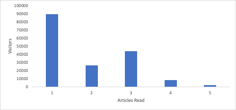
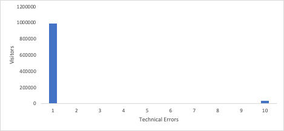
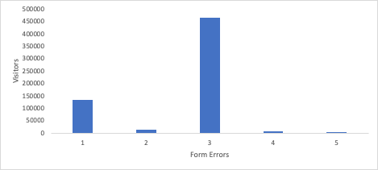

# ヒストグラムでインサイトを解き放つ：[!DNL Analytics]の平均値を超えています

_Analyticsでヒストグラムの影響を確認して、平均以上のインサイトを得ることができます。 ヒストグラムは、顧客の行動、訪問者のエンゲージメント、技術的なパフォーマンス、フォームのエラーなどのデータパターンを明らかにし、[!DNL Adobe] Workspaceでより深いインサイトと情報に基づいた意思決定を可能にします。_

では早速始めましょう。 [ ヒストグラム ](https://experienceleague.adobe.com/docs/analytics/analyze/analysis-workspace/visualizations/histogram.html)を使用してください。 その理由を説明しますが、最初の質問、「ヒストグラムとは何か？」に答えましょう 分かります。 多くの場合、多数の棒グラフが表示されているのを見ると、それは棒グラフだと思うかもしれません。 はい、ヒストグラムは似ていますが、私はあなたを保証します、彼らは異なります。 棒グラフでは比較し、ヒストグラムでは変数が発生した頻度を示します。 ご覧ください。 ここに棒グラフがあります。

6つのモデルがあり、各モデルの売上を比較できます。 ヨハネスブルグが最も多く、ベルリンが最も少ないことが分かります。

次に、ヒストグラムを見てみましょう。

X軸の下部には、各顧客が購入したユニット数があります。 最初のバーは、顧客が1 ユニットを購入した頻度を表し、2番目のバーは、10 ユニット以上を購入した顧客まで、2 ユニットを購入した顧客数などを表します。

では、どのように役立つのでしょうか？ ほとんどの人は、1つの商品しか購入していません。 5つのユニットに到達するまで減少し続けます。 10個になるまで再び減少します。 これは、顧客が5倍の価格で購入することを本当に好んでいることを示しており、それを活用するために特別な価格設定やパッケージを提供する必要があります。 もちろん、他にもたくさんの使い方があります。

## 訪問者のエンゲージメントを把握

サイトやアプリがリピートトラフィックに依存している場合、再訪問者数と頻度を把握する必要があります。 最も単純なヒストグラムのひとつは、1回以上再訪問する訪問者の数を把握することです。 ヒストグラムを時間をかけて追跡すると、進行状況を確認できます。右側の棒が高くなり、左側の棒が短くなることを期待しています。

人をサイトに引き留め、記事を読ませたいかもしれません。 Insightを使用すれば、異なる数の記事を閲覧した訪問者の数を示すヒストグラムによって、エンゲージメントのレベルを把握できます。 なぜそれが役に立つのか？ 例えば、多くの訪問者が1つの記事を読んで離脱したとしても、エンゲージメントの高い訪問者の中には3つの記事を読んで離脱する人がいるとします。 素晴らしい情報です！ これで、訪問者に1つ以上の記事を読んでもらうことを目的として、1つ目と3つ目の記事のページをパーソナライズする必要があることがわかりました。

## 顧客行動の理解

病院のシステムの患者記録のプロダクトオーナーから、データを求められました。 医療記録を取得するために選択できる6つの地域がありました。 彼女は、クリックしたオーディエンスが複数なのか。 1つ、2つ、3つ、4つ、5つ、6つのオプションをクリックした訪問者の数を示すヒストグラムを作成しました。 これは過剰に思えるかもしれませんが、訪問者の半数以上が少なくとも2つのオプションをクリックし、訪問者の3.2%が6つすべてをクリックしています。 そのヒストグラムを目の前にして、彼女は行動に移り、ロードマップを並べ替え、オプションを2つまで簡素化しました。 患者さんの体験がはるかにシンプルになりました。

## 技術的性能について

技術的エラーがどれだけあったかを示すヒストグラムを設定することで、サイトの技術的なパフォーマンスを詳細に把握できます。 多くの技術的エラーを経験している訪問者の多くは、これらの技術的な修正の優先順位を開始するためのサインです。

## フォームのパフォーマンスについて

フォームのエラーメッセージは別の問題です。 これは訪問者のエラーであり、ユーザーのエラーではありません。 しかし、どれだけの訪問者が、どれだけのエラーを経験しているかを示すヒストグラムがあれば、大きな成果を得ることができます。 多くの訪問者に多くのエラーが発生していることを示すヒストグラムが表示される場合、それは訪問者の責任ではない可能性があります。 これは、フォームの名前が低いフィールド、不明確な手順、または必須フィールドを非表示にするデザインがあることを示す優れた指標です。

## 計算指標ではない理由

計算指標を扱う場合と比べて、どのように異なるのでしょうか？ 適切に計算された指標だとわかります。 サイトのパフォーマンスを把握するために不可欠なツールです。 しかし、これまで挙げたユースケースの多くの問題は、平均データによって問題の大きさが示されるものの、問題の範囲が不明瞭になることです。 ヒストグラムを使用して、上記のいくつかのユースケースに関する追加情報を入手する方法について説明します。

- 訪問者のエンゲージメント – 平均ストーリー数が1.2である場合、最初の記事をパーソナライズすることはかなり明白です。 3つ目の記事を読むと、別の大きなグループが存在することを見逃すでしょう。これは、ヒストグラムで明らかになっています。

  

- 技術的エラー – 1訪問者あたり平均8.7件のエラーが発生した場合、問題があったことがわかります。 ヒストグラムでは、訪問者の97%が、1つ以上のエラーを経験していることがわかります。しかし、いくつかの異常値が、平均値を押し上げています。 そして、少数の異常値グループのエクスペリエンスの改善に多くの時間を割くのは価値がないと判断するかもしれません。

  

- フォームエラー – 訪問者ごとに平均3.6個のフォームエラーメッセージがある場合、これは問題の指標です。 技術的なエラーと同じ異常値の問題がある場合もありますが、ヒストグラムで特定の数のエラーが急増した場合にinsightを利用することもできます。 1つのエラーで大きなスパイクが発生する？ これは、これらすべての訪問者が経験する一般的な問題かもしれませんし、一度すべて異なるエラーが発生した場合もあります。 3つのエラーで大規模なスパイク？ ああ、今は面白い。 同じ3つのエラーであることを示す調査を求められた場合は、訪問者を把握し、相互に関連する可能性の高い問題を修正するのに役立つデータに重点を置きます。

  

ご覧のとおり、ヒストグラムには独自の用途があるだけでなく、平均から得られるinsightも深めることができます。 [!DNL Adobe Analytics]のすぐに使えるビジュアライゼーションで、簡単に作成できます。 これらのユースケースが参考になるか、インスピレーションを得られることを願っています。 ハッピー視覚化！

## 作成者

この文書の作成者：

**Gitai Ben-Ammi**、Concentrix Catalyst プリンシパルコンサルタント

[!DNL Adobe Analytics] チャンピオン
