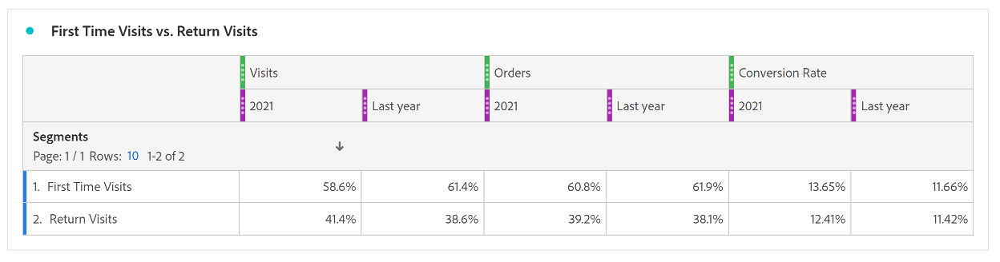
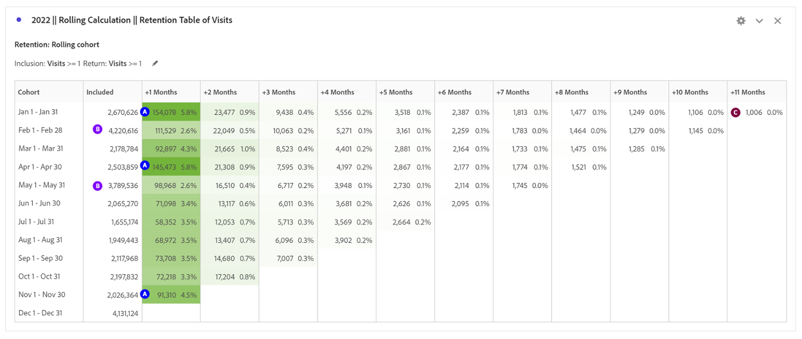
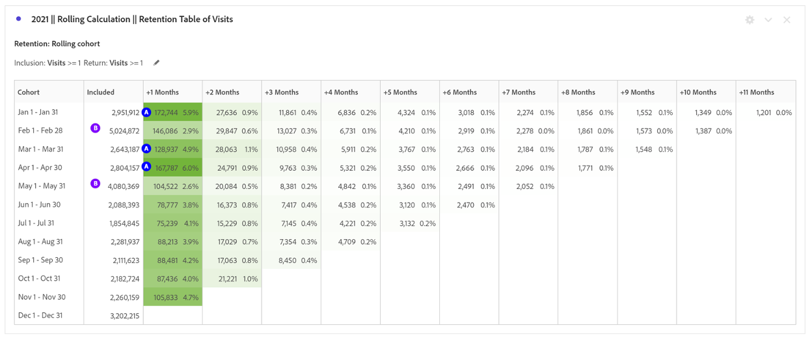
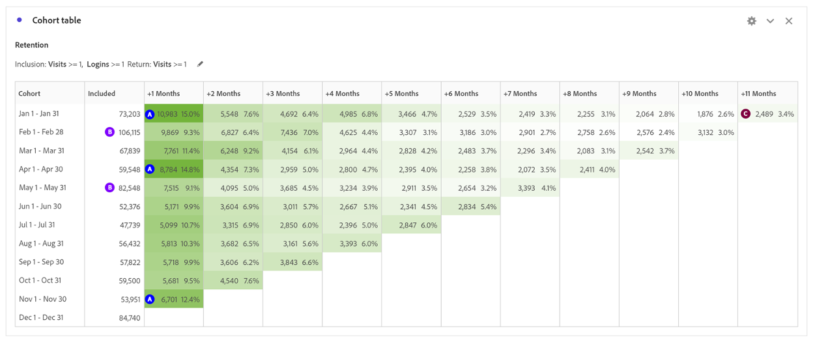
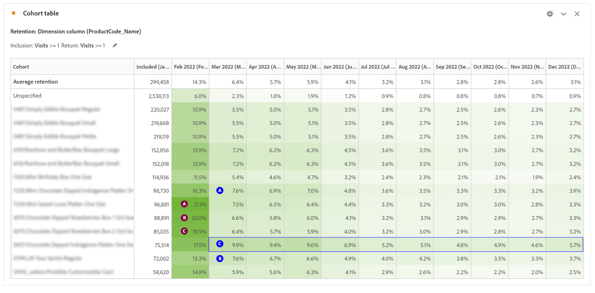

# コホート分析により、顧客の行動を把握

顧客体験と売上を向上させるには、顧客の行動を把握する必要があります。 コホート分析は、エンゲージメントと顧客維持率の把握に役立ちます。これにより、アカウント作成の改善や、何ヶ月にもわたるキャンペーンの構築などのアクションをスムーズに進めることができます。

デジタルパフォーマンスを分析することは、顧客がビジネスとどのようにやり取りし、顧客体験を向上させるために何を実施すべきかを把握するために非常に重要です。 この記事では、コホート分析を利用して、顧客の行動をより詳細に把握する方法を解説します。

## パート 1：初回訪問と再訪問のデジタルパフォーマンスの比較

### ステージの設定

顧客は、過去2年間のデジタルパフォーマンスを把握したいと考えており、デジタルパフォーマンスを促進するためのロイヤルティプログラムの構築を検討しています。 まず、新規訪問者とリピート訪問者の現在のサイトミックスを見て、2つの訪問者グループが今日どのように行動しているかを把握することができます。

最新のデジタルパフォーマンス

1. 2022年には、初回訪問による注文が62%であったのに対し、再訪問による注文は38%でした（Cookie、複数のデバイスが対象）。
1. 初回訪問者のコンバージョン率は、初回訪問者の方が、再訪問の場合よりも若干高く、11.6%対11.4%です。
1. 2021年と比較すると、コンバージョン率は両方のセグメントで低下しました。

## パート 2：コホート分析 – 可食配列を訪問グローバル製品

デジタルチャネルの粘り強さと、リピート購入者を促す機会を把握するために、次に考えるべきことは「2022年に毎月サイトに戻る訪問者の数はどのくらいか」です。

### コホート分析とは

コホート分析は、コホートが企業とどのように関わっているかを把握するための有用な手法です。 まず、どの質問に答えるかを決めました。

1. 特定の年の、月別の平均保持期間を教えてください。
1. 特定の年に1 ヶ月にサイトにアクセスした訪問者の数は？
1. ログインが保持に与える影響は何ですか？
1. リテンションを高めるために特定の製品を導入していますか？

コホートテーブルの設定方法

1. 日付範囲を1月から2022年12月に設定
1. **包含基準：**&#x200B;訪問
1. **返品条件：**&#x200B;件の訪問
1. **粒度：**&#x200B;か月
1. **設定：** ローリング計算
\*\*含まれている列ではなく、前の列に基づいて保持率を計算できます。 つまり、ユーザーは各月\*\*に含まれます
1. **セグメント：**&#x200B;この分析をさらに進めるために特定のセグメントを選択できます
   1. 特定のランディングページ
   1. Device Type
   1. マーケティングチャネル
   1. その他

### 結果の解釈

**2022年：**

1) 1か月の定着率が最も高い月は、1月、4月、11月です
1) 最も多い月には、2月と5月が含まれます
1) 毎月約1,000人の訪問者がサイトを再訪問しています

**2021年：**

1) 定着率+1か月が最も高い月は、4月、1月、3月です
1) 最も多い月には、2月と5月が含まれます

**アクション項目：**

約1,000人の訪問者にもとづいてセグメントを作成し、その詳細を確認します。

- どこにありますか？
- 年間でどんな商品を購入しているのか？
- どの店から買っているのか？

重要な月：配信数にもとづいて顧客維持を促進する機会を特定する

- 2月と5月にボリュームを活用するために、さらなる粘り強さを促すことができる特定の戦術はありますか？

リピート購入者を理解するための注文のリピート分析

- 同じ月の+1か月の定着率が最も高いですか？
- 訪問の最も高い月は注文と同じですか？

## パート 3：選択基準への2つの指標の追加

### ログインの影響について

この顧客はロイヤルティプログラムの価値を把握したいと考えていました。そのため、分析の次のステップでは、コホートへのインクルージョン指標として「ログイン成功」イベントを追加することにしました。

注意：コホート分析は、計算指標（コンバージョン率など）や非整数指標（収益など）には使用できません。 コホート分析では、セグメントで使用できる指標のみを使用でき、一度に1を超える増分しかできません。

ログインしているユーザーをサイトが保持する可能性が高いか？

より多くのユーザーをログインさせることができたらどのような影響があるでしょうか？ よりスムーズな体験でしょうか？

### コホートテーブルの設定

1. **日付範囲を設定：** ～ 2022年1月～12月
1. **包含条件：**&#x200B;訪問+ ログイン成功イベント
1. **返品条件：**&#x200B;件の訪問
1. **粒度：**&#x200B;か月
1. **設定：** ローリング計算
\*\*含まれている列ではなく、前の列に基づいて保持率を計算できます。 つまり、ユーザーは各月\*\*に含まれます

### 結果の解釈

**2022年：**

1) 定着率+1か月が最も高い月は、1月、4月、11月です（最初のコホートテーブルと同じ月）
1) 最も多い月には、2月、5月、12月が含まれます
1) 毎月約2500人の訪問者が再訪問します

**アクション項目：**

チェックアウト時にユーザーにアカウントを作成してもらうためのサイトユーザーエクスペリエンスを調査します

## パート 4：カスタムDimensionコホート

カスタム Dimension コホート：時間ベースのコホートではなく、選択したディメンションに基づいてコホートを作成します（デフォルト）。 多くの顧客は、時系列以外の方法でコホートを分析したいと考えています。新しいカスタムDimensionコホート機能では、選択したディメンションにもとづいてコホートを柔軟に構築できます。 マーケティングチャネル、キャンペーン、製品、ページ、地域、または[!DNL Adobe Analytics]内の他のディメンションなどのディメンションを使用して、これらのディメンションのさまざまな値に基づいて顧客維持率がどのように変化するかを示します。 「

カスタム Dimension コホートセグメント定義では、ディメンション項目は、返品定義の一部ではなく、包含期間の一部としてのみ適用されます。

「カスタムDimensionコホート」オプションを選択した後、必要なディメンションをドロップゾーンにドラッグ&amp;ドロップできます。 これにより、同じ期間の類似のディメンション項目を比較できます。 例えば、次の方法で都市のパフォーマンスを比較できます

商品、キャンペーンなどのサイドセグメンテーション。上位14 ディメンションの項目が返されます。 ただし、フィルター（ドラッグされたディメンションの右側にマウスポインターを置いてアクセス）を使用すると、目的のディメンション項目のみを表示できます。 カスタム Dimension コホートは、レイテンシーテーブル機能では使用できません。

### どのような製品がサイトの粘着性を高めているのか？

カスタムのDimensionコホートテーブルでは、平均を上回るリテンション率を達成している商品がハイライトされます。  この表は、注目すべき製品を取り上げて、社内外のマーケティングキャンペーンを推進するための上位の製品を特定するのに役立ちます。

**2月：** 3件の商品が高い定着率で際立つ

1) 商品1
1) 商品2
1) 商品3

**3月：**

1) 商品1
1) 商品2
1) 商品3 – 平均的な顧客維持率と比較して、顧客維持率が高く、優れたパフォーマンスを発揮する。

## まとめ

コホート分析とカスタムDimensionコホートは、顧客の行動を把握し、デジタルパフォーマンスを向上させるための強力なツールです。 顧客維持率、ログイン率、特定の製品の影響などを分析することで、データにもとづいた意思決定を行い、顧客体験を向上させ、成長を促進することができます。

## 作成者

この文書の作成者：

**Jennifer Yacenda**、マリオットのシニアディレクター

[!DNL Adobe Analytics] チャンピオン
