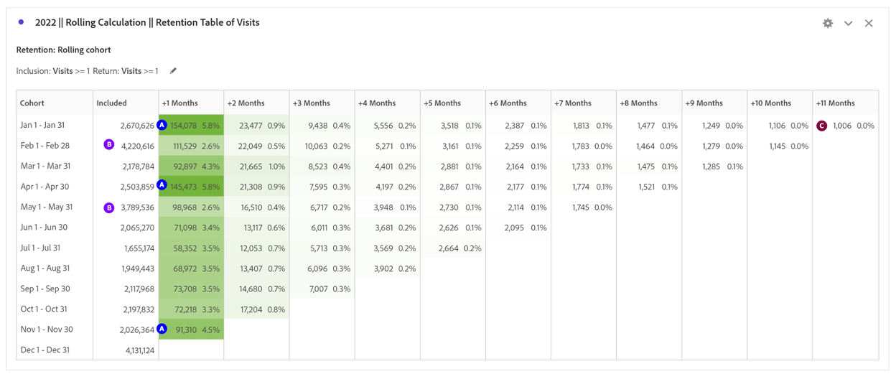

# コホート分析を使用した顧客行動の把握

顧客体験と収益を向上させるには、企業は顧客の行動を理解する必要があります。 コホート分析は、エンゲージメントとリテンションの把握に役立ち、アカウント作成の改善や、ボリュームの多い月向けのキャンペーンの作成などのアクションにつながります。

デジタルパフォーマンスの分析は、顧客のビジネスとのやり取りの方法と、エクスペリエンスを向上させるために実行できるアクションを理解するために重要です。 このブログ投稿では、コホート分析を使用して顧客行動をより深く理解する方法を説明します。

## 第 1 部：初回訪問と再訪問のデジタルパフォーマンスの比較

### ステージの設定

クライアントは、過去 2 年間のデジタルのパフォーマンスを理解したいと考えており、デジタルのパフォーマンスを向上させるためのロイヤルティプログラムの開発を検討しています。 まず、現在の新規ユーザーとリピートユーザーのサイトミックスを見て、2 つの訪問者グループの現在の行動を理解します。

現在のデジタル性能

1. 2022 年には、初回訪問からの注文の 62% が初回訪問によるものであるのに対して、再来訪からの注文の 38% （Cookie の場合、複数のデバイスの場合があります）でした。
1. 初回訪問のコンバージョン率は、両方の再訪問のコンバージョン率よりわずかに高く、11.6% 対 11.4% です。
1. 2021 年と比較して、コンバージョン率は両方のセグメントで減少しました。

## 第 2 部：コホート分析 – 可食手配グローバル製品の訪問

デジタルチャネルの粘着性と、リピート購入者を増やす機会を理解するために、次に答える質問は次のとおりです。2022 年に毎月サイトに戻る訪問者の量はどれくらいですか？

### コホート分析の概要

コホート分析は、コホートが時間の経過と共にブランドとどのように関わるかを理解するための便利なツールです。 まず、どの質問に答えるかを決定します。

1. 特定の年における月ごとの平均保存期間はどれくらいですか。
1. 特定の年において、毎月サイトに再訪問する訪問者の量はどれくらいですか？
1. ログインがリテンションに与える影響
1. リテンションを高める原因となった特定の製品はありますか？

コホートテーブルの設定方法

1. 日付範囲を 1 月から 2022 年 12 月に設定します
1. **インクルージョン条件：** 訪問数
1. **再来訪条件：** 訪問
1. **精度：** か月
1. **設定：** ローリング計算
\*\*含まれる列ではなく、前の列に基づいてリテンションを計算できます。 つまり、ユーザーは各月に含まれます\*\*
1. **セグメント：** この分析をさらに推進するために、特定のセグメントを選択できます
   1. 特定のランディングページ
   1. Device Type
   1. マーケティングチャネル
   1. 等。

### 結果の解釈

**2022 年：**

1) 保持率が 1 か月超の月には、1 月、4 月、11 月があります
1) 量が最も多い月には、2 月と 5 月が含まれます
1) 毎月 1000 人を超える訪問者がサイトに戻ります

**2021 年：**

1) 保持率が 1 か月超の月には、4 月、1 月、3 月があります
1) 量が最も多い月には、2 月と 5 月が含まれます

**アクション アイテム：**

約 1,000 人の訪問者に基づいてセグメントを作成し、それらの訪問者に関する詳細情報を次に示します。

- その場所はどこですか。
- 年間を通じて購入する製品は何ですか？
- 彼らはどこの店から買っているのですか。

ボリュームに基づいてリテンションを促進するオポチュニティを示す重要な月数：

- 2 月と 5 月にボリュームを活用して、さらに粘着性を高めることができる具体的な戦術はありますか？

受注の分析を繰り返し、リピート購買担当を把握します。

- 同じ月のリテンション率が 1 か月超の中で最も高い値はありますか。
- 訪問の最大ヶ月は注文と同じですか？

## 第 3 部：インクルージョン条件への 2 つの指標の追加

### ログインの影響について

このクライアントはロイヤルティプログラムの価値を理解したいと考えているので、分析の次の手順では、ログイン成功イベントをコホートにインクルージョン指標として追加することにしました。

警告：コホート分析は、計算指標（コンバージョン率など）や整数以外の指標（売上高など）には使用できません。 コホート分析で使用できるのはセグメントで使用できる指標のみで、一度に増やせるのは 1 を超える数のみです。

サイトがログイン中のユーザーを保持する可能性は高くなりますか？

より多くのユーザーにログインしてもらえるとしたら、どのような影響がありますか？ それってベタベタしてんの？

### コホートテーブルの設定

1. **日付範囲を設定：** 年 1 月～ 2022 年 12 月
1. **インクルージョン条件：** 訪問+ ログイン成功イベント
1. **再来訪条件：** 訪問
1. **精度：** か月
1. **設定：** ローリング計算
\*\*含まれる列ではなく、前の列に基づいてリテンションを計算できます。 つまり、ユーザーは各月に含まれます\*\*

### 結果の解釈

**2022 年：**

1) 保持率が 1 か月超の月には、1 月、4 月、11 月があります（最初のコホートテーブルと同じ月）
1) ボリュームが最も多い月には、2 月、5 月、12 月があります
1) 毎月\*\*倍数\*\*よりも多く返す訪問者は 2500 人までです

**アクション アイテム：**

チェックアウト時にユーザーにアカウントを作成させるためのサイトユーザーエクスペリエンスを調査します

## 第 4 部：カスタムDimensionコホート

カスタムDimensionコホート：時間ベースのコホート（デフォルト）ではなく、選択したディメンションに基づいてコホートを作成します。 多くのお客様は、時間以外の基準でコホートを分析したいと考えています。新しいカスタムDimensionコホート機能では、お客様が選択したディメンションに基づいてコホートを柔軟に構築できます。 マーケティングチャネル、キャンペーン、製品、ページ、地域などのディメンションや、その他のディメンションを [!DNL Adobe Analytics] 用して、これらのディメンションの様々な値に基づいてリテンションがどのように変化しているかを表示します。 「

カスタムDimensionコホートセグメント定義では、ディメンション項目をリターン定義の一部ではなくインクルージョン期間の一部としてのみ適用します。

「カスタムDimensionコホートオプション」を選択した後、必要なディメンションをドロップゾーンにドラッグ&amp;ドロップできます。 これにより、同じ期間で類似したディメンション項目を比較できます。 例えば、次の方法で都市別のパフォーマンスを比較できます

面、製品、キャンペーンなど 上位 14 個のディメンション項目が返されます。 ただし、フィルターを使用して（ドラッグしたディメンションの右側にマウスポインターを置いてアクセスして）、目的のディメンション項目のみを表示できます。 カスタムDimensionコホートは、待ち時間テーブル機能と共に使用することはできません。

### サイトの粘着性を促進しているのはどの製品ですか？

カスタムDimensionコホートテーブルでは、平均よりもリテンション率の高い製品をハイライト表示します。  この表は、注目に値する上位の製品を使用した内部および外部のマーケティングキャンペーンを推進するための上位の製品を特定するのに役立ちます。

**2 月：** リテンション率の高い 3 製品が際立っています

1) 製品 1
1) 製品 2
1) 製品 3

**3 月：**

1) 製品 1
1) 製品 2
1) 製品 3：平均リテンションに比べて高いリテンション率でパフォーマンスを上回ることがよくあります。

## まとめ

コホート分析とカスタムDimensionコホートは、顧客の行動を理解し、デジタルパフォーマンスを向上させるための強力なツールです。 保持率、ログイン率、特定の製品の影響を分析することで、企業は顧客体験を向上させ、成長を促進するためのデータに基づく意思決定を行うことができます。

## 作成者

このドキュメントの作成者：

**Jennifer Yacenda**、Marriott シニアDirector

[!DNL Adobe Analytics] チャンピオン
