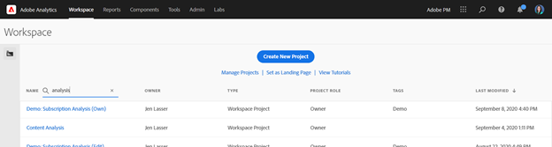
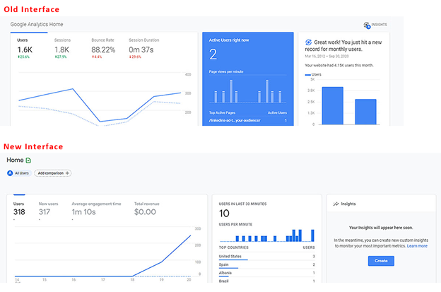
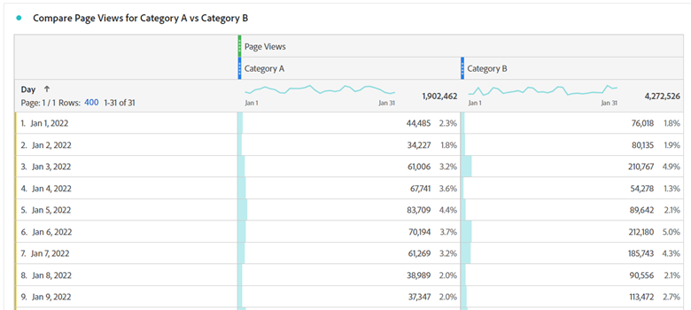
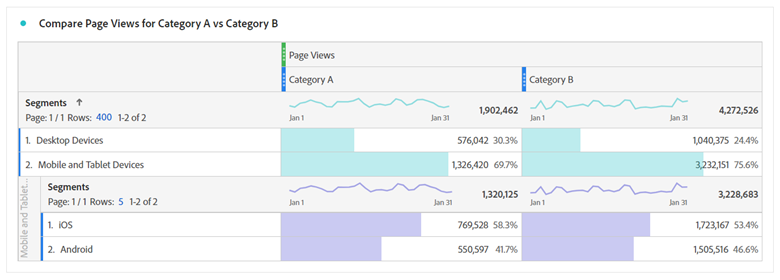
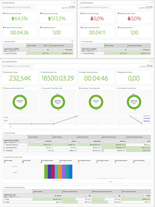
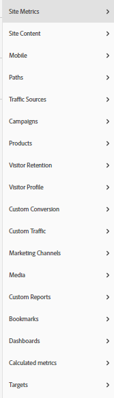
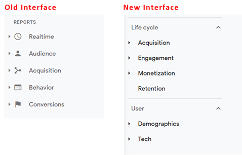

# Google [!DNL Analytics]から[!DNL Adobe Analytics]への移行に関する包括的なガイド{#comprehensive-guide-for-transitioning-to-adobe-analytics}

## &#x200B;1. 概要

ツール間を移行する際の最大の課題のひとつは、同等の機能をどこで見つけるかを学び、それを効率的に使用する方法を学ぶことです。 このディスカッションは、ユーザーが新しいユーザーとして[!DNL Adobe Analytics]に移行する場合や、Google [!DNL Analytics]から移行する場合など、ユーザーがより簡単にに移行できるように支援する、より大きなガイドの一部です。 ほとんどのユーザーが使い慣れている最も可能性の高い比較ツールとして、GAとの詳細な比較は、既存の知識を新しいツールセットに関連付けるために提供されます。 練習に代わるものがない場合は、これを使用することで始め、この時間に遭遇する可能性のある不満を減らすことができます。

用語をすばやく比較する必要があります。

| **説明** | **[!DNL Adobe Analytics]** | **Google[!DNL Analytics]** |
|--------------------------------------------------------------------------------------------------------------------------------|---------------------|----------------------|
| ページ（またはアプリの画面）を表すイベント指標が表示されました | ページビュー | ページビュー |
| 同じ時間枠で行われる、web サイトやアプリでのインタラクションのグループを表す指標 | 訪問 | Session |
| 特定されたデバイスを定義する指標（Cookieやその他の行動パターンを含む複数の基準にもとづいて、ユーザー情報をつなぎ合わせる） | 個別訪問者 | ユーザー |

## &#x200B;2. インターフェイス

[!DNL Adobe Analytics]とGoogle [!DNL Analytics]を比較すると、[!DNL Adobe]のインターフェイスが最初は気が進まないとコメントします。 これは真実ですが、それは同じです。信じようと信じまいと、強さであり、弱さではありません。 [!DNL Adobe]は、データの可視化に幅広いツールと柔軟性を提供し、必要なものを構築する自由度を大幅に高めます。

まず、「サイト内」レポートを見てみましょう。

### 2.1. サイト内レポート

#### 2.1.1. ホーム画面

[!DNL Adobe Analytics]とGoogle [!DNL Analytics]の両方で、ユーザーがログインしたときに最初に表示されるビューをカスタマイズできます。

##### 2.1.1.1. Workspace / カスタムセットホーム画面（[!DNL Adobe Analytics]）

[!DNL Adobe Analytics]は、すべてのユーザーがログイン時に表示できるように事前定義済みのレポートを作成することを前提としていません。 デフォルトのホームページでは、Workspaceのランディング画面に移動します。この画面には、各ユーザーが作成または共有したすべてのワークスペースレポートが表示されます。 また、各ユーザーが選択した場合は、これらのレポートのいずれかをホーム画面として設定できます。

このガイドでは、後ほどWorkspaceについて詳しく説明します。 セクション 2.1.2.1を参照

>[!TIP]
>
>組織向けのいくつかの標準レポートを作成/共有して、独自のレポートの作成にすぐに取り組むことなく、情報を確認するための出発点を設けることができます。

##### 2.1.1.2. ホーム画面のインサイト （Google [!DNL Analytics]）

* Google [!DNL Analytics] ホーム画面には、いくつかの事前定義済みのビジュアライゼーションが用意されています。 主な内容：
* 過去7日間のユーザー、セッション、直帰率、セッション期間
* 過去30日間の時間別ユーザー数
* 現在のユーザーと上位のアクティブページ
* 過去7日間のトラフィックチャネル、Source/Medium、およびリファラー
* 過去7日間の国別セッション
* 過去7日間のトップページ
* 過去30日間のアクティブユーザーの傾向
* その他

独自のレポートをカスタマイズしてホーム画面に追加できる機能が増えています。

これは、おそらく[!DNL Adobe Analytics]で最も見逃しているもののひとつです。 事前に構築されたホーム画面はありません。 ただし、カスタム Workspaceを簡単に設定して、上記のリストから必要なものを複製し、ランディング画面として設定することができます。 このトピックについては、後ほど詳しく説明します（またはセクション 2.1.2.1 [!DNL Adobe] Workspaceを参照）。

#### 2.1.2. サイト内レポートビルダー

分析ツールが提供するシンプルなレポートに加えて、各ツールには、独自のカスタムレポートを作成するための強力なツールも用意されています。

##### 2.1.2.1. [!DNL Adobe Analytics] ワークスペース

これは[!DNL Adobe Analytics]の強力な機能です。2017年に導入されて以来、[!DNL Analytics]分析に最適な機能となり、レポート セクションが間もなく廃止される主な理由となっています。

このツールを利用すれば、ほぼ自由にレポートを作成できます。

レポートはパネルに分割でき、これらのパネルには任意の数のビジュアライゼーションを含めることができます。 パネルは、日付範囲や共通セグメントフィルターなどの共通の情報に設定できます。

パネルとパネル内のビジュアライゼーションの両方をサイズ変更してドラッグすると、アイテムを横に並べて表示したり、積み重ねたりできます。 2つの異なるデータスイートを並べて比較する場合は、パネルを作成して、50/50を真ん中に分割し、2つのサイトを並べて表示することで、簡単に比較できます。

ユーザーが利用できるビジュアライゼーションは多数あります。

* フリーフォームテーブル
* コホートテーブル
* フォールアウト
* フロー
* グラフ
   * 積み上げ領域（積み上げ領域と積み上げ領域なし）
   * 折れ線グラフ
   * 散布図
   * 棒グラフ（積み上げ/積み上げ解除）
   * 箇条書き
   * ドーナツ
   * ヒストグラム
   * 横棒グラフ（積み上げ/積み上げ解除）
* マップ
* サマリーブロック
   * 変更概要
   * 概要テキスト
   * テキスト（コンテキストを与えるための追加情報を入力する空きテキストフィールド）
* ベン

各パネルとビジュアライゼーションにはタイトルを付け、説明を適用することで、情報に表示される内容を説明することができます。[!DNL Adobe]では、セグメント（基本的にデータのフィルター）は過去にさかのぼって適用され、これらはフリーフォームテーブルの列に取り込んで、データを並べて比較できます。 例えば、ユーザーがサイト上の2つの異なるカテゴリをトラフィックと比較したい場合、「カテゴリ A」のセグメントと「カテゴリ B」のセグメントを作成できます。

フリーフォームテーブルでは、必要に応じて複数の列とセグメント化を使用して、データを思い通りに視覚化できます。

日付別の分類を表示しない場合は、別のディメンションまたはセグメントをドラッグ&amp;ドロップするだけで、データを別の方法で表示できます。 例えば、デバイスタイプにセグメントを使用し、モバイル/タブレットユーザーのオペレーティングシステム別の分類を追加します。

Workspaceなら、クリエイティビティを発揮できます。「標準的な」内訳に限定されません。 実行する必要のある比較を深く掘り下げる必要があるビジュアライゼーションを構築することができます。

>[!TIP]
>
>遊んだり探検したりすることを恐れないでください。 箱の外で考える方法はたくさんあります。 さらに、自分が構築したものが自分の考えを示していることを検証します。 体験が助ける！

レポート内にのみ存在する計算指標やセグメントを即座に作成して、セグメントや計算リポジトリが氾濫するのを防ぐことができます。 これにより、特定のレポートに必要なアイテムを、ほかのコンテキストでは使用できないものと混同することなく作成することができます。

この議論はこのツールの紹介に過ぎません。他にも始めるための包括的なガイドがあります。 ガイドを確認したら、次のような包括的なレポートを作成します。

ワークスペースは自動保存されないので、レポートリポジトリを停止することなく、1回限りのアドホックレポートを簡単に作成できます。

ワークスペースのもうひとつの強力な機能は、インタラクティブな修飾子をドロップダウンの形式でレポートに適用できることです。 これらのドロップダウンは、レポートの書き出されたCSVまたはPDF ファイルでは機能しません。 ただし、ライブレポートでは、パネル内のすべてのビジュアライゼーションを更新して、異なる条件で同じレポートを表示できます。 複数のドロップダウンを使用できます。オプションが相互に排他的でない場合、選択したアイテムはスタックされ、情報をクリーンに表示できます。

>[!IMPORTANT]
>
>ドロップダウンとフリーフォームの分類の使用について詳しくは、<https://experienceleaguecommunities.adobe.com/t5/adobe-analytics-discussions/the-power-of-dropdown-filters-and-dimension-breakdowns-in-adobe/td-p/434680?profile.language=ja>を参照してください

##### 2.1.2.2. Google [!DNL Analytics]: ダッシュボード、カスタムレポート、保存されたレポート

Googleには、インターフェイス内でレポートを作成するためのツールがいくつかありますが、レポートセクションの同じ表示と制限に従います。

この記事を読んでいるGoogle [!DNL Analytics]に詳しい方は、「少し待ってください。Google Data Studioについてはどうでしょう。[!DNL Adobe]のWorkspaceと同等の優れたバージョンではありませんか？」と言われるかもしれません。 はい。ただし、Data Studioは技術的には[!DNL Analytics] ツールの一部ではなく、異なるデータソースへの接続が可能です。 このツールについては、「拡張レポートアクセス」セクション、特に2.2.3節で後述します。

Google ダッシュボードとカスタムレポートを使用すると、複数のビジュアライゼーションをまとめて1つのレポートにまとめることができますが、Workspaceとは異なり、単純な相関関係と、どのデータをどの列に配置できるかはまだ固定されています。

カスタムレポートでは、フィルターを作成する際に、レポートのすべてのタブに適用されることが最大の課題の1つです。 同じレポート内の2つの異なるフィルターを比較する方法はありません。

表面比較の場合は、次の処理を行います。 これらはすべて、[!DNL Adobe]の従来のダッシュボード、カスタムレポート、およびブックマークに似ています。 レポートスイート内にある、ニーズをサポートする基本的なツールです。

#### 2.1.3. レポート

Googleと[!DNL Adobe]の両方には、ビルド済みのテーブルと、ディメンションに基づく基本的なタイムライングラフである、ナビゲーション可能なレポートがいくつかあります。

##### 2.1.3.1. [!DNL Adobe Analytics] レポート

[!DNL Adobe Analytics]には「レポート」セクションもありますが、これはAnalysis Workspaceに有利に段階的に廃止されています。 実際、Workspaceがより強力なツールであるため、このインターフェイスの提供は終了することが発表されています。 これらのテーブルのほとんどは、より簡単に構築および変更できます。 [!DNL Adobe]のセクションははるかに分かれており、これは困難な場合があります。

上記の大部分はワークスペースからアクセスできるので、これらのセクションの概要と、これらのセクションがGoogle [!DNL Analytics]とどのように関連しているかを簡単に説明し、ここでまだ関連するレポートを強調表示します。

サイト指標は期待通りのもので、標準的な指標（ページビュー、ユニーク訪問者、訪問、設定したカスタムイベント）をカバーしています。 これはビヘイビアーレポート GAと似ていますが、Audienceで見つかる内容の一部も含まれます（[!DNL Adobe]は指標タイプを分割していないため）。

ここでは、「ボット」レポートがあります。 ボットからのトラフィックは、すべての標準レポートから除外されますが、insightで何が起こっているのか、どのボットがサイトにアクセスしているのかを示すレポートは2つあります。 これは、カスタムボットルールを設定して、サイトに頻繁にアクセスする既知の迷惑メールボットを除外する場合に特に適しています。 メインのレポートが溢れることはなく、トラフィックにアクセスすることなく、insightを利用してボットが何をしているのかを確認できます。 現在、Workspaceではボットレポートを利用できません（新しいレポート機能は近日リリース予定で、ユーザーもこれらの情報を入手できます）。

サイトコンテンツは、ページ名、サイトセクション、階層、サーバーなど、[!DNL Adobe]標準ディメンションのグループ化です。 これらのディメンションはすべてWorkspaceで利用できます。

モバイルとは、デバイスやデバイスの種類など、モバイルデバイスに特化したデータのグループです。 これらはWorkspaceで利用できます。

Workspaceではパスは使用できません。 Workspaceには、1つのページ/値のインフローとアウトフローを表示できるフロー図があります。 一方、パスを使用すると、web サイトで最も一般的なパスを表示できます。 デフォルトでは、ページは最初に設定されるパスレポートです。 ただし、「ページタイプ」値などのカスタムプロパティの場合は、このオプションをオンにすることができます。 ページタイプ内の経路を確認することもできます。 パスについて私が個人的に好むもう一つの点は、情報が表示される簡単な方法です… ワークスペースのフロー図は（見ようとしていることに応じて）圧倒される可能性があります。 両方を試すことをお勧めします。達成しようとしていることに応じて、それぞれが使用と価値を持っています。 任意のディメンションはフローで使用できますが、パスは管理パネルのPropで設定する必要があります。

トラフィックソース、[!DNL Campaign]s、およびマーケティングチャネルのレポートはすべて、Googleの製品の獲得レポートに似ています。 トラフィックソースは実際のリファラーに焦点を当て、[!DNL Campaign]sは[!DNL Campaign] コードに焦点を当て、マーケティングチャネルも[!DNL Campaign] コードに焦点を当てています。また、情報の処理方法に関してユーザーが決定する追加のロジックも適用されます。 [!DNL Adobe]は、ルールの設定方法に関する詳細な自由度を提供します。 対照的に、Googleは多くのことを行い、これは考え方の変化です。 デフォルトでは、[!DNL Campaign] コードのGoogleのアトリビューションは6か月です。 [!DNL Adobe]のアトリビューションは、デフォルトで1週間に設定されています。 これは管理者設定で変更できますが、Workspaceでは、任意のディメンションに加えてカスタムアトリビューションを実際に適用できるため、より「オンザフライ」な柔軟性が得られます。

訪問者保持率レポートと訪問者プロファイルレポートは、Google [!DNL Analytics]のオーディエンスレポートと似ています。 リテンションは返品頻度に重点を置き、訪問者プロファイルは利用者の地域とテクノロジーに重点を置きます。

カスタムコンバージョンレポートとカスタムトラフィックレポートはどちらもカスタムディメンションレポートです。 コンバージョンはeVarです。 ヒット、訪問、月、年などの値にカスタム有効期限を設定できます。 この値は、上書きされない限り、設定された時間枠のユーザーに対して保持されます。 トラフィック変数はpropです。 パスレポート用に設定したり、選択した区切り文字に基づいて複数の値を分割するリストアイテムとして設定することもできます。

メディアは、特別なメディアトラッキングを設定したビデオやオーディオファイル用です。

カスタムレポートとは、ユーザーがレポートインターフェイス内で作成した列と分類をカスタマイズし、カスタムレポートとして保存できるセクションです。 しかし、前述したように、Workspaceでは、より強力な分類と相関関係が可能なため、カスタマイズしたものはすべてそこに配置する必要があります。 Workspaceが登場する前は、これは優れたソリューションでした。

ブックマークセクションは、カスタムレポートと似ています。頻繁に使用されるレポートは、レポートインターフェイス内でブックマーク付けされるので、簡単に見つけることができます。

ダッシュボードは、レポートレットのデータをひとつのビジュアライゼーションにまとめることができる時代遅れの製品でした。 ただし、Workspaceの機能（セクション 2.1.2.1）は操作が非常に簡単なので、この機能が廃止される前に再構築する必要があるレガシーレポートへのアクセスポイントとしてのみ存在します。

ターゲット：特定の期間内のターゲットにもとづいて、レポートを作成できます。 キャンペーンを監視し、トラフィック目標を達成できる成果を上げているかどうかを確認します。

ここにあるすべてのレポートでは、複数の指標列とディメンションの分類が可能です。 しかし、視覚化のシンプルさと、どの要素が相関する可能性があるかの背後にあるロジックの一部は、時には不満を感じる可能性があります。

##### 2.1.3.2. Google [!DNL Analytics] レポート

Google [!DNL Analytics]では、これらのレポートを次のセクションに分割します。Realtime、Audience、Acquisition、Behavior、およびConversations （GA3の場合）とLifecycle （サブセクション：Acquisition、Engagement、Monetization、Retention）とUser （サブセクション：DemographicsとTech）。

これらのビジュアライゼーションに微調整を加えたり、セカンダリディメンションの分類を追加したり、ビジュアライゼーションを変更したり、データにフィルターを作成したりできます。 カスタマイズを保存したレポートとして保存できます。

これらは、データに迅速で簡単なインサイトを提供します。 ただし、ユーザーと同じテーブル内のページのページビューを比較することはできず、追加のデータを表示するために複数のディメンションを追加することはできません。

これらは迅速な分析データに適していますが、本当に深く掘り下げる必要がある場合、限界に悩まされます。

### 2.2. レポートの拡張アクセス

「サイト内レポート」に加えて、多くのツールは、分析をツールの外に持ち出し、もう少しカスタマイズされた機能を構築できる拡張機能を提供しています。

#### 2.2.1. [!DNL Adobe Analytics] Report Builder （Microsoft® Excel拡張機能）

Workspaceを利用することは、容易なことではありません。複数のデータソースをつなぎ合わせるために、カスタマイズされたスプレッドシートにデータを取り込む必要があることもあります。 ここでReport Builderを使用します。

Report Builderは、Microsoft® Excel用のプラグインで、[!DNL Adobe Analytics] データへの接続を作成して、Excel内で操作できる表形式データを取り込むことができます。 通常、これを効率的に使用するには、データを生のデータタブに取り込み、Excelのセル参照を使用してこれらのタブからデータを単一の統合レポートに取り込み、グラフとビジュアライゼーションを作成します。

>[!NOTE]
>
>Report Builderには、このプラグインにアクセスするためにユーザーに適用する必要がある特別な権限があります。 これは、ツールの適切な使用方法を学んだユーザーに付与する必要があります。

#### 2.2.2. [!DNL Adobe Analytics] API接続

[!DNL Adobe Analytics] データをExcel以外でダイジェストする必要があり、ボットルールの除外を含む処理データが必要な場合は、[!DNL Adobe]のAPIを使用してデータを直接取得します。 次に、スクリプトを使用してデータを処理するか、別のシステムで使用するためにデータベースに追加します。

APIは、引き続き、プルリクエストで指定された分類とセグメントを適用して相関データを引き出すことに注意してください。

[!DNL Adobe]のWorkspace （セクション 2.1.2.1）では、APIを使用してレポートを作成し、Workspaceでデバッグモードを有効にすると、使用された正確なAPI呼び出しが表示されます。 これは、API呼び出しを構築する簡単な方法です。 Workspaceを使用して取得するデータを構築および検証し、それらのAPI呼び出しを使用して独自の処理にデータを取り出します。

#### 2.2.3. Google [!DNL Analytics] Data Studio

既にご存知の方もいらっしゃると思いますが、上記でData Studioは[!DNL Adobe]のWorkspaceに相当すると言っています。 Data Studioを使用すると、Google [!DNL Analytics] データだけでなく、他のソースからのデータも取得できます。 これは、分析データを他の収集されたデータと統合する場合に便利です。 ただし、Google [!DNL Analytics]では、同じ種類のビジュアライゼーション制限が存在します。 行と列の形成方法はまだ制限されています。

それでも強力なツールであり、私は人々が何らかの方法でそれを使用することを思いとどまらせません。 私の個人的な経験は、厳格な行動は非常に限定的だと思うことです。

#### 2.2.4. Google Spreadsheet Extension

Google [!DNL Analytics]から拡張された方法でデータを取得する必要がある場合は、Google スプレッドシート拡張機能を選択します。 GA テーブルに複数の接続を作成する必要がありますが、生データからセルを参照し、必要なレポートを作成できます。 次に、Google Spreadsheetのグラフ機能を使用して、それらを視覚化します。

## &#x200B;3. 生データの書き出し

生データが本当に必要な場合は、[!DNL Adobe]とGoogleの両方で、この方法で情報を取得する機能が提供されます。

### 3.1. [!DNL Adobe] データフィード

セクション 2.2.2では、[!DNL Adobe Analytics] APIが「処理済みデータ」から取得されていることを説明しました。 Raw データフィードは、管理パネルで設定された「処理ルール」によって処理されたデータを引き出しますが、この生データには、他の場所で除外されるすべてのデータが含まれます。

つまり、ボットの除外、内部IP フィルタリングされたデータ、その他の除外データはすべて生のデータフィードに含まれています。 データを識別するフラグがあるので、データレイクを構築する場合、それに応じてデータを処理するロジックを作成することができます。

生のデータフィードは、データのすべての列を送信するようにカスタマイズすることも、より焦点を絞ったフィードが必要な場合は特定の列のみを送信するようにカスタマイズすることもできます。

フィードは、FTP、SFTP、S3に直接送信できます。

### 3.2. Google BigQuery

残念ながら、これは私が使った経験のないGoogleツールです。 理論的には、[!DNL Adobe]のデータフィードに似ており、エンジニアリングチームがGoogle [!DNL Analytics] アカウントから生データにアクセスできるようにする必要があります。

ただし、生データの完全なダンプを提供するのではなく、エンジニアはSQL クエリを介してデータにアクセスし、ターゲットを絞った生データまたは生データのすべての列を取得できます。

## &#x200B;4. まとめ

他のシステムと同様に、ツールに慣れるためには練習が必要です。 このガイドでは、詳しく説明したり、[!DNL Adobe Analytics]の使用方法を改善するためのヒントを提供したりします。

ただし、実装戦略に[!DNL Adobe Analytics]とGoogle [!DNL Analytics]の両方を使用することをお勧めします（Google [!DNL Analytics]が無料版のみの場合でも）。 これにより、システムに間違いがないので、データを保持していることを確認するためのバックアップシステムを使用できます。

このガイド以外にも、戦略の改善に役立つリソースが数多くあります。

* [[!DNL Adobe] Experience League](https://experienceleague.adobe.com/ja?lang=ja#home) - チュートリアル、ビデオ、ドキュメント、コミュニティフォーラムが含まれています
* [[!DNL Adobe]  ユーザーグループ &#x200B;](https://analytics-augs.adobe.com/) - ユーザー同士が接続し、実装を改善するのに役立つコミュニティ実行イベントのハブ。
* [[!DNL Adobe Analytics] User Groups YouTube Channel](https://www.youtube.com/channel/UCQOHnCs7KZgsuFHVzwboQuA) - [!DNL Adobe Analytics] ユーザーグループセッションを作成できませんでした。 世界中の以前のユーザーグループセッションを再視聴して、同僚がこのツールをどのように使用しているかをご確認ください。
* [Measure Chat Slack channel](https://www.measure.chat/) – 世界中の[!DNL Adobe Analytics]人のユーザーとつながり、業界の知識を共有し、同僚の質問を行い、測定に焦点を当てた興味グループに参加します。
* その他！

## 作成者

この文書の作成者：

Jennifer Dungan氏（Torstar、最適化マネージャー[!DNL Analytics]）

[!DNL Adobe Analytics] チャンピオン
