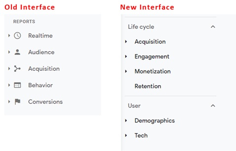

# Google [!DNL Analytics] から [!DNL Adobe Analytics] への移行に関する包括的なガイド{#comprehensive-guide-for-transitioning-to-adobe-analytics}

## 1.はじめに

ツール間の移行における最大の課題の 1 つは、同等の機能がどこにあるのかを知り、それを効率的に使用する方法を学ぶことです。 このディスカッションは、ユーザーが（新規ユーザー、またはGoogle [!DNL Analytics] からのユーザーとして） [!DNL Adobe Analytics] に簡単に移行できるようにするための膨大なガイドの一部です。 GA との詳細な比較。ほとんどのユーザーになじみがある最も頻繁に使用される比較ツールとして、ユーザーが既存の知識を新しいツールセットに関連付けるのに役立つように提供されています。 実践に代わるものはありませんが、これは基本を学ぶのに役立ち、移行中に感じる可能性のあるフラストレーションを減らすことができます。

用語を簡単に比較する必要があります。

| **説明** | **[!DNL Adobe Analytics]** | **Google[!DNL Analytics]** |
|--------------------------------------------------------------------------------------------------------------------------------|---------------------|----------------------|
| ページ（またはアプリの画面）を表すイベント指標が表示されました | ページビュー | ページビュー |
| 同じ時間枠で行われる web サイトまたはアプリでのインタラクションのグループを表す指標 | 訪問 | Session |
| 識別されたデバイスを定義する指標（ユーザー情報をつなぎ合わせるための cookie やその他のビヘイビアーパターンを含む複数の基準に基づく） | ユニーク訪問者 | ユーザー |

## 2. インターフェイス

[!DNL Adobe Analytics] とGoogle [!DNL Analytics] を比較した人からは、[!DNL Adobe] のインターフェイスは最初が大変だというコメントが寄せられます。 これが真実ですが、信じられないかもしれませんが、それは弱点ではなく強みでもあります。 [!DNL Adobe] は、データのビジュアライゼーションに幅広いツールと柔軟性を提供し、必要なものをより自由に作成できるようにします。

まず、「サイト内」レポートを見てみましょう。

### 2.1. サイト内レポート

#### 2.1.1. ホーム画面

[!DNL Adobe Analytics] とGoogleはどちらも、ユーザー [!DNL Analytics] ログインしたときに最初に表示されるビューをカスタマイズする手段を提供します。

##### 2.1.1.1. Workspace/カスタム設定ホーム画面（[!DNL Adobe Analytics]）

[!DNL Adobe Analytics] べてのユーザーがログイン時に表示できるように事前定義済みレポートを作成することは想定していません。 デフォルトのホームページでは、Workspaceのランディング画面が表示されます。この画面には、各ユーザーが作成または共有したすべてのワークスペースレポートが表示されます。 また、各ユーザーは、必要に応じて、これらのレポートのいずれかをホーム画面として設定できます。

このガイドの後半で、ワークスペースに関する以下の詳細を説明します。 2.1.2.1 節を参照

>[!TIP]
>
>組織の標準レポートをいくつか作成/共有して、すぐに独自のレポートを作成しなくても情報を確認できるようにします。

##### 2.1.1.2. ホーム画面のインサイト（Google [!DNL Analytics]）

* Google [!DNL Analytics] のホーム画面には、事前定義済みビジュアライゼーションがいくつかあります。 これらには、次のような情報が含まれています。
* 過去 7 日間のユーザー、セッション、バウンス率およびセッション期間
* 過去 30 日間の時間帯別のユーザー
* 現在のユーザー数と上位のアクティブページ
* 過去 7 日間のトラフィックチャネル、Source/Mediumおよび参照
* 過去 7 日間の国別セッション
* 過去 7 日間のトップページ
* 過去 30 日間のアクティブユーザーの傾向
* と他名

GA4 ユーザーには、カスタマイズした独自のレポートをホーム画面に追加するためのより多くのオプションがあります。

これはおそらく、あなたが最も [!DNL Adobe Analytics] く逃すことの一つです。 事前に作成されたホーム画面はありません。 ただし、上記のリストから必要なものをレプリケートしてランディング画面として設定するように、カスタム Workspaceを簡単に設定できます。 このトピックについては後で詳しく説明します（またはWorkspaceの 2.1.2.1 節 [!DNL Adobe] 参照してください）。

#### 2.1.2. サイト内Report Builder

分析ツールが提供するシンプルなレポートに加えて、各ツールは、独自のカスタムレポートを作成するためのより強力なツールも提供します。

##### 2.1.2.1. [!DNL Adobe Analytics] Workspace

これは [!DNL Adobe Analytics] の原動力であり、2017 年の導入以来、[!DNL Analytics] の分析の場となり、レポートセクションが間もなく廃止される主な理由となっています。

このツールを使用すると、ほとんど完全に自由にレポートを作成できます。

レポートはパネルに分割でき、それらのパネルには任意の数のビジュアライゼーションを含めることができます。 パネルは、日付範囲や共通セグメントフィルターなどの一般的な情報に設定できます。

パネルとその中のビジュアライゼーションの両方をサイズ変更してドラッグし、項目を並べて表示したり、積み重ねたりすることができます。 したがって、2 つの異なるデータスイートを並べて比較する場合は、中央で 50/50 に分割されたパネルを作成し、2 つのサイトを並べて簡単に比較できます。

ユーザーが利用できるビジュアライゼーションは多数あります。

* フリーフォームテーブル
* コホートテーブル
* フォールアウト
* フロー
* グラフ
   * 面グラフ（積み重ねおよび非積み重ね）
   * 折れ線グラフ
   * 散布
   * 棒グラフ（積み重ねおよび非積み重ね）
   * 箇条書き
   * ドーナツグラフ
   * ヒストグラム
   * 横棒グラフ（積み重ねおよび非積み重ね）
* マップ
* ブロックの概要
   * 変更の概要
   * 概要テキスト
   * テキスト（コンテキストを提供するために追加情報を入力するためのフリーテキストフィールド）
* ベン図

各パネルとビジュアライゼーションにはタイトルを付け、説明を適用して、情報が表示している内容にコンテキストを提供することができます。
ま [!DNL Adobe]、セグメント（基本的にデータのフィルター）は遡及的に適用され、これらをフリーフォームテーブルの列に取り込んで、データを並べて比較できます。 例えば、ユーザーがサイトの 2 つの異なるカテゴリのトラフィックを比較する場合は、「カテゴリ A」のセグメントと別の「カテゴリ B」のセグメントを作成できます。

フリーフォームテーブルでは、必要に応じて複数の列とセグメント化を使用して、データを思いどおりに視覚化できます。

日付別の分類を表示しない場合は、別のディメンションやセグメントをそこにドラッグ&amp;ドロップするだけで、別の方法でデータを表示できます。 例えば、デバイスタイプにセグメントを使用し、モバイル/タブレットユーザーに対してオペレーティングシステム別の分類を追加できます。

Workspaceでは創造性を伸ばすことができます。「標準」的な分類に制限されるわけではありません。 実行する必要のある比較を深く掘り下げるために必要なビジュアライゼーションを作成できます。

>[!TIP]
>
>遊んだり探索したりすることを恐れないでください。 既成概念にとらわれない考え方がいろいろあります。 さらに、作成したものが自分の考えを示しているかどうかを検証してください。 経験が役に立つ

レポート内でのみ有効なオンザフライの計算指標やセグメントを作成して、セグメントや計算のリポジトリがあふれないようにすることができます。 これにより、他のコンテキストでは使用できないもので組織を混乱させることなく、特定のレポートに必要な項目に的を絞って作成できます。

このディスカッションは、このツールの紹介にすぎません。基本を学ぶためのより包括的なガイドは他にもあります。 これらのガイドを確認したら、次のような包括的なレポートを作成します。

ワークスペースは自動保存されないので、レポートリポジトリをいっぱいにすることなく、1 回限りのアドホックレポートを実行しやすくなります。

Workspaces のもう 1 つの強力な機能は、ドロップダウンの形式でレポートにインタラクティブな修飾子を適用できることです。 これらのドロップダウンは、書き出された CSV やレポートのPDFファイルでは機能しません。 ただし、ライブレポートでは、パネル内のすべてのビジュアライゼーションを更新して、同じレポートを異なる条件で表示できます。 複数のドロップダウンを使用することができ、オプションが相互に排他的でない場合、選択された項目は積み重ねられ、情報をきれいに表示できます。

>[!IMPORTANT]
>
>ドロップダウンとフリーフォームの分類の使用について詳しくは、<https://experienceleaguecommunities.adobe.com/t5/adobe-analytics-discussions/the-power-of-dropdown-filters-and-dimension-breakdowns-in-adobe/td-p/434680> を参照してください。

##### 2.1.2.2. Google [!DNL Analytics]：ダッシュボード、カスタムレポート、保存済みレポート

Googleには、インターフェイス内でレポートを作成するためのツールがいくつかありますが、それらは引き続きレポートセクションと同じ表示と制限に従います。

さて、これを読んでいるときにGoogle [!DNL Analytics] に精通している人にとっては、「ちょっと待ってください、Google Data Studio は、[!DNL Adobe] のWorkspaceと同等ではないでしょうか？」と言うかもしれません。 はい。ただし、Data Studio は、厳密には [!DNL Analytics] ツールの一部ではなく、様々なデータソースへの接続を可能にします。 このツールは、「拡張レポートアクセス」の節、特に 2.2.3 節で後述します。

Google ダッシュボードとカスタムレポートを使用すると、複数のビジュアライゼーションを 1 つのレポートにまとめることができますが、Workspaceとは異なり、単純な相関関係と、どのデータをどの列に配置できるかが決まります。

カスタムレポートで最も大きな課題の 1 つは、フィルターを作成する際に、レポートのすべてのタブに適用される点です。 同じレポート内の 2 つの異なるフィルターを比較する方法はありません。

表面上の比較の場合は、問題ありません。 これらはすべて、[!DNL Adobe] のレガシーダッシュボード、カスタムレポート、ブックマークに似ています。 ニーズをサポートするために提供される基本ツールは、レポートスイート内に存在します。

#### 2.1.3. レポート

Googleと [!DNL Adobe] の両方に、ディメンションごとに作成されたテーブルと基本的なタイムライングラフであるナビゲート可能なレポートがいくつかあります。

##### 2.1.3.1. [!DNL Adobe Analytics] レポート

[!DNL Adobe Analytics] には「レポート」セクションもありますが、Analysis Workspaceを優先して段階的に廃止されています。 実際、Workspaceはより強力なツールなので、このインターフェイスの提供終了が発表されました。 これらのテーブルのほとんどは、容易に作成および変更できます。 [!DNL Adobe] のセクションははるかに分類化されており、これが大変な作業となる可能性があります。

上記のほとんどは Workspaces からアクセスできるので、これらのセクションの概要と、それらがGoogle [!DNL Analytics] にどのように関連しているかを簡単に説明し、ここでまだ関連しているレポートをハイライト表示します。

サイト指標には、標準指標（設定したページビュー数、ユニーク訪問者数、訪問回数、カスタムイベント数）が含まれています。 これは行動レポート GA に似ていますが、指標タイプを分割しないため、オーディエンスで見つかるものの一部も含ま [!DNL Adobe] ます。

ここには「ボット」レポートがあります。 ボットからのトラフィックはすべての標準レポートから除外されていますが、2 つのレポートで、何が起こっているのか、どのボットがサイトにアクセスしているのかのインサイトを得ることができます。 これは、サイトに頻繁にヒットする既知のスパマーボットを除外するカスタムボットルールを設定する場合に特に便利です。 メインのレポートがフラッディングすることなく、それらのボットが何をしているかについてのインサイトを得ることができますが、そのトラフィックです。 ボットレポートは現在、Workspaceからは利用できません（ただし、間もなく登場する新しいレポート機能により、ユーザーはそこでもこの情報を取得できるようになります）。

サイトコンテンツとは、ページ名、サイトセクション、階層、サーバーなど、[!DNL Adobe] つの標準ディメンションをグループ化したものです。 これらのディメンションはすべてWorkspaceで使用できます。

Mobile は、モバイルデバイス固有のデータ（デバイス、デバイスタイプなど）をグループ化したものです。 これらは、Workspaceで使用できます。

Workspaceではパスを使用できません。 Workspaceにはフロー図があり、1 つのページ/値のインフローとアウトフローを確認できます。 一方、パスを使用すると、web サイトで最もよく使用されるパスを表示できます。 デフォルトでは、最初に設定されるパスレポートはページです。 ただし、「ページタイプ」の値などのカスタム prop に対してこれをオンにできます。 ページタイプ内のパスを確認できます。 パスについて個人的に気に入っているもう 1 つの点は、情報を表示する簡単な方法であることです。ワークスペースのフロー図（見ようとしている量によって異なります）は、圧倒される可能性があります。 両方を試してみることをお勧めします。それぞれ、達成しようとしていることに応じて用途と価値があります。 フローでは任意のディメンションを使用できますが、パスは管理パネルのプロップで設定する必要があります。

トラフィックソース、[!DNL Campaign]、マーケティングチャネルのレポートはすべて、Googleの製品の獲得レポートに似ています。 トラフィックソースは実際のリファラーに、[!DNL Campaign] は [!DNL Campaign] コードに、マーケティングチャネルも [!DNL Campaign] コードに焦点を当てますが、情報の処理方法についてユーザーが決定した追加のロジックも適用します。 [!DNL Adobe] では、ルールの設定方法の自由度が向上しています。 これに対し、Googleは多数の機能を提供するので、考え方が変わります。 デフォルトでは、[!DNL Campaign] コードのGoogle アトリビューションは 6 か月です。 [!DNL Adobe] のアトリビューションは、デフォルトで 1 週間に設定されています。 これは管理者設定で変更できますが、Workspaceでは、実際に任意のディメンションにカスタムアトリビューションを適用して、「即座」の柔軟性を大幅に高めることができます。

訪問者保持率レポートと訪問者プロファイル レポートは、Google [!DNL Analytics] のオーディエンスレポートに似ています。 リテンションは再来訪頻度に重点を置いていますが、訪問者プロファイルはユーザーの地理とテクノロジーに重点を置いています。

カスタムコンバージョンレポートとカスタムトラフィックレポートは、両方ともカスタムディメンションレポートです。 コンバージョンは eVar です。 ヒット、訪問、月、年などの値にカスタムの有効期限を設定できます。 この値は上書きされない限り、設定された時間枠のユーザーに対して永続的に保持されます。 トラフィック変数は prop です。 パスレポート用に、または選択した区切り文字に基づいて複数の値を分割するリストアイテムとして設定することもできます。

メディアは、特別なメディアトラッキングを設定したビデオやオーディオファイルなどに使用されます。

カスタムレポートは、ユーザーがレポートインターフェイス内で作成した列と分類をカスタマイズして、カスタムレポートとして保存できるセクションです。 ただし、前述のように、Workspaceでは非常に強力な分類と相関関係が可能であるため、カスタマイズした情報はすべてそこで作成する必要があります。 これは、Workspaceが存在する前の優れた解決策でした。

ブックマークセクションはカスタムレポートに似ており、頻繁に使用するレポートをレポートインターフェイス内でブックマークして、簡単に見つけられるようにすることができます。

ダッシュボードは、データのレポートレットを 1 つのビジュアライゼーションにまとめることができるレガシー製品でした。 ただし、Workspaceの機能（2.1.2.1 節）は操作が非常に簡単であるため、これは、この機能が廃止される前に再作成する必要があるレガシーレポートへのアクセスポイントとしてのみ存在します。

ターゲットを使用すると、特定の期間内のターゲットに基づいてレポートを作成できます。 チームはキャンペーンを監視して、トラフィックターゲットを達成するために順調に進んでいるかどうかを確認します。

ここにあるすべてのレポートでは、複数の指標列とディメンションの分類が可能でした。 ただし、ビジュアライゼーションの単純さと、どの要素を相関させることができるかの背後にあるロジックのいくつかは、フラストレーションを引き起こすこともありました。

##### 2.1.3.2. Google [!DNL Analytics] レポート

Google [!DNL Analytics] は、これらのレポートを、リアルタイム、オーディエンス、獲得、ビヘイビアー、会話（GA3）とライフサイクル（サブセクション：獲得、エンゲージメント、収益化、保持）とユーザー（サブセクション：人口統計と技術）のセクションに分割します。

これらのビジュアライゼーションにいくつかの小さな調整を加えたり、セカンダリディメンションの分類を追加したり、ビジュアライゼーションを変更したり、データにフィルターを作成したりできます。 カスタマイズを保存済みレポートとして保存できます。

これらは、データに対する迅速で簡単なインサイトを提供します。 ただし、ユーザーなどを同じテーブル内のページのページビューと比較したり、複数のディメンションを追加して追加のデータを表示したりすることはできません。

これらは迅速な分析データに適していますが、実際に深く掘り下げる必要がある場合は、制限に苦しみます。

### 2.2.拡張レポートアクセス

「サイト内レポート」に加えて、ほとんどのツールは、ツールの外部で分析を行い、もう少しカスタマイズされたものを作成できる拡張機能を提供します。

#### 2.2.1. [!DNL Adobe Analytics] Report Builder（Microsoft® Excel Extension）

Workspaceは優れたツールですが、複数のデータソースをつなぎ合わせるために、データをカスタマイズされたスプレッドシートに取り込む必要がある場合があります。 ここでReport Builderが役に立ちます。

Report Builderは、[!DNL Adobe Analytics] データへの接続を作成して、Excel 内で操作できる表形式のデータを取り込むことができる、Microsoft® Excel のプラグインです。 通常、これを効率的に使用するには、データをいくつかの生データタブに取り込み、Excel セル参照を使用してこれらのタブから単一の統合レポートにデータを取り込み、グラフとビジュアライゼーションを作成します。

>[!NOTE]
>
>Report Builderには、このプラグインにアクセスするユーザーに適用される必要がある特別な権限があります。 これは、ツールの適切な使用方法を学んだユーザーに付与する必要があります。

#### 2.2.2. [!DNL Adobe Analytics] API 接続

[!DNL Adobe Analytics] データを Excel 以外でダイジェストする必要があるが、ボットルールの除外を含む処理されたデータが必要な場合は、[!DNL Adobe] の API を使用してデータを直接取り込みます。 次に、スクリプトを使用してデータを処理するか、別のシステムで使用するためにデータベースに追加します。

API は、プルリクエストで指定されているように、分類とセグメントを適用して相関データを取り込むことに注意が必要です。

[!DNL Adobe] のWorkspace（2.1.2.1 節）は、API を使用してレポートを作成します。Workspaceでデバッグモードを有効にすると、使用した正確な API 呼び出しが表示されます。 これは、API 呼び出しを作成する簡単な方法です。 Workspaceを使用して取り込むデータを作成および検証すると、それらの API 呼び出しを使用してデータを独自の処理に出力できます。

#### 2.2.3. Google [!DNL Analytics] Data Studio

読んでいると、Data Studio が [!DNL Adobe] のWorkspaceと同等であると言及したことを上記から既に知っています。 Data Studio を使用すると、Google [!DNL Analytics] データだけでなく、他のソースからのデータも取り込むことができます。 これは、分析データを他の収集されたデータと統合する場合に便利です。 ただし、Google [!DNL Analytics] では、同じ種類のビジュアライゼーションの制限が存在します。 行と列の形成方法はまだ制限されています。

それでもこのツールは強力なので、使用をやめろと言うつもりはありませんが、 私の個人的な経験では、個人的には厳密なビヘイビアーが非常に制限されていると感じています。

#### 2.2.4. Google スプレッドシート拡張機能

私自身の用途では、Google [!DNL Analytics] から拡張された方法でデータを取り込む必要がある場合、個人的に選択するツールはGoogle スプレッドシート拡張機能です。 GA テーブルに複数の接続を確立する必要がありますが、生データからセルを参照して必要なレポートを作成できます。 次に、Google スプレッドシートのグラフ機能を使用して視覚化します。

## 3.生データの書き出し

生データが本当に必要な場合は、[!DNL Adobe] とGoogleの両方が、この方法で情報を取り込む機能を提供します。

### 3.1. [!DNL Adobe] データフィード

2.2.2 節で、[!DNL Adobe Analytics] API が「処理済みデータ」から取り込まれることを説明しました。 生データフィードは、管理パネルで設定された「処理ルール」によって処理されるデータを取り込みますが、この生データには、その他のすべての場所で除外されるすべてのデータが含まれます。

つまり、すべてのボット除外、内部 IP フィルター処理されたデータ、その他の除外データが生データフィードに含まれます。 このデータを識別するフラグがあるので、データレイクを作成する場合、エンジニアリングチームは、適宜このデータを処理するロジックを作成できます。

生データフィードは、データのすべての列を送信するようにカスタマイズすることも、より焦点を絞ったフィードが必要な場合は特定の列のみを送信するようにカスタマイズすることもできます。

フィードは、FTP、SFTP、S3 などに直接送信できます。

### 3.2. Google Big Query

残念ながら、これは私が使用した経験のない 1 つのGoogleツールです。 理論的には、[!DNL Adobe] のデータフィードに似ているはずなので、エンジニアリングチームがGoogle [!DNL Analytics] アカウントから生データにアクセスできるようになります。

ただし、エンジニアは、生データの完全なダンプではなく、SQL クエリを使用してデータにアクセスし、ターゲット化された生データや生データのすべての列を取り込むことができます。

## 4.まとめ

他のシステムと同様に、ツールを快適に使用するには練習が必要です。 このガイドは、[!DNL Adobe Analytics] の使い方を向上させるためのヒントや基本を学ぶのに役立ちます。

ただし、実装戦略では、[!DNL Adobe Analytics] とGoogle [!DNL Analytics] の両方を使用することをお勧めします（Google [!DNL Analytics] が無料版のみの場合でも）。 確実なシステムはありませんが、これによりバックアップシステムを使用してデータを確実に保持できます。

このガイド以外にも、戦略の改善に役立つリソースが多数あります。

* [[!DNL Adobe] Experience League](https://experienceleague.adobe.com/ja#home) - チュートリアル、ビデオ、ドキュメントおよびコミュニティフォーラムが含まれています
* [[!DNL Adobe]  ユーザーグループ ](https://analytics-augs.adobe.com/) - ユーザーが相互につながり、実装を改善するのに役立つ、コミュニティ実行イベントのハブ。
* [[!DNL Adobe Analytics]  ユーザーグループのYouTubeチャンネル ](https://www.youtube.com/channel/UCQOHnCs7KZgsuFHVzwboQuA) - [!DNL Adobe Analytics] ユーザーグループのセッションに参加できなかった場合は、 世界中の以前のユーザーグループセッションを再視聴して、同業者がどのようにツールを使用しているかを知ることができます。
* [Measure Chat Slackチャネル ](https://www.measure.chat/) – 世界中の [!DNL Adobe Analytics] ユーザーとつながって、業界の学びを共有したり、同業者に質問したり、測定に焦点を当てたインタレストグループに参加したりできます。
* その他

## 作成者

このドキュメントの作成者：

Jennifer Dungan （Torstar 社 [!DNL Analytics] 最適化マネージャー）

[!DNL Adobe Analytics] チャンピオン
